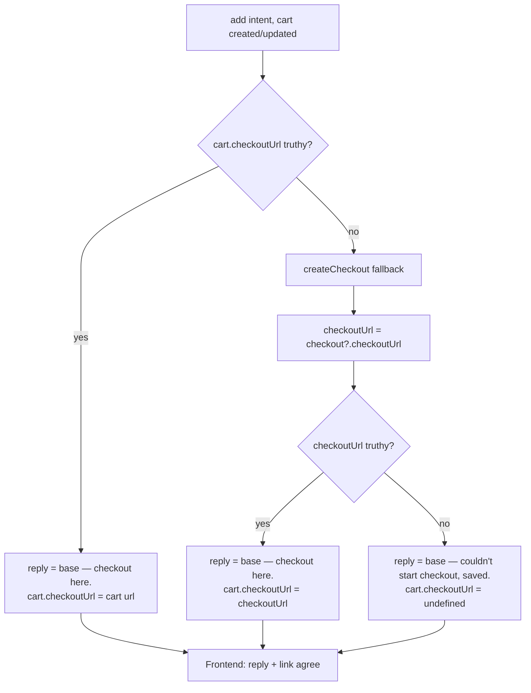

# Fix Plan: Assistant renders a "checkout here" CTA with no URL when checkout can't be started

**Slug:** `fix-assistant-checkout-null-dangling-cta`
**Type:** Bug fix (Low severity, UX only)
**Bug report:** `docs/bugs/assistant-checkout-null-dangling-cta.md`
**Investigation (root-cause source):** `docs/bugs/assistant-checkout-null-dangling-cta-investigation.md`
**Planned:** 2026-07-15

---

## 1. Root cause statement

Per the investigation (`assistant-checkout-null-dangling-cta-investigation.md`, "Root cause" and
"Mechanism" §1), the route action in `app/routes/($locale).api.assistant.jsx` composes the assistant
`reply` text with the hardcoded call-to-action phrase **"checkout here" unconditionally**, while the
`cart.checkoutUrl` it returns can be `undefined`:

- Line **175** — `const reply = 'Added to your assistant cart — checkout here.';` — reused by the
  truthy-URL return (line 181) **and** the fallback return (line 194).
- Line **226** — `reply: 'Started a new cart and added the item — checkout here.'` (stale-cart retry,
  truthy-URL return).
- Line **242** — `reply: 'Started a new cart and added the item — checkout here.'` (stale-cart retry,
  fallback return).

On the two **fallback** returns (lines 193–196 and 241–245), `checkoutUrl` is `checkout?.checkoutUrl`.
After the `fix-create-checkout-soft-error-gap` fix, a soft-error `create_checkout` correctly yields
`checkout: null`, so `checkout?.checkoutUrl` evaluates to `undefined` (this is verified against the code:
`normalizeCheckout` in `app/lib/mcp-normalize.js:238–243` returns `checkoutUrl: rawCheckout.continue_url ?? undefined`).

The frontend (`app/components/ChatAssistant.jsx:345`) **correctly** gates the actual hyperlink on a
truthy `cart.checkoutUrl`, so the "Go to checkout →" anchor does not render — but the reply bubble
(`ChatAssistant.jsx:292–295`) still prints "…checkout here." The result is a textual CTA pointing at a
link that isn't there: a dead-end. The defect is that the **route emits reply text that contradicts the
data it returns**. The fix belongs in the route; the component's gating is already correct and must not
change.

---

## 2. The exact change (per site)

### Design: gate the CTA copy on the _same_ value the frontend gates the link on

The frontend renders the link only when `cart.checkoutUrl` is truthy (`ChatAssistant.jsx:345`). To make
text and link agree in every state, the route must derive the reply's CTA copy from the **same**
`checkoutUrl` value it writes into `cart.checkoutUrl`. We do this by:

1. Introducing one small **pure helper** that returns reply text with the "checkout here" CTA **iff** a
   usable checkout URL is present, and graceful copy otherwise.
2. At each of the four return sites, computing the resolved `checkoutUrl` into a single local, passing
   it to both the helper (for `reply`) and the cart object (for `cart.checkoutUrl`). One variable feeds
   both, so they cannot disagree.

### 2a. New pure helper — `app/lib/assistant-reply.js` (new file)

Placed in `app/lib/` to match the project's directory directive ("`lib` — Utility functions … and
generic helpers") and so it is directly unit-testable without mocking any MCP call. It is a pure
function (no I/O, no side effects), per the global "prefer pure functions" style preference.

Signature and behavior:

```js
/**
 * Composes the add-to-cart assistant reply, gating the "checkout here" CTA copy
 * on a usable checkout URL so the reply never promises a link that will not render.
 *
 * Pure: no side effects, no I/O. The CTA phrase appears if and only if `checkoutUrl`
 * is truthy — the same field the frontend (ChatAssistant.jsx) gates the "Go to
 * checkout →" link on, keeping reply text and link in agreement in every state.
 *
 * @param {object} opts
 * @param {string|undefined|null} opts.checkoutUrl - resolved checkout URL, if any
 * @param {boolean} [opts.cartReset=false] - true on the stale-cart retry path
 * @returns {string}
 */
export function composeAddReply({checkoutUrl, cartReset = false}) {
  const base = cartReset
    ? 'Started a new cart and added the item'
    : 'Added to your assistant cart';
  return checkoutUrl
    ? `${base} — checkout here.`
    : `${base} — I couldn't start checkout just now, but it's saved.`;
}
```

The two `base` phrases reproduce today's copy exactly, so the healthy-path replies are preserved
**byte-for-byte**:

- `cartReset=false`, URL present → `Added to your assistant cart — checkout here.` (== current line 175/181)
- `cartReset=true`, URL present → `Started a new cart and added the item — checkout here.` (== current line 226)

> **Prettier note for the Coder:** the fallback strings contain apostrophes (`couldn't`, `it's`).
> `@shopify/prettier-config` will keep these as **double-quoted** literals (to avoid escaping). Write
> them double-quoted so `npm run format:check` / lint stays clean; do not fight Prettier by escaping
> inside single quotes.

### 2b. Route edits — `app/routes/($locale).api.assistant.jsx`

Add the import (top of file, alongside the existing `~/lib/...` imports):

```js
import {composeAddReply} from '~/lib/assistant-reply';
```

**Primary add path (currently lines 175–196).** Remove the shared `const reply` at line 175. Rewrite
the two returns so each derives its copy from the URL it actually returns.

Before (lines 175–196):

```js
const reply = 'Added to your assistant cart — checkout here.';

// Handoff URL: prefer the cart's own continue_url (§3.5, AL-UCP-6).
// Only call create_checkout as a fallback when the cart response
// does not expose a usable checkoutUrl.
if (cart.checkoutUrl) {
  return json({reply, cart});
}

const checkoutResult = await createCheckout({
  ...mcpBase,
  cartId: cart.id,
  lineItems: [newLine],
});
const checkout = checkoutResult.checkout
  ? normalizeCheckout(checkoutResult.checkout)
  : null;

return json({
  reply,
  cart: {...cart, checkoutUrl: checkout?.checkoutUrl},
});
```

After:

```js
// Handoff URL: prefer the cart's own continue_url (§3.5, AL-UCP-6).
// Only call create_checkout as a fallback when the cart response
// does not expose a usable checkoutUrl.
if (cart.checkoutUrl) {
  return json({
    reply: composeAddReply({checkoutUrl: cart.checkoutUrl}),
    cart,
  });
}

const checkoutResult = await createCheckout({
  ...mcpBase,
  cartId: cart.id,
  lineItems: [newLine],
});
const checkout = checkoutResult.checkout
  ? normalizeCheckout(checkoutResult.checkout)
  : null;
// One resolved value feeds BOTH the reply copy and cart.checkoutUrl so the
// "checkout here" CTA can never contradict the rendered link (root cause fix).
const checkoutUrl = checkout?.checkoutUrl;

return json({
  reply: composeAddReply({checkoutUrl}),
  cart: {...cart, checkoutUrl},
});
```

**Stale-cart retry path (currently lines 224–245).** Same shape, with `cartReset: true`.

Before (lines 224–245):

```js
if (cart.checkoutUrl) {
  return json({
    reply: 'Started a new cart and added the item — checkout here.',
    cart,
    cartReset: true,
  });
}

const checkoutResult = await createCheckout({
  ...mcpBase,
  cartId: cart.id,
  lineItems: [newLine],
});
const checkout = checkoutResult.checkout
  ? normalizeCheckout(checkoutResult.checkout)
  : null;

return json({
  reply: 'Started a new cart and added the item — checkout here.',
  cart: {...cart, checkoutUrl: checkout?.checkoutUrl},
  cartReset: true,
});
```

After:

```js
if (cart.checkoutUrl) {
  return json({
    reply: composeAddReply({checkoutUrl: cart.checkoutUrl, cartReset: true}),
    cart,
    cartReset: true,
  });
}

const checkoutResult = await createCheckout({
  ...mcpBase,
  cartId: cart.id,
  lineItems: [newLine],
});
const checkout = checkoutResult.checkout
  ? normalizeCheckout(checkoutResult.checkout)
  : null;
const checkoutUrl = checkout?.checkoutUrl;

return json({
  reply: composeAddReply({checkoutUrl, cartReset: true}),
  cart: {...cart, checkoutUrl},
  cartReset: true,
});
```

**Confirmed:** the field the reply is now gated on (`checkoutUrl` → `cart.checkoutUrl`) is exactly the
field the frontend gates the link on (`ChatAssistant.jsx:345` `{cart.checkoutUrl && …}`). Text and link
therefore agree in all four returns.

### 2c. No change to `ChatAssistant.jsx`

The component's link gating (`ChatAssistant.jsx:345`) is already correct and is **left untouched**. Once
the route stops emitting "checkout here" when there is no URL, the reply bubble and the link agree
without any frontend edit. Stated explicitly per the task: the component does **not** need a change.

### 2d. No change to checkout / cart logic

`createCheckout`, `normalizeCheckout`, and the cart normalizers are **not** touched. `null`/`undefined`
remains the correct value for an absent checkout URL (the `fix-create-checkout-soft-error-gap` fix is
correct); this plan only fixes how that absence is **communicated** in the reply copy.

### Decision flow (after fix)



---

## 3. Copy decision

**Chosen fallback strings (exact):**

- Primary add: `"Added to your assistant cart — I couldn't start checkout just now, but it's saved."`
- Stale-cart retry: `"Started a new cart and added the item — I couldn't start checkout just now, but it's saved."`

**Tradeoff weighed.** Two candidate fallbacks:

1. **Silent CTA drop** — keep only "Added to your assistant cart." (no CTA, no explanation).
2. **Explicit "couldn't start checkout" note** (chosen).

**Recommendation: the explicit note (option 2).** Justification:

- The item genuinely **is** saved — the route still returns the `cart` object, and the frontend renders
  the assistant-cart summary (line count + `<Money>` total) below the reply. Silently dropping the CTA
  leaves the user with a cart summary and no word on why they can't proceed to checkout.
- The bug report's **Expected behavior** explicitly asks the assistant to "say something honest like 'I
  couldn't start checkout'." Option 2 satisfies that; option 1 does not.
- It matches the file's existing plain, first-person-honest reply tone (e.g. the search replies and the
  "The assistant ran into a problem. Please try again." error copy).
- Format matches the healthy copy: same em-dash-joined clause structure (`base — clause.`), so the
  bubble reads consistently whether or not checkout is available.

Cost of option 2: a few extra words and surfacing a failure the user may not have been thinking about.
Given the bug report's explicit request for honesty, this cost is acceptable and preferred over a silent
drop. Recommendation stands: **explicit note.**

**i18n.** The investigation flagged i18n as a risk. Verified against the code: **every** reply/error
string in `($locale).api.assistant.jsx` is a plain English literal (e.g. `'Found N products.'`,
`'Please enter a search query.'`, `'The assistant ran into a problem. Please try again.'`). There is
**no** translation layer for reply copy — the only locale handling in the file is the URL-prefix guard
(lines 46–53), which does not translate strings. Therefore the fallback strings must also be **plain
literals**, matching the existing convention. No i18n work is in scope; introducing a translation
mechanism here would be scope creep and is explicitly out of bounds.

---

## 4. Affected files and modules

| File                                     | Change                                                                                                                                                                |
| :--------------------------------------- | :-------------------------------------------------------------------------------------------------------------------------------------------------------------------- |
| `app/lib/assistant-reply.js`             | **New.** Pure `composeAddReply({checkoutUrl, cartReset})` helper.                                                                                                     |
| `app/lib/assistant-reply.test.js`        | **New.** Node `--test` unit tests for the helper.                                                                                                                     |
| `app/routes/($locale).api.assistant.jsx` | Import helper; remove line-175 `const reply`; rewrite the four `add`-intent return sites to derive reply copy and `cart.checkoutUrl` from one resolved `checkoutUrl`. |
| `package.json`                           | Add `app/lib/assistant-reply.test.js` to the existing `test:unit` script's file list.                                                                                 |

Not touched: `ChatAssistant.jsx` (gating already correct), `mcp-normalize.js`, `mcp.server.js`, any
`create_checkout`/cart logic, generated types, `.env`. No `.tsx` conversion. Files stay `.jsx` with
JSDoc.

---

## 5. Helper vs. inline decision

**Recommendation: the shared pure helper (as in §2a), used at all four return sites.**

- The four returns span two base phrases and a two-state CTA rule. A single helper makes the invariant
  "CTA copy iff checkoutUrl" a single source of truth, so a future edit to one return can't
  reintroduce the mismatch. This directly matches the global "prefer pure functions … no clever
  one-liners" preference.
- It keeps the route diff small (one import + swapping four `reply` literals) and moves the only
  branching logic into a function that is trivially unit-testable **without** MCP mocking — which is the
  crux of the test plan (§7), since the reply logic is otherwise only reachable through the full action.
- Using it at the two already-correct truthy-URL returns (as well as the two buggy fallbacks) also
  removes the awkward line-175 shared `const` that currently feeds both a correct and a buggy return.

**Minimal alternative considered:** touch only the two fallback returns and inline a ternary there,
leaving the truthy returns' literals as-is. This is a slightly smaller diff but leaves the CTA rule
duplicated/inlined and not centrally testable, and keeps the shared-const asymmetry. Recorded in the
Ambiguity Log; the helper is preferred.

---

## 6. Regression risk areas

> Note: the task also asked for these to be added to the bug report's "Regression risk areas" section,
> but this plan's write scope is limited to `docs/plans/`. They are recorded here; an operator/Coder with
> write access should mirror them into `docs/bugs/assistant-checkout-null-dangling-cta.md` for QA.

1. **Healthy checkout path (`cart.checkoutUrl` present, route lines 180–182 / 224–230).** The most
   common flow. Must still emit the exact copy "…— checkout here." and the frontend must still render the
   "Go to checkout →" link. The helper reproduces the phrase byte-for-byte; verify no whitespace/em-dash
   drift.
2. **Normal add-to-cart reply (primary path).** Confirm the reply still reads naturally and the cart
   summary (line count + total) renders unchanged.
3. **Stale-cart retry variant (`cartReset: true`).** Both retry returns must apply the same rule:
   "Started a new cart …" with CTA when URL present, graceful note when absent. Confirm `cartReset: true`
   is still set on both returns and the frontend's "Started a new assistant cart." banner still shows.
4. **Reply/link agreement in the component.** Verify (via unit test on the helper plus a code read of
   `ChatAssistant.jsx:345`) that reply text and the link are now driven by the same `checkoutUrl` value —
   no state where "checkout here" shows without a link, and no state where a link shows without the CTA
   phrase.
5. **Other intents unaffected.** `search` and the unknown-intent/`default` branch do not compose checkout
   CTAs and must be untouched. Confirm the import and helper are used only in the `add` intent.
6. **Test-coverage gap (root cause was untested).** No test previously exercised reply composition. The
   new helper test closes this gap; without it, the fix is unguarded against future regressions.

---

## 7. Test plan

**Primary guard: unit tests on the pure `composeAddReply` helper** (`app/lib/assistant-reply.test.js`).
This is the primary guard because the dangling-CTA path is a rare fallback that is hard to force live
(it needs both an absent cart `continue_url` and a soft-error `create_checkout`). Extracting the pure
helper makes the reply logic directly testable with zero MCP mocking — the minimal clean approach called
for in the investigation.

Use Node's built-in test runner (`node:test` + `node:assert/strict`), matching
`app/lib/mcp-normalize.test.js` conventions (no new dependencies).

Test cases (6):

1. `{checkoutUrl: 'https://…', cartReset: false}` → equals `"Added to your assistant cart — checkout here."` (healthy primary copy preserved).
2. `{checkoutUrl: 'https://…', cartReset: true}` → equals `"Started a new cart and added the item — checkout here."` (healthy retry copy preserved).
3. `{checkoutUrl: undefined, cartReset: false}` → equals the primary fallback string; assert it does **not** contain `"checkout here"`.
4. `{checkoutUrl: undefined, cartReset: true}` → equals the retry fallback string; assert no `"checkout here"`.
5. `{checkoutUrl: null, cartReset: false}` → same as case 3 (null is falsy → fallback).
6. `{checkoutUrl: '', cartReset: false}` → same as case 3 (empty-string URL is falsy → fallback; guards against an empty-string URL slipping a CTA through).

Wire the new file into the existing script:

```jsonc
// package.json
"test:unit": "node --test app/lib/mcp.server.test.js app/lib/mcp-normalize.test.js app/lib/ucp-auth.server.test.js app/lib/assistant-reply.test.js"
```

**Secondary guard: QA browser check on the healthy path.** Because the fallback path is hard to force
live, QA verifies the fix did not break the common case: run an `add` in the assistant panel, confirm the
reply still says "…— checkout here." and the "Go to checkout →" link renders and navigates. The
no-URL state is proven by the unit tests rather than a live repro (reference the bug report's "Steps to
reproduce", which is itself marked "Not reproduced live"). Optionally, QA may confirm agreement by reading
the response payload in DevTools: whenever `cart.checkoutUrl` is falsy, the reply must not contain
"checkout here".

Existing suites (`mcp.server.test.js`, `mcp-normalize.test.js`, `ucp-auth.server.test.js`) must remain
green.

---

## 8. Verification steps

Run in order; all must pass before the fix is declared done:

1. `npm run lint` — clean (watch the double-quoted fallback strings; do not escape apostrophes into single quotes).
2. `npm run build` — completes without errors. This is the type-check + production-build gate (codegen + type validation); there is no separate `typecheck` script. Any new JSDoc must be valid.
3. `npm run test:unit` — all green, including the 6 new `composeAddReply` cases and the unchanged existing suites.
4. `npm run format:check` — clean (or run `npm run format`).
5. QA browser check (healthy path) per §7, secondary guard: assistant `add` still shows "…— checkout here." plus a working "Go to checkout →" link; no React hydration warnings in the console.

---

## 9. Step-by-step implementation checklist (for the Coder)

1. Create `app/lib/assistant-reply.js` with the pure `composeAddReply` helper from §2a (JSDoc included,
   fallback strings double-quoted).
2. Create `app/lib/assistant-reply.test.js` with the 6 cases from §7, mirroring the `node:test` /
   `node:assert/strict` structure of `app/lib/mcp-normalize.test.js`.
3. Add `app/lib/assistant-reply.test.js` to the `test:unit` script in `package.json` (§7).
4. In `app/routes/($locale).api.assistant.jsx`:
   a. Add `import {composeAddReply} from '~/lib/assistant-reply';` with the other `~/lib` imports.
   b. Remove the `const reply = 'Added to your assistant cart — checkout here.';` at line 175.
   c. Rewrite the primary truthy-URL return and fallback return per §2b (derive one `checkoutUrl` local
   in the fallback; feed both `reply` and `cart.checkoutUrl`).
   d. Rewrite the stale-cart retry truthy-URL return and fallback return per §2b with `cartReset: true`.
5. Pre-save audit (project directive): no leftover unused `reply` variable, no duplicate exports, no
   unresolved imports. Confirm `ChatAssistant.jsx` is **not** modified.
6. Run §8 verification steps 1–4; fix any issues.
7. Write `docs/plans/fix-assistant-checkout-null-dangling-cta-impl-notes.md` and hand off to QA for the
   §8 step-5 browser check.

---

## 10. Ambiguity Log (open questions with proposed resolutions)

1. **Exact fallback copy.** _Resolved (proposed):_ primary
   `"Added to your assistant cart — I couldn't start checkout just now, but it's saved."`; retry
   `"Started a new cart and added the item — I couldn't start checkout just now, but it's saved."`
   Justification and tradeoff in §3. If the operator prefers a shorter neutral drop
   ("Added to your assistant cart."), only the helper's fallback branch changes — no structural impact.
2. **Helper vs. inline.** _Resolved (proposed):_ shared pure helper at all four return sites (§5). Minimal
   inline-at-fallback-only alternative documented; helper recommended for testability and single-source
   CTA invariant.
3. **Helper location.** _Resolved (proposed):_ `app/lib/assistant-reply.js` (matches the `lib` directory
   directive and keeps the helper unit-testable without importing a route file). Alternative — exporting
   the helper from the route file — is workable but mixes a route module into the test target list;
   `lib` is cleaner.
4. **Retry affordance.** Should the no-URL fallback also offer a "try again" action? _Resolved (proposed):_
   **No** — out of scope for a Low-severity bug fix; the graceful note already sets honest expectations and
   the item is saved. A retry affordance would be a separate feature with its own plan.
5. **Bug-report regression section.** The task asked to fill the bug report's "Regression risk areas."
   This plan's write scope is `docs/plans/` only, so §6 records them here. _Proposed resolution:_ an
   operator/Coder mirrors §6 into `docs/bugs/assistant-checkout-null-dangling-cta.md` before QA.

---

End of plan.
