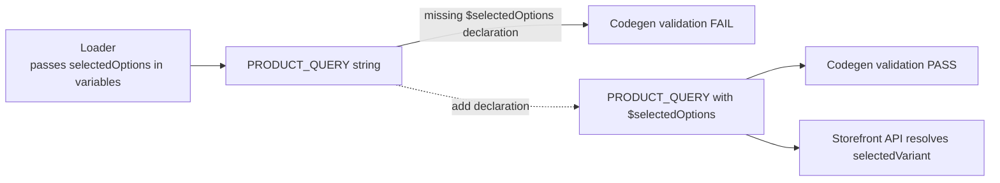

# Plan: Fix codegen `$selectedOptions` not defined in `PRODUCT_QUERY`

**Slug:** fix-codegen-selectedoptions-not-defined
**Bug report:** `docs/bugs/codegen-selectedoptions-not-defined.md`
**Investigation:** `docs/bugs/codegen-selectedoptions-not-defined-investigation.md`
**Author:** Architect (Claude)
**Date:** 2026-05-18
**Revision:** 2 (addresses review at `docs/reviews/fix-codegen-selectedoptions-not-defined-review.md`)

---

## 1. Problem statement and goals

### Root cause (from investigation)

`PRODUCT_QUERY` in `app/routes/($locale).products.$productHandle.jsx` (lines 499–535) references `$selectedOptions` through its expanded `PRODUCT_FRAGMENT` (line 482: `variantBySelectedOptions(selectedOptions: $selectedOptions)`), but the operation header declares only three variables: `$country`, `$language`, `$handle`. GraphQL schema validation requires every variable used inside the operation (including via fragment spreads) to be declared in the operation signature. Codegen therefore emits:

```
[Codegen] GraphQL Document Validation failed with 1 errors;
Error 0: Variable "$selectedOptions" is not defined by operation "Product".
```

The loader at line 62 already passes `selectedOptions` (sourced from `getSelectedProductOptions(request)` at line 59) inside the `variables` object, so the JavaScript side is correct. The defect is isolated to the GraphQL operation string.

### Goal

Add a single variable declaration to `PRODUCT_QUERY` so the operation header matches the actual variable usage. After the fix:

1. `npm run dev` and `npm run build` complete codegen with zero `Variable "$selectedOptions" is not defined` errors.
2. The product page route continues to render and `selectedVariant` resolves correctly.
3. No other code changes ship with this fix.

---

## 2. Non-goals

- No refactor of `PRODUCT_FRAGMENT`, `PRODUCT_VARIANT_FRAGMENT`, or `MEDIA_FRAGMENT`.
- No changes to the loader (`loadCriticalData`) — it already passes `selectedOptions` correctly.
- No changes to `storefrontapi.generated.d.ts` by hand (regenerated automatically by `npm run build`).
- No conversion of `.jsx` to `.tsx`.
- No reorganization of where `PRODUCT_QUERY` lives.
- No drive-by edits to other GraphQL queries in the route file (e.g., `RECOMMENDED_PRODUCTS_QUERY`).
- No new dev fixtures, lint rules, or codegen configuration changes.

---

## 3. Proposed design

A single-line addition inside the `PRODUCT_QUERY` operation header. The variable type is `[SelectedOptionInput!]!` to match the schema signature of `variantBySelectedOptions(selectedOptions:)` (a non-nullable array of non-nullable `SelectedOptionInput`).



The fragment is unchanged; only the operation header gets the new variable line. This is the minimum surgical change consistent with the GraphQL spec and the existing loader.

---

## 4. Affected files and modules

| File                                               | Change                                                                                                                                                                                                                                                                   |
| -------------------------------------------------- | ------------------------------------------------------------------------------------------------------------------------------------------------------------------------------------------------------------------------------------------------------------------------ |
| `app/routes/($locale).products.$productHandle.jsx` | Add `$selectedOptions: [SelectedOptionInput!]!` to the `PRODUCT_QUERY` variable list (lines 500–504).                                                                                                                                                                    |
| `storefrontapi.generated.d.ts`                     | Will be regenerated automatically by `npm run build` (the `--codegen` flag). Do NOT hand-edit. The Coder must accept whatever codegen emits — the file's diff shape is not specified by this plan; the only requirement is that `npm run build` exits cleanly afterward. |

No other files are touched. The investigation explicitly cleared `app/components/Cart.jsx`, `app/lib/seo.server.js`, and `app/data/fragments.js` — those use `selectedOptions` as a field, not a query variable.

---

## 5. Context and caveats

### Stale `docs/QA-DEBUG-REPORT.md` — explicitly superseded

`docs/QA-DEBUG-REPORT.md` (lines 6, 39, 74) describes the OPPOSITE failure mode (`$selectedOptions` declared but unused, recommending the declaration be removed). That report reflects an earlier code state and is **superseded by this plan and the linked investigation**. The current file at line 482 unambiguously uses `$selectedOptions`, so the correct fix is to ADD the declaration, not remove it.

**Directive to the Coder:** Follow THIS plan. Do not act on the contradictory guidance in `docs/QA-DEBUG-REPORT.md`. After this fix lands, that stale report should be archived or marked superseded in a follow-up cleanup (out of scope here).

---

## 6. Data model and API changes

### GraphQL operation change

**Before** (lines 499–504 of `app/routes/($locale).products.$productHandle.jsx`):

```graphql
const PRODUCT_QUERY = `#graphql
  query Product(
    $country: CountryCode
    $language: LanguageCode
    $handle: String!
  ) @inContext(country: $country, language: $language) {
```

**After**:

```graphql
const PRODUCT_QUERY = `#graphql
  query Product(
    $country: CountryCode
    $language: LanguageCode
    $handle: String!
    $selectedOptions: [SelectedOptionInput!]!
  ) @inContext(country: $country, language: $language) {
```

The `$selectedOptions` line is inserted between `$handle: String!` and the closing `)`. Indentation matches the surrounding variables (4 spaces inside the template literal, as in the existing variables).

### Type signature impact

`ProductQueryVariables` in `storefrontapi.generated.d.ts` already declares:

```ts
selectedOptions: SelectedOptionInput | Array<SelectedOptionInput>;
```

Adding the missing GraphQL declaration aligns the operation string with the existing generated type. Codegen will regenerate `storefrontapi.generated.d.ts` as part of `npm run build`. The Coder should accept whatever it produces and must not hand-edit the regenerated file; the success criterion is `npm run build` exiting cleanly, not a particular diff shape.

### Runtime / loader behavior

No change. The loader at line 62 already supplies `selectedOptions` in the `variables` object. The fix simply makes the operation legal so the value the loader passes is actually accepted by the GraphQL validator.

---

## 7. Risks, edge cases, and open questions

### Risks

1. **Schema mismatch on the variable type.** The investigation specifies `[SelectedOptionInput!]!`. If the schema treats `selectedOptions` as nullable or as a non-list, codegen will produce a new validation error. Mitigation: the generated `ProductQueryVariables` already types this as `SelectedOptionInput | Array<SelectedOptionInput>`, and `variantBySelectedOptions` in the Storefront API requires a non-empty list. If codegen complains after the change, adjust the nullability per the codegen error message — but do not change it preemptively.
2. **Variable order.** GraphQL does not care about variable order, so inserting after `$handle` is safe.
3. **Trailing whitespace / template literal whitespace.** The existing file has a blank line at line 534 inside the template. Preserve the existing formatting; only insert the new line, do not reformat.

### Edge cases

- **Product page with no `?variant=` query string.** `getSelectedProductOptions(request)` returns an empty array `[]` when no options are present. `[SelectedOptionInput!]!` accepts `[]` as a valid non-null empty list, and `variantBySelectedOptions` returns null, after which the loader falls back to `product.variants.nodes[0]` (line 80). No behavior change.
- **Product page with explicit variant options.** `selectedOptions` is a populated array. The newly-declared variable carries the value through. The `selectedVariant` field resolves to the matching variant. No behavior change.

### Open questions

None. The investigation is unambiguous: one-line variable declaration on `PRODUCT_QUERY`.

### Regression risk areas (for QA)

Copied from the investigation for QA's convenience:

1. **Product page route** (`/products/<handle>`) — primary site of the fix; must render correctly with and without a `?variant=...` query string.
2. **Generated types** (`storefrontapi.generated.d.ts`) — regenerated by `npm run build`. The Coder should accept whatever codegen emits; QA's only verification here is that `npm run build` exits cleanly.
3. **Other `selectedOptions` consumers** — `Cart.jsx`, `seo.server.js`, `fragments.js` all use it as a field, not a variable. Not affected.
4. **Other queries in the same file** — `RECOMMENDED_PRODUCTS_QUERY` does not use `$selectedOptions`. Not affected.

---

## 8. Follow-up / known limitations

Out of scope for this fix, but recorded here for the next planning cycle:

- **Codegen validation errors are currently non-fatal warnings.** The original bug shipped because `npm run build` emitted the `Variable "$selectedOptions" is not defined` error as a warning rather than failing the build. A follow-up task should configure the codegen step to treat GraphQL document-validation errors as hard build failures, so this class of regression cannot ship again. This will likely involve adjusting the codegen invocation flags or the build script — it is a configuration change that deserves its own plan and its own review.
- **Archive `docs/QA-DEBUG-REPORT.md`** (or annotate it as superseded) so future readers don't encounter contradictory guidance.

Neither item is required for this fix to be considered done.

---

## 9. Step-by-step implementation checklist for the Coder

Execute in order. Do not skip steps.

1. **Open** `app/routes/($locale).products.$productHandle.jsx`.

2. **Locate** the `PRODUCT_QUERY` constant starting at line 499. Confirm the operation header currently reads:

   ```graphql
   query Product(
     $country: CountryCode
     $language: LanguageCode
     $handle: String!
   ) @inContext(country: $country, language: $language) {
   ```

3. **Insert one new line** after `$handle: String!` and before the closing `)`:

   ```
       $selectedOptions: [SelectedOptionInput!]!
   ```

   Match the indentation of the existing variable lines (same number of leading spaces as `$handle: String!`). The resulting header must read:

   ```graphql
   query Product(
     $country: CountryCode
     $language: LanguageCode
     $handle: String!
     $selectedOptions: [SelectedOptionInput!]!
   ) @inContext(country: $country, language: $language) {
   ```

4. **Pre-save audit** (per project conventions in `CLAUDE.md`):

   - Confirm no duplicate `loader` exports were introduced.
   - Confirm no unused imports were added (none should be — this is a string-literal change).
   - Confirm the template literal is still syntactically valid (no stray backticks, no broken interpolations).

5. **Save** the file. Do not modify any other line of this file. Do not touch any other file. **Reminder:** Disregard the contradictory guidance in `docs/QA-DEBUG-REPORT.md` (it is stale and superseded — see Section 5).

6. **Run lint:**

   ```bash
   npm run lint
   ```

   Must return clean (no new errors or warnings introduced by this change).

7. **Run build (codegen + type validation):**

   ```bash
   npm run build
   ```

   Must complete with no `Variable "$selectedOptions" is not defined` error. The build will regenerate `storefrontapi.generated.d.ts`. Accept whatever codegen produces — do not hand-edit the regenerated file. The success criterion is a clean build exit, not a specific diff shape.

8. **Start the dev server** and confirm codegen runs clean:

   ```bash
   npm run dev
   ```

   Watch the terminal output during startup. The previous warning:

   ```
   [Codegen] GraphQL Document Validation failed with 1 errors;
   Error 0: Variable "$selectedOptions" is not defined by operation "Product".
   ```

   must no longer appear.

9. **Smoke-test the product page** in a browser.

   9a. **Discover a real product handle.** `docs/dev-fixtures.md` does not yet list a canonical fixture product, and no handle should be assumed. With the dev server running, open `http://localhost:3000` in a browser, navigate the storefront (the homepage, a collection page, or `/collections`) until you see a product link, and note its URL slug (the path segment after `/products/`). Do NOT guess a Shopify-default handle — use one you have just visually confirmed exists on this specific dev store (`theme-evolution-os2-hydrogen.myshopify.com`).

   9b. **Navigate to the product page** using the discovered handle:

   ```
   http://localhost:3000/products/<discovered-handle>
   ```

   Verify:

   - HTTP 200 response.
   - Page renders product title, price, image(s), and variant selector (if the product has multiple variants).
   - No React hydration warnings in the DevTools console.
   - Selecting a variant updates the URL and the displayed variant (this exercises `selectedVariant: variantBySelectedOptions(selectedOptions: $selectedOptions)`).

   9c. **Analytics Contract verification** (project requirement per `CLAUDE.md`). Open DevTools and confirm one of the following:

   - The React component tree (via React DevTools) contains `<Analytics.ProductView>` and its `data` prop includes `products[0].variantId` set to a non-empty string, OR
   - The analytics event fires (visible in the Network tab or console, depending on the analytics sink) with a non-empty `variantId`.

   If `variantId` is empty or missing, the Analytics Contract is violated and the fix is not complete — stop and report it in the impl notes.

10. **Write impl notes** to `docs/plans/fix-codegen-selectedoptions-not-defined-impl-notes.md`:
    - Confirm the one-line change was made.
    - List the verification outputs (lint clean, build clean, dev server starts without the warning, product page renders, Analytics Contract verified).
    - Note the product handle used for the smoke test (so QA can reuse it).
    - Note whether `storefrontapi.generated.d.ts` regenerated with any diff (describe the diff shape briefly; do NOT assert it must be empty or whitespace-only).

### Definition of done

All six must hold:

1. `npm run lint` passes.
2. `npm run build` passes with no `$selectedOptions`-related codegen error.
3. `npm run dev` starts cleanly with no codegen warning in the terminal.
4. The product page at `http://localhost:3000/products/<discovered-handle>` renders correctly and variant selection works.
5. `<Analytics.ProductView>` receives a non-empty `variantId` on the product page (Analytics Contract).
6. Only `app/routes/($locale).products.$productHandle.jsx` is modified by hand; `storefrontapi.generated.d.ts` is regenerated by codegen (not hand-edited), and whatever it produces is accepted as long as the build exits cleanly.
