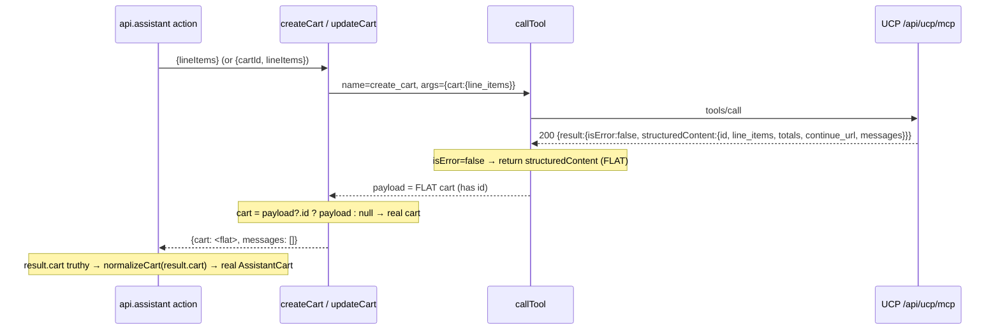

# Fix Plan: `create_cart` / `update_cart` success payload is flat, not nested under `.cart`

**Slug:** `fix-ucp-cart-create-flat-shape`
**Type:** Bug fix (root-cause plan)
**Author:** Architect
**Date:** 2026-07-15
**Bug report:** `docs/bugs/ucp-cart-create-flat-shape.md`
**Investigation (root-cause source):** `docs/bugs/ucp-cart-create-flat-shape-investigation.md`
**Severity:** High — the assistant add-to-cart path fails on every success.

---

## 1. Root cause statement

Per the investigation (`docs/bugs/ucp-cart-create-flat-shape-investigation.md`, "Root cause" and the live curl probe of `ashford-quantum.myshopify.com`, 2026-07-15), a successful UCP `create_cart` returns the cart object **FLAT** at `result.structuredContent`: `id`, `line_items`, `currency`, `totals[]`, `continue_url`, and `messages` all sit at the top level. **There is no `.cart` key.**

`callTool()` returns that raw `result.structuredContent` unmodified as `payload` (`app/lib/mcp.server.js:252`, returned at `:274` — confirmed: it does not unwrap or normalize anything). But `createCart()` reads `payload.cart ?? null` (`:386`), and `payload.cart` is `undefined` on the flat shape, so the `?? null` fallback fires on **every** success. The route action receives `result.cart === null` (`app/routes/($locale).api.assistant.jsx:163`), its `if (!cart)` guard (`:164`) treats a real created cart as a failure, and surfaces a generic `tool_error`. `updateCart()` has the byte-identical defect at `:441`.

The misleading "nested at `structuredContent.cart`" comments (`:339–343`, `:381–384`) were **inferred from Dev MCP schema docs** against the old `theme-evolution-os2-hydrogen` store, where `create_cart` always crashed upstream with `-32603` — so no successful response was ever observed to contradict the inference. The existing `mcp-normalize.test.js` fixtures (`:316–329`) already pass a FLAT cart to `normalizeCart()`, quietly contradicting those comments. The reference implementation is `createCheckout()` (`:504–511`), which already correctly unwraps the whole flat `payload` (`checkout: payload ?? null`).

---

## 2. Goals

- Make a successful `create_cart` / `update_cart` return the real cart object so the assistant surfaces the cart + continue URL instead of a false `tool_error`.
- Correct the misleading response-shape comments so the next reader is not re-misled (the wrong comment is what propagated this bug — correcting it is part of the fix).
- Close the **zero-coverage** gap on `createCart()` / `updateCart()` with unit tests that fail against the current buggy code and pass after the fix.

## 3. Non-goals

- No refactor of `callTool()`, the auth-mode logic, the route action's control flow, or `mcp-normalize.js` behavior.
- No change to `createCheckout()` **code** (it is already correct — only a stale clause in its comment is corrected).
- No `.tsx` conversion, no dependency changes, no drive-by cleanups.
- No change to the route action (`($locale).api.assistant.jsx`) — its `normalizeCart(result.cart)` call and its null-cart defensive branch are already correct for the flat shape once `createCart`/`updateCart` return the real payload.

---

## 4. Design and the exact unwrap expression (justified)

### 4.1 What `callTool()` hands back

`callTool()` returns raw `result.structuredContent` (`app/lib/mcp.server.js:252`, `return payload` at `:274`). It does **not** normalize. Two relevant exit shapes:

1. **Hard business error** — `result.isError === true` → `callTool` **throws** `McpError('tool_error', {payload})` (`:267–271`). `createCart`/`updateCart` never reach their `return` on this path; the route's outer `try/catch` (and stale-cart retry) handles it.
2. **Success or soft business outcome** — `result.isError === false` → `callTool` **returns** the payload. Per `callTool`'s own JSDoc (`:70–74`), a _soft_ business error is a `isError:false` result whose `structuredContent.messages[]` carries `type:"error"` entries and **no cart fields**; callers are expected to inspect it themselves (this is exactly the case the route's defensive `if (!cart)` branch at `:164–173` and its comment at `:165` accommodate — "not observed live, but the messages[] contract allows it").

So the return-path payload is EITHER a flat cart (has an `id`) OR a soft-error envelope (no `id`, has `messages[]`).

### 4.2 Why the fix is NOT bare `payload ?? null`

The investigation's high-level suggestion (`payload ?? null`) fixes the success case but **regresses the soft-error case**: a soft-error envelope `{messages:[{type:"error",...}], ...}` is a truthy object, so `payload ?? null` returns it as a non-null "cart". The route's `if (!cart)` guard (`:164`) would then pass, `normalizeCart()` would run on a cart with `id: undefined`, and the route would proceed as if it succeeded (with `checkoutUrl` undefined → a doomed `create_checkout` fallback on `cart.id === undefined`). That silently defeats the route's documented defensive contract.

**Chosen expression:** guard on the cart's identifying field, mirroring the _intent_ of the original `?? null` (return null when there is no cart) while matching the flat shape:

```js
cart: payload?.id ? payload : null,
```

The flat success cart always carries `id` (the Cart GID — see the investigation's probe: `structuredContent.id` at top level). A soft-error envelope has no `id`. This satisfies BOTH required test cases (success → non-null; soft error → null) and preserves the route's `if (!cart)` defensive path. It follows `createCheckout`'s "unwrap the whole payload" model, tightened with an identity guard appropriate to the return-path soft-error contract that `createCheckout` does not itself guard (see Ambiguity Log AL-2).

### 4.3 `messages` path — confirmed correct, mirrored to the reference

Per the live probe (investigation, response excerpt), the flat success payload carries `messages: []` at the **top level**. So `payload.messages` is the right path and needs no relocation. To mirror `createCheckout` exactly (`messages: payload?.messages ?? []`, `:510`) and to stay null-safe, the fix uses optional chaining: `messages: payload?.messages ?? []`.

### 4.4 Data flow (after fix)



---

## 5. The exact change, file by file

### 5.1 `app/lib/mcp.server.js` — `createCart()` JSDoc response-shape comment (`~339–343`)

**Before:**

```js
 * Response shape (PROBED + Dev MCP, corrects an earlier flat-payload
 * assumption): the cart object is nested at `structuredContent.cart`, NOT
 * flat at `structuredContent` — unlike search_catalog/create_checkout, whose
 * payloads ARE the top-level structuredContent object. `cart.continue_url`
 * and `cart.totals[]` live inside that nested `cart` object.
```

**After:**

```js
 * Response shape (PROBED live 2026-07-15 against ashford-quantum.myshopify.com,
 * UCP no-auth mode): a successful create_cart payload is FLAT at
 * `structuredContent` — cart fields (`id`, `line_items`, `totals`,
 * `continue_url`, `messages`) sit at the top level, exactly like
 * search_catalog and create_checkout. There is NO nested `.cart` key. The
 * earlier "nested at structuredContent.cart" claim was inferred from Dev MCP
 * schema docs against the old dev store, where create_cart always crashed
 * upstream (-32603) so no successful response was ever observed. The flat
 * shape is the live-verified truth and matches the mcp-normalize.test.js
 * fixtures.
```

### 5.2 `app/lib/mcp.server.js` — `createCart()` return (`~380–388`)

**Before:**

```js
const payload = await callTool(callOpts);
// Success: structuredContent.cart. Business-error (tool_error) payloads
// observed live carry NO .cart key at all (just ucp/messages/continue_url) —
// the ?? null fallback keeps the caller's cart-presence check honest rather
// than fabricating a cart from the error envelope.
return {
  cart: payload.cart ?? null,
  messages: payload.messages ?? [],
};
```

**After:**

```js
const payload = await callTool(callOpts);
// Success: the payload IS the flat cart object (id/line_items/totals/
// continue_url/messages at top level) — mirror createCheckout, which unwraps
// the whole payload. Guard on the cart's identifying `id` so a NON-thrown
// soft business-outcome payload (isError:false with error messages[] and no
// cart fields — see callTool's business-error contract) still yields
// cart:null, preserving the route's defensive cart-presence check.
return {
  cart: payload?.id ? payload : null,
  messages: payload?.messages ?? [],
};
```

### 5.3 `app/lib/mcp.server.js` — `updateCart()` return (`~439–443`)

**Before:**

```js
const payload = await callTool(callOpts);
return {
  cart: payload.cart ?? null,
  messages: payload.messages ?? [],
};
```

**After:**

```js
const payload = await callTool(callOpts);
// Same flat shape as create_cart (see createCart above): the payload IS the
// cart object; there is no nested `.cart` key. Guard on `id` so a soft
// business-outcome payload (no cart fields) still yields cart:null.
return {
  cart: payload?.id ? payload : null,
  messages: payload?.messages ?? [],
};
```

### 5.4 `app/lib/mcp.server.js` — `createCheckout()` comment clause only (`~505–507`), NO CODE CHANGE

The `createCheckout` **code** is correct and must not change. Only the stale clause claiming cart tools nest is corrected so it stops propagating the myth.

**Before:**

```js
// Success: checkout fields are FLAT at structuredContent (id, status,
// messages, continue_url, totals[], line_items[]) — unlike the cart tools,
// which nest under a .cart key. There is no .checkout wrapper to unwrap.
```

**After:**

```js
// Success: checkout fields are FLAT at structuredContent (id, status,
// messages, continue_url, totals[], line_items[]) — the same flat shape as
// the cart tools (create_cart / update_cart) and search_catalog. There is no
// .checkout wrapper to unwrap.
```

### 5.5 `app/lib/mcp-normalize.js` — `normalizeCart()` doc accuracy (recommended, doc-only)

The `normalizeCart` JSDoc still says its input is `structuredContent.cart` (`~191`, `~205`). Functionally harmless (it reads top-level `rawCart.id/totals/line_items/currency/continue_url`, which exist on the flat payload), but it perpetuates the same wrong mental model. Recommended one-line correction (see AL-3):

- `~191`: `... (from create_cart / update_cart `structuredContent.cart`)` → `... (from create_cart / update_cart, whose payload is the flat `structuredContent`cart object — no`.cart` wrapper)`
- `~205`: `@param {object} rawCart - structuredContent.cart` → `@param {object} rawCart - the flat structuredContent cart object`

No other change to `mcp-normalize.js`.

---

## 6. Data model and API changes

None. No GraphQL fragments/queries change, so **no codegen regeneration is triggered** (`storefrontapi.generated.d.ts` untouched). The `{cart, messages}` return shape of `createCart`/`updateCart` is unchanged (`{cart: object|null, messages: object[]}`); only which value populates `cart` on success changes. `AssistantCart` and `normalizeCart` contracts are unchanged.

---

## 7. Regression risk areas

Feeds QA's regression matrix.

1. **`updateCart()` shares the identical logic.** Fixed in the same change (§5.3). Before the fix it silently returned `cart:null` on every success, so the "add to an existing cart" path (`route :156`) was already broken; the fix will start returning real carts. Regression check: exercise the _second_ add-to-cart in a session (a `cartId` is present → `updateCart` path) and confirm the cart updates rather than erroring.

2. **`createCheckout()` must NOT regress.** Its code is untouched (§5.4 is a comment-only edit). It already returns `checkout: payload ?? null` correctly. Regression check: the fallback handoff path (route `:184–196`, fires when `cart.checkoutUrl` is absent) still produces a checkout URL. Note the flat cart's `continue_url` is normally present, so `createCheckout` typically is NOT invoked — verify both the common path (continue_url present, no checkout call) and, if reproducible, the fallback.

3. **Normalize layer (`normalizeCart`).** After the fix, the route passes the flat payload (not `null`) to `normalizeCart(result.cart)` (`route :163`). `normalizeCart` reads top-level `id`, `totals[]`, `line_items[]`, `currency`, `continue_url` — all present on the flat payload (matches the existing `mcp-normalize.test.js:316–329` fixture). No behavior change in `normalizeCart` itself; risk is only that it now actually receives data. Regression check: `npm run test:unit` — the existing `normalizeCart` suite must stay green.

4. **Route null-cart / stale-cart retry path — the `cart:null` business case must stay correct.** The investigation flags a stale-cart retry (route `:197–249`). Two distinct null scenarios must be preserved:

   - **Hard cart_id error (stale/invalid cart_id):** arrives as `isError:true` → `callTool` throws `tool_error` → caught at `route :197`, `isCartIdError()` matches → clears cartId → retries via `createCart` without cart*id → `cartReset:true`. The fix does not touch this throw path; it only makes the \_retry's* `createCart` return a real cart instead of `null` (previously the retry double-failed). Regression check: submit a stale `cartId`, confirm a fresh cart is created and `cartReset:true` is returned (previously impossible).
   - **Soft business outcome (isError:false, no cart fields):** the `payload?.id` guard (§4.2) preserves `cart:null` here, so the route's `if (!cart)` guard (`:164`, `:214`) still surfaces the intended `tool_error` instead of fabricating a junk cart. This is the case a bare `payload ?? null` fix would break — the unit tests in §8 pin it.

5. **`messages[]` on success.** Now that success returns a real cart, `messages: payload?.messages ?? []` is populated from the top-level `messages` (empty `[]` on the observed success). The route does not currently read `result.messages` on the success path, so no behavior change; noted only so QA knows `messages` is intentionally surfaced for future use.

6. **`isCartIdError()` unaffected.** It reads `mcpError.detail.payload.messages` from a _thrown_ `tool_error` (`route :294–309`), independent of the `createCart` return-shape fix. No change, no regression expected.

---

## 8. Test plan (mandatory — currently ZERO coverage on `createCart`/`updateCart`)

Add a new `describe` block to the **existing** `app/lib/mcp.server.test.js` (do not create a new file — the harness, `withPasswordShim`, `BASE_OPTS`, and `__resetForTests()` already live there). Import `createCart` and `updateCart` alongside the existing `callTool`/`McpError` import. Tests use the same injected `fetchImpl` pattern that returns a mocked JSON-RPC `Response`, so `createCart`/`updateCart` exercise the real `callTool` end to end without a network.

Shared success fixture (flat, mirrors the investigation's live probe excerpt):

```js
const FLAT_CART_PAYLOAD = {
  id: 'gid://shopify/Cart/hWNEWlsFaRz4?key=abc',
  line_items: [{id: 'gid://shopify/CartLine/1', quantity: 1}],
  currency: 'USD',
  totals: [
    {type: 'subtotal', amount: 72995, display_text: 'Subtotal'},
    {type: 'total', amount: 72995, display_text: 'Total'},
  ],
  continue_url:
    'https://ashford-quantum.myshopify.com/cart/c/hWNEWlsFaRz4?key=abc',
  messages: [],
};
```

Soft business-error fixture (isError:false, no cart identity):

```js
const SOFT_ERROR_PAYLOAD = {
  ucp: {status: 'error'},
  messages: [{type: 'error', code: 'some_soft_error', content: 'soft failure'}],
};
```

Each mocked response wraps the fixture as `{jsonrpc:'2.0', id:1, result:{structuredContent: <fixture>, isError: <false>}}` with a 200 + `Content-Type: application/json`, served via `withPasswordShim(...)` (or `plainFetch` with `authMode:'none'`). Call `__resetForTests()` at the top of each test, matching the existing suite.

Required cases:

| #   | Tool         | Fixture (isError)                                   | Assertion                                                                                                                                    | Current code                                               | After fix                                                                                 |
| --- | ------------ | --------------------------------------------------- | -------------------------------------------------------------------------------------------------------------------------------------------- | ---------------------------------------------------------- | ----------------------------------------------------------------------------------------- |
| 1   | `createCart` | `FLAT_CART_PAYLOAD` (false)                         | `result.cart` is non-null, `result.cart.id === FLAT_CART_PAYLOAD.id`, `result.cart.continue_url` present, `result.messages` deep-equals `[]` | **FAILS** (`payload.cart` undefined → null) — pins the bug | **PASSES**                                                                                |
| 2   | `createCart` | `SOFT_ERROR_PAYLOAD` (false)                        | `result.cart === null`, `result.messages` deep-equals the error `messages[]`                                                                 | passes (guard)                                             | passes — and would FAIL a naive `payload ?? null` mis-fix, distinguishing the correct fix |
| 3   | `updateCart` | `FLAT_CART_PAYLOAD` (false), called with a `cartId` | `result.cart` non-null with `id`                                                                                                             | **FAILS** — pins the bug                                   | **PASSES**                                                                                |
| 4   | `updateCart` | `SOFT_ERROR_PAYLOAD` (false)                        | `result.cart === null`, messages preserved                                                                                                   | passes (guard)                                             | passes                                                                                    |

Bug-pinning requirement: cases **1 and 3 fail against the current code and pass after the fix** (this is what genuinely pins the bug). Cases 2 and 4 are contract guards that stay green AND specifically catch the tempting-but-wrong bare `payload ?? null` implementation (AL-1) — without them a reviewer could "fix" the bug while reintroducing the soft-error regression.

Optional (recommended, not required): a case asserting `createCart` **rejects** with `McpError('tool_error')` when the mocked `result.isError === true`, documenting that hard business errors throw (not return null) — this matches the existing `callTool` `tool_error` test at `:164–194` and clarifies the two error paths.

No changes to `mcp-normalize.test.js` are required; its existing flat-cart fixture already covers `normalizeCart`.

---

## 9. Verification steps

Run in order; all must pass before the fix is declared done:

1. `npm run lint` — clean (ESLint over `.js/.jsx`).
2. `npm run build` — completes without errors. This is the project's type-check + production-build gate (codegen bundled via `--codegen`); there is no separate `typecheck` script. No GraphQL changed, so generated types should be identical.
3. `npm run test:unit` — all green, including the four new cases (§8). Confirm cases 1 and 3 fail on the pre-fix code (run once before applying §5.2/§5.3) to prove they pin the bug, then pass after.
4. **Live re-verification (QA re-runs the bug report's repro):** with `PUBLIC_STORE_DOMAIN=ashford-quantum.myshopify.com` and `UCP_AUTH_MODE=none` (bug report "Steps to reproduce" 1–3), open the assistant, `search_catalog` for a product, and add it to the cart. Expected: the assistant reports the cart was created and surfaces the cart / continue URL (bug report "Expected behavior") — **no** `tool_error`. Confirm "reproduced before / not after" against the original screenshot `docs/qa/screenshots/ucp-no-auth-mode-pass2-cart-tool-error.png`. Also add a second item in the same session (exercises the `updateCart` path, §7 risk 1) and confirm the cart updates.
5. Baseline smoke (CLAUDE.md "Verification"): `curl -s -o /dev/null -w "%{http_code}\n" http://localhost:3000` → 200; no React hydration warnings in console.

---

## 10. Ambiguity Log

- **AL-1 — Unwrap discriminator: `payload?.id ? payload : null` vs bare `payload ?? null`.** The investigation suggested bare `payload ?? null`, which mirrors `createCheckout` literally. **Recommendation: use the `id`-guarded form** (§4.2). Tradeoff: bare `payload ?? null` is one token simpler and matches `createCheckout` exactly, but it returns a truthy junk "cart" for a non-thrown soft-error envelope (`isError:false` + error `messages[]`, no cart fields), defeating the route's documented defensive `if (!cart)` branch (`route :164–173`) and feeding `normalizeCart` a cart with `id: undefined`. The `id` guard costs nothing at runtime, satisfies the required soft-error test (§8 case 2/4), and is faithful to the _intent_ of the original `?? null`. Committing to the guard, not hedging.

- **AL-2 — `createCheckout` has the same latent soft-error gap (`checkout: payload ?? null`, `:509`).** A soft-error checkout payload would likewise be returned as a truthy junk checkout. **Recommendation: leave `createCheckout` code unchanged in this fix** — it is out of scope (works today, no soft-error observed live for checkout, and the checkout call only fires as a rare fallback). Flagging it here as a known parallel so it is a deliberate deferral, not an oversight. If a follow-up wants symmetry, it should apply the same `payload?.id` guard to `createCheckout` under its own bug/plan.

- **AL-3 — Doc-only corrections beyond the two cart functions.** The `normalizeCart` JSDoc (`mcp-normalize.js:191`, `:205`) and the `mcp-normalize.test.js:305–313` header comment still reference `structuredContent.cart`. **Recommendation: include the two-line `normalizeCart` JSDoc fix (§5.5)** since it is the same propagated error and near-zero risk; **treat the test-file comment as optional** (it is a comment in a test that already uses the flat shape correctly). This is a doc-accuracy judgment call, surfaced rather than silently expanded.

- **AL-4 — `messages` optional chaining.** Changing `payload.messages` → `payload?.messages` (§5.2/§5.3) is a defensive mirror of `createCheckout`. On the success return path `payload` is always defined (`callTool` throws `empty_result` otherwise), so this is behavior-neutral today. Included for consistency with the reference and null-safety; no downside identified.

---

## 11. Step-by-step implementation checklist for the Coder

1. Re-read `CLAUDE.md` (Anti-Stubbing Rule, `.jsx`+JSDoc, do not hand-edit generated types, do not touch `.env`).
2. In `app/lib/mcp.server.js`:
   a. Replace the `createCart` JSDoc response-shape comment (§5.1).
   b. Change `createCart`'s return to `cart: payload?.id ? payload : null` + `messages: payload?.messages ?? []` and replace the inline comment (§5.2).
   c. Apply the identical change + comment to `updateCart`'s return (§5.3).
   d. Correct only the stale clause in `createCheckout`'s success comment (§5.4) — **do not touch its code**.
3. In `app/lib/mcp-normalize.js`: apply the two `normalizeCart` JSDoc one-line corrections (§5.5). No code change.
4. Pre-save audit (CLAUDE.md): no duplicate exports, no unused imports, no stray declarations introduced.
5. In `app/lib/mcp.server.test.js`: add `createCart, updateCart` to the existing `mcp.server.js` import; append a new `describe('createCart / updateCart — flat UCP cart payload', ...)` block with the four cases in §8 (and optionally the thrown-`tool_error` case), reusing `withPasswordShim`/`plainFetch`, `BASE_OPTS`, and `__resetForTests()`.
6. Prove the pin: run `npm run test:unit` BEFORE applying step 2b/2c to confirm cases 1 and 3 fail; then apply the fix and confirm all green.
7. Run `npm run lint`, then `npm run build`. Both must pass.
8. Write `docs/plans/fix-ucp-cart-create-flat-shape-impl-notes.md` summarizing the change and the before/after test result, then hand off to QA for the live re-verification (§9 step 4).
