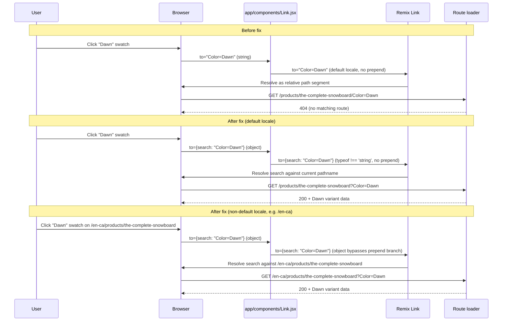

# Fix: Variant swatch clicks return 404 instead of switching variants

**Bug slug:** `variant-clicks-return-404`
**Plan slug:** `fix-variant-clicks-return-404`
**Date:** 2026-05-18
**Revision:** 2 (addresses `docs/reviews/fix-variant-clicks-return-404-review.md`)
**References:**
- Bug report: `docs/bugs/variant-clicks-return-404.md`
- Investigation: `docs/bugs/variant-clicks-return-404-investigation.md`
- Review: `docs/reviews/fix-variant-clicks-return-404-review.md`

---

## 1. Root cause statement

Per the investigation (`docs/bugs/variant-clicks-return-404-investigation.md`, "Root cause" and "Mechanism"):

`getProductOptions` from `@shopify/hydrogen` returns `variantUriQuery` as a **bare query string** (e.g. `"Color=Dawn"`) — the output of `URLSearchParams.toString()`, which does not include a leading `?`. The product route at `app/routes/($locale).products.$productHandle.jsx` passes this value directly as the `to` prop to the project's `<Link>` wrapper at two sites (line 274 inside the `Listbox` dropdown and line 299 inside the swatch grid).

Remix's `<Link>` treats a string `to` that does not begin with `/` (or `?`) as a **relative path segment**. So `to="Color=Dawn"` on a URL of `/products/the-complete-snowboard` resolves to `/products/the-complete-snowboard/Color=Dawn` — a path with no matching route in the Remix file router. The loader 404s and the variant never switches.

The fix is to pass an **object-form `to` prop**: `to={{search: variantUriQuery}}`. Remix understands the object form (`Path` object with `pathname` / `search` / `hash` fields), resolves the search string against the current pathname, and — critically — **bypasses the locale-prefix prepend branch** in `app/components/Link.jsx` (line 30), which only fires when `typeof to === 'string'`. This avoids both the original 404 and the latent non-default-locale regression flagged in review Issue 1.

---

## 2. Goals and scope

### Goals

- Variant swatch clicks and Listbox option clicks update the URL via query string (`?Color=Dawn`) and trigger a normal loader-driven variant switch, returning HTTP 200.
- Fix is **surgical**: two single-prop edits at the two known call sites in one file. No new helpers, no refactor.
- Variant switching works correctly on **both the default locale and any non-default locale-prefixed route**. The object-form `to` makes this a single change that handles both cases.

### Non-goals (explicitly out of scope)

- Refactoring `variantUriQuery` construction into a shared helper (`getVariantLinks`, etc.). The investigation listed this as Option B but did not recommend it; not pursued here.
- Modifying the `<Link>` wrapper at `app/components/Link.jsx`. The object-form `to` already bypasses the wrapper's `typeof === 'string'` guard, so the wrapper does not need to learn about `?`-prefixed strings.
- Re-shaping any GraphQL fragment or query. The Storefront-API-side variant resolution is verified correct in the bug report (direct query-string navigation returns HTTP 200 and the right variant GID).
- Converting `.jsx` files to `.tsx`. Project conventions forbid drive-by conversions.
- Touching SEO, analytics, or recommendation logic. Verified untouched by the fix mechanically; only checked as regression areas.
- Fixing the unrelated `preserveControl` prop oddity on the swatch `<Link>`. See Section 6, OQ2.

---

## 3. Files to modify

### Sole file changed

`app/routes/($locale).products.$productHandle.jsx` — two `to`-prop edits.

#### Change 1: Listbox option `<Link>` (line 274)

Before:

```jsx
<Link
  to={value.variantUriQuery}
  preventScrollReset
  prefetch="intent"
  className={clsx(
```

After:

```jsx
<Link
  to={{search: value.variantUriQuery}}
  preventScrollReset
  prefetch="intent"
  className={clsx(
```

#### Change 2: Swatch grid `<Link>` (line 299)

Before:

```jsx
option.optionValues.map(({name, variantUriQuery, selected, swatch}) => (
  <Link
    key={name}
    to={variantUriQuery}
    preserveControl
    prefetch="intent"
    preventScrollReset
```

After:

```jsx
option.optionValues.map(({name, variantUriQuery, selected, swatch}) => (
  <Link
    key={name}
    to={{search: variantUriQuery}}
    preserveControl
    prefetch="intent"
    preventScrollReset
```

That is the entire code change. No other lines, files, fragments, or types are modified.

**Note on `preserveControl`:** the swatch `<Link>` at line 300 passes a `preserveControl` prop that is not a recognized Remix or Hydrogen `<Link>` prop and is not destructured in `app/components/Link.jsx`. It will fall through into `...resOfProps` and become a DOM attribute on the underlying `<a>`. **This is pre-existing and unrelated to this bug.** Do not remove or "fix" it in this pass — it is recorded as an observation in OQ2 of Section 6 for a separate cleanup ticket.

### Files NOT modified (and why)

- `app/components/Link.jsx` — the object-form `to` bypasses the locale-prepend branch via the existing `typeof to === 'string'` guard at line 30. No wrapper change needed.
- `app/lib/variants.js` — does not exist; no local helper is being introduced.
- `app/lib/seo.server.js` — SEO payload uses `request.url` server-side and is unaffected by client-side `<Link>` `to` formatting.
- The product GraphQL fragments — `variantUriQuery` is computed client-side by the SDK, not fetched from Storefront API. No fragment change required.

---

## 4. Step-by-step implementation checklist for the Coder

Execute sequentially. Run lint + build only after both edits are in place to avoid noise.

1. **Capture baseline lint count.** Before any edits, run `npm run lint` and record the **exact** error count and full output in the impl notes. The expected baseline is 73 pre-existing errors. This number is the bar to compare against post-fix: any increase means the fix introduced a new lint error. (Use `git stash && npm run lint && git stash pop` if local working changes might pollute the baseline.)
2. Open `app/routes/($locale).products.$productHandle.jsx`.
3. At line 274 (inside the `Listbox.Option` render prop), change `to={value.variantUriQuery}` to `to={{search: value.variantUriQuery}}`. Use object-form `to` — pass a `Path` object literal with `search` populated. **Do not** use the string `?`-prefix form; the string form is intentionally rejected for this fix because `app/components/Link.jsx` would prepend `pathPrefix` and break locale-prefixed routes.
4. At line 299 (inside the `option.optionValues.map(...)` for the swatch grid), change `to={variantUriQuery}` to `to={{search: variantUriQuery}}`. Same pattern as step 3.
5. Pre-save audit (per `CLAUDE.md`): re-scan the file for duplicate exports, conflicting declarations, and unused imports. None should appear — the edit does not touch imports or exports.
6. Save the file.
7. Run `npm run lint`. Confirm the error count is **exactly equal** to the baseline captured in step 1. Any increase = a new error was introduced and must be addressed before continuing.
8. Run `npm run build`. The build must (a) exit zero, **and** (b) produce terminal output with **zero codegen warnings of any kind** — not just zero of the two prior-fix-era warnings. Capture the full build output in impl notes. If any codegen warning appears, stop and investigate before proceeding.
9. Start the dev server with `npm run dev`. Confirm startup completes without new warnings.
10. Execute the manual verification checks in Section 7 below.
11. Write `docs/plans/fix-variant-clicks-return-404-impl-notes.md` with: (a) the two edited line numbers, (b) lint baseline + post-fix counts with diff evidence, (c) build-pass evidence including the codegen-clean confirmation, (d) screenshots/console-output evidence for the manual checks (including the mandatory locale-prefix regression check from Section 7 step 6), (e) any observations on the `preserveControl` prop for a separate cleanup follow-up.

---

## 5. Data model and API changes

**None.**

- No GraphQL fragment changes.
- No new fields fetched.
- No generated type regeneration triggered (no `--codegen` impact).
- No new loader/action behavior. The existing loader already correctly resolves a variant from `?Color=Dawn` query params via `getSelectedProductOptions(request)` — confirmed in the bug report ("Direct navigation via query param DOES work").

The fix is purely a client-side URL-construction correction at two `<Link>` call sites, changing the `to` prop from a bare string to an object-form `Path`.

---

## 6. Risks, edge cases, and open questions

### Regression risk areas (cross-reference: same list mirrored into `docs/bugs/variant-clicks-return-404.md`)

The following code paths share infrastructure with the change and should be verified post-fix:

1. **Locale-prefix handling in `app/components/Link.jsx`.** The wrapper at lines 30–33 prepends `selectedLocale.pathPrefix` **only when `typeof to === 'string'`**. The object-form `to={{search: variantUriQuery}}` falls into the `else`-side of that guard and is passed verbatim to `<RemixLink>`. Remix then resolves an object `to` with only `search` set against the **current** pathname — preserving `/en-ca/products/<handle>` correctly on locale-prefixed routes. This is precisely why the object form was chosen over the `?`-prefix string form.
2. **Analytics variant-click events.** No analytics is wired to the swatch `<Link>` `onClick` today, but `<Analytics.ProductView>` at line 189 receives `selectedVariant.id`. Variant switching must still re-render the page with a new `selectedVariant` so `variantId` updates. Verify item 5 in Section 7.
3. **URL prefetch (`prefetch="intent"`).** Remix prefetches the resolved URL on hover. With the object-form `to`, prefetch targets become `/products/<handle>?Color=Dawn` (correct) rather than `/products/<handle>/Color=Dawn` (404). Prefetch should now stop generating 404 noise in the dev server log.
4. **SEO canonicals (`seoPayload.product` at line 82).** Runs server-side from `request.url`, so it is structurally unaffected by client-side `<Link>` `to` formatting. After the fix, when a user navigates via the variant click, the server-rendered canonical/og:url for that variant should reflect the query-string URL. **Explicit verification step added — see Section 7 step 4a.**
5. **Other call sites of `getProductOptions`.** The investigation confirmed none exist elsewhere in the codebase at the time of writing. If any are added in the future, they will hit the same bug.

### Edge cases

- **Default locale, no prefix.** `pathPrefix` is `''` (see `app/lib/utils.js` line 241 `DEFAULT_LOCALE`). The Link wrapper's locale-prepend branch is skipped entirely for both string and object `to` props. Object `to={{search: "Color=Dawn"}}` reaches Remix verbatim and resolves correctly against the current `/products/<handle>` pathname. **Verified safe.**
- **Non-default locale, with prefix (e.g. `/en-ca`).** The wrapper's `typeof to === 'string'` guard short-circuits for object `to`, so no prepend occurs. Remix resolves the object `to` against the current pathname `/en-ca/products/<handle>`, producing `/en-ca/products/<handle>?Color=Dawn`. **This is the case that the string `?`-prefix form would have broken** — review Issue 1 — and is the technical reason for adopting the object form.
- **Multi-option variants** (e.g. Color + Size). `variantUriQuery` from the SDK already serializes all selected options together — e.g. `"Color=Dawn&Size=Medium"` — so it slots into `{search: ...}` unchanged. No special handling needed.
- **Empty `variantUriQuery`.** If the SDK ever returns an empty string (current variant matches the option being rendered), the object becomes `{search: ""}`. Remix interprets this as "current path with empty search"; harmless. The SDK's current behavior is to return a non-empty string for non-selected option values, so this is theoretical.
- **Hydration safety.** The change is a pure object-literal construction inside server-side React render output. The same object shape is computed identically on server and client (both call `getProductOptions(product)` with the same input). No new hydration mismatch surface area.

### Open questions

**OQ1 — Resolved.** Earlier revision left non-default-locale safety as an open question. Adopting object-form `to={{search: variantUriQuery}}` resolves it definitively: the wrapper's `typeof to === 'string'` guard at line 30 excludes objects from the locale-prepend branch, so the same single-site change correctly handles both default and non-default locales. No follow-up bug needed. Verification step 6 in Section 7 proves it empirically.

**OQ2 — `preserveControl` prop at line 300.** The swatch `<Link>` passes a `preserveControl` prop that is not a recognized Remix `<Link>` prop and is not destructured in `app/components/Link.jsx`. It will fall through into `...resOfProps` and become a DOM attribute on the `<a>`. This is a pre-existing oddity unrelated to the bug; **do not** fix it as part of this plan. The Coder should record it as a separate observation in impl notes for a possible follow-up `cleanup-` ticket.

---

## 7. Verification steps

All checks must pass before declaring the bug fixed. Record evidence in `docs/plans/fix-variant-clicks-return-404-impl-notes.md`.

1. **Lint clean (relative to baseline).** Run `npm run lint`. Compare against the pre-edit baseline captured in Section 4 step 1. The error count post-fix must equal the baseline exactly. Record both numbers in impl notes.
2. **Build passes cleanly.** Run `npm run build`. Must (a) exit zero, **and** (b) produce terminal output with zero codegen warnings of any kind. Capture full build output. This is the project's effective type-check (includes codegen). Per `CLAUDE.md`, no separate `typecheck` script exists.
3. **Dev server starts cleanly.** Run `npm run dev`. Confirm no new warnings (compare against a known-clean baseline run if possible). Server reachable at `http://localhost:3000`.
4. **Variant click navigates with query string (HTTP 200).** Open `http://localhost:3000/products/the-complete-snowboard`. Click a non-selected Color swatch (e.g. "Dawn"). Verify:
   - Browser URL becomes `http://localhost:3000/products/the-complete-snowboard?Color=Dawn` (query-param form, no path segment).
   - Network tab shows the loader request returning **HTTP 200**, not 404.
   - Dev server log shows `GET 200 loader /products/the-complete-snowboard` (with `?Color=Dawn` query) — **no** `GET 404 loader /products/the-complete-snowboard/Color=Dawn`.

   **4a. SEO canonical reflects the variant query string.** Still on the post-click page, open the browser's **View Source** (Cmd-Opt-U) and search for `<link rel="canonical"`. Confirm the `href` attribute contains `?Color=Dawn` (e.g. `href="...://.../products/the-complete-snowboard?Color=Dawn"`), not a path-segment form. This is a single-line view-source check. Capture the line in impl notes.
5. **Variant data updates after click.** After step 4's click:
   - Price (`<Money>` output) updates to reflect the Dawn variant.
   - Product gallery / featured image updates to the Dawn variant's images.
   - The `<Analytics.ProductView>` `variantId` reflects the new variant GID. Inspect with React DevTools or check the analytics network payload.
   - Swatch selection state (`selected` border on the active swatch) moves to Dawn.
6. **Locale-prefixed URL regression check — MANDATORY.** This step is a hard pass/fail requirement, not conditional.
   - **Discover the locale prefix.** Inspect `app/data/countries.js` (the authoritative `countries` map; `app/lib/utils.js` just imports it) to identify a non-default `pathPrefix`. The US default has an empty prefix; the canonical non-default example is `en-ca` (see line 32). Substitute another available prefix if `en-ca` is not configured.
   - Navigate to `http://localhost:3000/en-ca/products/the-complete-snowboard` (or the discovered locale-prefixed equivalent).
   - Click a Color swatch (e.g. "Dawn").
   - **Required outcome:** URL becomes `http://localhost:3000/en-ca/products/the-complete-snowboard?Color=Dawn` (locale prefix preserved, product handle preserved, query string appended). HTTP 200. Variant switches as in step 5.
   - **Failure modes to detect:** if the URL becomes `/en-ca?Color=Dawn` (handle dropped), or `/en-ca/products/the-complete-snowboard/Color=Dawn` (path segment), or 404s — the fix is incorrect or incomplete. Stop and do not mark the bug fixed.
   - **If the locale prefix is genuinely unavailable in the dev store** (e.g. `countries` contains only `default`, no alternative is reachable): the Coder must explicitly document this in impl notes — quote the relevant portion of `app/data/countries.js`, state which prefixes were attempted and how each failed, and flag it as a verification gap requiring follow-up. **Do not silently skip.** This is the only acceptable form of "could not run" for step 6, and it requires the documented evidence above.
7. **No new console errors or hydration warnings.** Open DevTools console on the test product page (default locale). Click through several variant swatches. Confirm:
   - No new React hydration warnings.
   - No new console errors.
   - Any pre-existing warnings remain unchanged in count and content.

---

## 8. Implementation diagram



---

## 9. Revision log

**Revision 2 (2026-05-18)** — Addresses `docs/reviews/fix-variant-clicks-return-404-review.md` (APPROVE WITH CHANGES):

- **Change 1 (MAJOR, review Issue 1):** Switched fix from string `?`-prefix form (`to={\`?${variantUriQuery}\`}`) to object-form `to={{search: variantUriQuery}}`. Root cause statement, files-to-modify diffs, sequence diagram, edge-case analysis, and OQ1 all updated. The object form bypasses `app/components/Link.jsx`'s `typeof to === 'string'` guard at line 30, resolving the non-default-locale regression in the same single-site change. OQ1 is now closed (resolved), not deferred.
- **Change 2 (MAJOR, review Issue 2):** Verification step 6 is now a mandatory pass/fail requirement with a concrete URL (`/en-ca/products/the-complete-snowboard`) and explicit failure modes. The "not testable in current dev setup" escape hatch is removed; the only acceptable non-execution requires documented evidence quoting `app/data/countries.js` and listing attempted prefixes.
- **Change 3 (MINOR, review Issue 5):** Added explicit SEO canonical verification as step 4a — view-source check for `<link rel="canonical">` containing `?Color=Dawn`.
- **Change 4 (MINOR, review Issue 4):** Section 4 step 1 now requires the Coder to capture baseline lint output (count and full output) before any edits. Step 7 / Section 7 step 1 require exact equality against that baseline.
- **Change 5 (MINOR, review Issue 3):** Added explicit acknowledgement of the pre-existing `preserveControl` prop oddity near Change 2 in Section 3, with a clear "do not remove or fix it in this pass" directive. OQ2 retained as an observation-only entry.
- **Change 6 (MINOR, review Issue not numbered but in revisions list):** Section 4 step 8 and Section 7 step 2 now require build verification to confirm zero codegen warnings of any kind, not merely a zero exit code.

Unchanged from Revision 1: root cause direction (still a `<Link>`/`variantUriQuery` interaction; only the fix expression changed from string to object form), scope (still the two call sites in the same file), file list, regression-risk areas, Analytics Contract check, hydration-safety notes.
