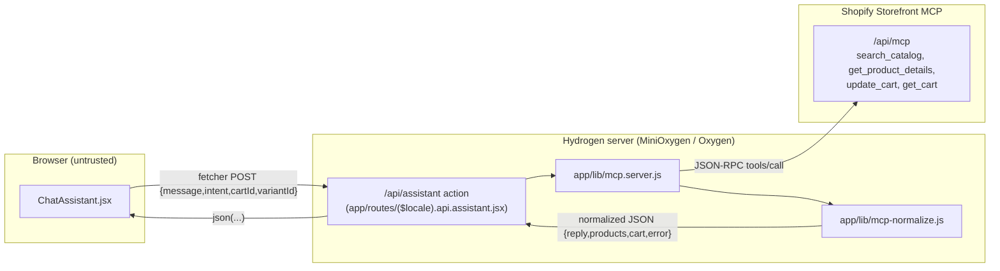

# AI Shopping Assistant powered by Shopify Storefront MCP (standard `/api/mcp`)

Plan slug: `mcp-shopping-assistant`
Status: REVISED — revision 3 (substantive re-architecture). Pivot from the two-endpoint UCP design to the standard `/api/mcp` endpoint, driven by the Coder's live probe findings (`docs/plans/mcp-shopping-assistant-impl-notes.md`). The UCP `/api/ucp/mcp` endpoint is **blocked by the dev store's storefront password** and is out of reach for this session.
Owner: Architect
Date: 2026-06-27

### Revision changelog

- **Revision 1** — Addressed the Plan-Reviewer's first `APPROVE WITH CHANGES` pass (required changes #1–#7, findings G1–G4, and the `update_cart` key contradiction). Added AL-18 (PDP/handle), AL-19 (Analytics Contract), AL-20 (`update_cart` key), and OQ-8/OQ-9.
- **Revision 2** — Single blocker **N1** from the Plan-Reviewer's third pass: Hydrogen 2026-04 `Analytics` exposes no `Analytics.ItemView`. Replaced all `<Analytics.ItemView>` references with `<Analytics.ProductView>` using `data={{products: [ProductPayload]}}`. AL-19 marked corrected/SUPERSEDED.
- **Revision 3 (this pass)** — **Endpoint pivot.** The Coder executed the §8.1 probe sequence against the live dev store before writing any feature code and hit a stop condition: the plan's two-endpoint UCP assumptions are contradicted by the real MCP surface. The operator decided the direction: **target the standard `/api/mcp` endpoint for ALL tools** (UCP `/api/ucp/mcp` is blocked by the storefront password — out of scope this session, documented as a Next step). All shapes below are now grounded in the Coder's live probe results (probes 1–6), not docs assumptions. Concretely, this revision:
  - Removed the two-endpoint architecture, the `meta["ucp-agent"].profile` plumbing, the agent-profile section (former §0.6), and the `MCP_AGENT_PROFILE_URL` env var entirely. The feature now requires **no new environment variable**.
  - Replaced `result.structuredContent` with `JSON.parse(result.content[0].text)` + `result.isError` everywhere (AL-12 corrected from live probe 3).
  - Renamed the detail tool `get_product` → **`get_product_details`** (argument `product_id`, not `catalog.id` — probe 4).
  - Replaced the cart line-item field `merchandise_id` → **`product_variant_id`** (probe 5), kept `add_items`.
  - Replaced the stale-cart auto-create disambiguation with explicit `isError` handling + clear-stored-`cartId` (probe 6).
  - Replaced the price normalizer's single integer-minor-units assumption with an explicit **two-path** contract: `search_catalog` returns integer minor units (`{amount, currency}`), while `get_product_details` and cart costs return **decimal strings** (probe 3 vs probes 4/5). Note the `currency` (not `currencyCode`) key on every Money-like object.
  - Reconciled the image mapper to the real media shape: field is `alt_text` (not `altText`), and there is **no `width`/`height`** (probe 3). Media host is `cdn.shopify.com` (CSP-safe — resolves G3).
  - **Dropped the local PDP `<Link>` entirely** for this session: products carry no `handle` and `get_product_details.url` is `null` (probes 3/4). Cart `checkout_url` handoff is the sole product destination (supersedes AL-18/OQ-8).
  - Analytics wiring unchanged from revision 2 (`<Analytics.ProductView>`, `variantId` from `variants[0].id`, `ProductPayload.price` is a string).

> Scope guard: this is a tight, few-hours feature. A chat panel, one server-side Remix action acting as the MCP client (single `/api/mcp` endpoint), product discovery via `search_catalog` + detail via `get_product_details`, and cart assistance via `update_cart`. Everything else (customer-account MCP, checkout completion, the preview framework-agnostic Hydrogen, and the UCP `/api/ucp/mcp` migration) is explicitly out of scope and documented under "Next steps," not designed.

---

## 0. Ground truth: verified facts vs. assumptions

This section is the spine of the plan. As of revision 3, the load-bearing shapes are **verified from live probes** against `theme-evolution-os2-hydrogen.myshopify.com` (recorded in `docs/plans/mcp-shopping-assistant-impl-notes.md`, probes 1–6). Items labelled **PROBED** are facts confirmed against the live endpoint and must NOT be re-assumed. Items labelled **ASSUMPTION** or **OPEN** still require empirical confirmation by the Coder during implementation. Items labelled **FACT** were confirmed via the Shopify Dev MCP / `WebSearch` during planning.

### 0.1 Endpoint (PROBED — single endpoint, no auth, no agent profile)

| Surface                 | Endpoint                               | Tools                                                                                               | Auth                              |
| :---------------------- | :------------------------------------- | :-------------------------------------------------------------------------------------------------- | :-------------------------------- |
| Standard Storefront MCP | `https://{shop}.myshopify.com/api/mcp` | `search_catalog`, `get_cart`, `update_cart`, `search_shop_policies_and_faqs`, `get_product_details` | none (no token, no agent profile) |

- **PROBED (probe 2)** — `tools/list` on `https://theme-evolution-os2-hydrogen.myshopify.com/api/mcp` returns HTTP 200 and lists exactly: `search_catalog`, `get_cart`, `update_cart`, `search_shop_policies_and_faqs`, `get_product_details`. **Every tool the feature needs lives on this one endpoint.** No agent profile and no storefront token are required for these calls.
- **PROBED (probe 1)** — `https://theme-evolution-os2-hydrogen.myshopify.com/api/ucp/mcp` returns `302` → `/password` regardless of headers or request body. The store's storefront password gates the UCP endpoint. **The UCP endpoint is OUT of scope for this session.** It is documented as a Next step (migrate when the password is removed or a path exception is configured).
- **PROBED (probe 2)** — Each `search_catalog`/`update_cart` response carries a DEPRECATION NOTICE in `result.content[1].text`: _"This tool is served by the Storefront MCP server at /api/mcp and will no longer be accessible after August 31, 2026. Migrate to the UCP-conforming Cart MCP tools at /api/ucp/mcp."_ The feature **ignores `content[1].text`** (parses only `content[0].text`). This deprecation is an **accepted, documented trade-off** the operator chose for this session (see OQ-3 and Next steps).

### 0.2 `search_catalog` (PROBED — probe 3)

- Request (JSON-RPC 2.0 `tools/call`): `params.name = "search_catalog"`, `params.arguments = { catalog: { query, context?, filters?, pagination? } }`. **No `meta`/agent profile.**
  - `catalog.query` — free-text string (e.g. `"snowboard"`).
  - `catalog.context` — `{ address_country, language?, currency?, intent? }`. **Always include `context.address_country` (e.g. `"US"`) for best relevance.**
  - `catalog.filters` — e.g. `price: { min, max }` in **minor currency units**; `categories`.
  - `catalog.pagination` — `{ cursor?, limit? }`; default 10.
- Response envelope (PROBED — supersedes the old `structuredContent` assumption, AL-12):
  - `result.content[0].text` → a **stringified JSON** string → `JSON.parse(...)` → `{ ucp, products[], pagination, messages, instructions }`.
  - `result.isError` → boolean. Check this before trusting the payload.
  - `result.content[1].text` → deprecation notice — **ignore**.
- Verified product shape (probe 3), abbreviated:

```jsonc
{
  "id": "gid://shopify/Product/9356161155292", // PROBED: real Product GID (not a UPID gid://shopify/p/…)
  "title": "The Inventory Not Tracked Snowboard",
  "description": {"html": "…"},
  "price_range": {
    "min": {"amount": 94995, "currency": "USD"}, // PROBED: INTEGER MINOR UNITS + `currency` (not currencyCode) → $949.95
    "max": {"amount": 94995, "currency": "USD"}
  },
  "variants": [
    {
      "id": "gid://shopify/ProductVariant/50239738609884", // PROBED: present → firstVariantId for add-to-cart + Analytics
      "title": "Default Title",
      "price": {"amount": 94995, "currency": "USD"},
      "availability": {"available": true},
      "options": [{"name": "Title", "label": "Default Title"}],
      "media": [{"type": "image", "url": "https://cdn.shopify.com/s/files/…"}] // PROBED: variant media has NO alt_text
    }
  ],
  "options": [{"name": "Title", "values": [{"label": "Default Title"}]}],
  "media": [
    {
      "type": "image",
      "url": "https://cdn.shopify.com/s/files/…", // PROBED: host cdn.shopify.com (CSP-safe, G3 resolved)
      "alt_text": "Top and bottom view of a snowboard…" // PROBED: field is `alt_text` (NOT altText); NO width/height
    }
  ],
  "tags": ["Accessory", "Sport", "Winter"]
}
```

- **PROBED — no `handle`, no product `url`** on `search_catalog` products. A local PDP `<Link>` cannot be built from search data (see §3.5: the PDP link is dropped).
- **PROBED — store data:** 15 products, all snowboard-related (Shopify sample data). Text queries for terms not in the store (e.g. `"shirt"`) return 0 products — a legitimate **empty** result, not an error.

### 0.3 `get_product_details` (PROBED — probe 4)

- Tool name is **`get_product_details`** (NOT `get_product`).
- Request: `params.name = "get_product_details"`, `params.arguments = { product_id: "gid://shopify/Product/…" }`. The argument is a flat **`product_id`** string — NOT a `catalog.id` wrapper, and no agent profile.
- Response: `JSON.parse(result.content[0].text).product`, verified shape (probe 4):

```jsonc
{
  "product_id": "gid://shopify/Product/9356161155292",
  "title": "The Inventory Not Tracked Snowboard",
  "description": "Engineered with sustainable Graphene-infused…",
  "url": null, // PROBED: null — no PDP destination
  "image_url": "https://cdn.shopify.com/s/files/…",
  "images": [{"url": "https://cdn.shopify.com/s/files/…", "alt_text": "…"}], // PROBED: images[] (not media[]), alt_text, no width/height
  "options": [{"name": "Title", "values": ["Default Title"]}],
  "total_variants": 1,
  "price_range": {"min": "949.95", "max": "949.95", "currency": "USD"}, // PROBED: DECIMAL STRINGS + `currency`
  "selectedOrFirstAvailableVariant": {
    "variant_id": "gid://shopify/ProductVariant/50239738609884", // PROBED: variant_id (not variants[].id)
    "title": "Default Title",
    "price": "949.95", // PROBED: DECIMAL STRING
    "currency": "USD",
    "image_url": "…",
    "image_alt_text": "…",
    "available": true,
    "selected_options": [{"name": "Title", "value": "Default Title"}]
  }
}
```

- **PROBED — `url` is `null`, no `handle`.** Confirms the PDP link is unsatisfiable from detail data too. Checkout handoff is the sole destination (§3.5).
- **PROBED — price format diverges from `search_catalog`.** `get_product_details` returns **decimal strings** (`"949.95"`) with a separate `currency`, while `search_catalog` returns **integer minor units** (`94995`). The normalizer must handle both paths explicitly (§5.3, AL-21).
- **PROBED — field-name differences** from the catalog shape: `product_id` (not `id`), `selectedOrFirstAvailableVariant.variant_id` (not `variants[0].id`), `images[]` (not `media[]`), decimal-string prices. `normalizeProductDetail` needs its own mapping.

### 0.4 Cart tools — standard `/api/mcp` only (PROBED — probes 5, 6)

The standard `/api/mcp` `update_cart`/`get_cart` are the **only** accessible cart surface this session (the UCP Cart MCP at `/api/ucp/mcp` is blocked, §0.1). There is no longer a surface-choice decision; the former surface-B (UCP PUT-replace) design is a Next step only.

- **`update_cart` request** (PROBED — probe 5): `params.name = "update_cart"`, `params.arguments = { cart_id?, add_items: [{ product_variant_id: "gid://shopify/ProductVariant/…", quantity }] }`.
  - **PROBED — the line-item field is `product_variant_id`, NOT `merchandise_id`.** Sending `merchandise_id` errors: _"object at `/add_items/0` is missing required properties: product_variant_id"_ (AL-20 resolved).
  - **PROBED — `add_items` is the correct array key** (the `lines`-vs-`add_items` ambiguity is settled; it is `add_items`).
  - Omitting `cart_id` creates a fresh cart. `quantity: 0` removes an item.
- **`update_cart` response** (PROBED — probe 5): `JSON.parse(result.content[0].text)` → `{ instructions, cart, errors }`. The `cart` object carries `id`, `lines[]`, `cost.total_amount` (decimal string + `currency`), `total_quantity`, and **`checkout_url`** (the handoff destination). `result.isError` is the success/failure flag.
- **`get_cart`** returns the same `cart` envelope (incl. `checkout_url`).
- **Stale/invalid `cart_id`** (PROBED — probe 6): does NOT auto-create. Two failure shapes:
  - Invalid GID format → `isError: true`, message _"Invalid cart_id format…"_.
  - Valid format but non-existent → `isError: true`, `errors: [{ field: ["cart_id"], message: "The specified cart does not exist." }]`.
  - The action must catch `isError: true` on a submitted `cart_id`, **clear the stored `cartId`**, and let the next `add` create a fresh cart (§5.4). The previous `cartCreated` auto-create-disambiguation is removed.
- **Cart cost format:** decimal strings (`"949.95"`) + `currency` key — same path as `get_product_details`, NOT the `search_catalog` integer path (§5.3, AL-21).
- **Deprecation (PROBED notice, accepted trade-off):** these standard cart tools are flagged toward the UCP Cart MCP and unavailable after 2026-08-31. The operator accepted this for the session; migration is a documented Next step (OQ-3).

### 0.5 Rate limits / cost budget (FACT + one unconfirmed figure)

- **FACT** — Cart/Checkout MCP rate limits scale by trust tier: **Token > Signed > Anonymous**; unauthenticated requests are anonymous-tier. On throttle, the server returns `Retry-After`; clients should retry after that delay with exponential backoff + jitter. Source: Cart MCP server doc / "Auth and rate limiting."
- **UNCONFIRMED (ASSUMPTION)** — The brief's "~1,000 cost points/min" figure was not reproduced by Dev MCP searches, and could not be probed for `/api/mcp`. The §3.4 budget design is conservative regardless. This is OQ-5.

### 0.6 Canonical reference (FACT)

- **FACT** — The official tutorial "Build a Storefront AI agent" (`https://shopify.dev/docs/apps/build/storefront-mcp/build-storefront-ai-agent?framework=reactRouter`) has a React Router variant — the closest match to this Remix/React-Router Hydrogen app. Treat it as the canonical transport pattern (fetch + JSON-RPC `tools/call`); the §3.3 client reproduces it. Note: where the tutorial differs from the **live probed shapes** (envelope, field names, endpoint), the probed shapes win.

---

## 1. Problem statement and goals

Add an AI shopping-assistant chat panel to the Hydrogen storefront. A shopper types natural language ("do you have any snowboards under $1000?"); the storefront answers by calling Shopify's Storefront MCP server-side at `/api/mcp`, rendering product results with the project's Hydrogen helpers, and letting the shopper add a chosen variant to an assistant cart from within the chat, then hand off to `checkout_url`.

Goals:

1. A chat UI panel component mounted globally in the storefront (floating launcher + slide-out/drawer panel). Simple is fine.
2. A **single server-side Remix action** that acts as the MCP client: natural-language discovery via `search_catalog`, detail/variant resolution via `get_product_details`, and cart assistance via `update_cart` — all against the single `/api/mcp` endpoint.
3. Results rendered with existing Hydrogen patterns and helpers (`<Image>`/`` fallback, `<Money>`). No local PDP `<Link>` this session (the MCP surface provides no handle/URL — §3.5).
4. **All MCP calls server-side.** The browser only ever talks to our own same-origin `/api/assistant` route. The trust boundary is explicit (§3.1).
5. Robust handling of error / empty / timeout / rate-limit responses (no stubbed/fake product data — Anti-Stubbing Rule applies). The error path and the empty-results path are **distinct and individually verified** (§3.5, §8) — neither may masquerade as the other.
6. Keep all files `.jsx` + JSDoc; no native TypeScript; no GraphQL fragment changes (MCP is JSON-RPC, not Storefront GraphQL — see §5).

Non-functional:

- The chat panel must SSR cleanly (no `window`/`document` at render; open/close state gated behind `useIsHydrated` to avoid hydration mismatch).
- No new heavy runtime dependencies. MCP calls use the platform `fetch`; JSON-RPC bodies are hand-built (matching the tutorial pattern). No MCP SDK is required. The only test-time addition is Node's **built-in** test runner (`node --test`, zero dependencies) for the `callTool` unit test (§8.4).

## 2. Non-goals

- **UCP `/api/ucp/mcp` migration** — blocked this session by the dev-store storefront password (PROBED, §0.1). Out of scope; see Next steps.
- **Customer-account MCP** — needs Level 2 protected data + the Next-Gen platform. Out of scope; see Next steps.
- **Checkout completion** (`create_checkout` / `complete_checkout`, Checkout MCP) — out of scope. The assistant surfaces the cart `checkout_url` for handoff but does not drive completion.
- **The new preview framework-agnostic Hydrogen** — not adopted; build on current stable Remix/React-Router Hydrogen.
- **Streaming LLM responses / a third-party LLM planner** — out of scope. The "assistant" is a thin deterministic orchestration layer mapping user intent to MCP tool calls.
- **UCP Cart MCP PUT-replace cart** — documented but not implemented; we use the standard `/api/mcp` cart tools (the only accessible surface).
- **Unifying the MCP cart with the site's Hydrogen cart** — see the dual-cart caveat in §6 (OQ-1). Out of scope to merge them this pass.
- **A local PDP deep-link from chat** — dropped this session (no `handle`/`url` on the MCP surface, PROBED). See Next steps.
- **Persisting conversation history** server-side — chat state lives in component state for the session only.
- **i18n of assistant copy** — English strings, matching the rest of the codebase.

## 3. Proposed design

### 3.1 Trust boundary (explicit)



Rules enforced by the boundary:

- **MCP is called only from `*.server.js` / the route `action`.** `app/lib/mcp.server.js` carries the `.server.js` suffix so Remix/Vite never bundle it into the client graph. If any MCP call leaks into a component module, the build pulls server code client-side — that is a defect.
- The browser **never** receives the MCP endpoint URL or raw MCP payloads. It receives only the **normalized** view model (§5). `PUBLIC_STORE_DOMAIN` is technically public, but routing through our own action still buys us: server-side rate-limit/budget control, response normalization/sanitization, no browser CORS exposure, and a single place to add auth tiers later.
- The user's free-text message is treated as untrusted input: trimmed, length-capped, and passed only as `catalog.query` / tool arguments — never interpolated into the endpoint URL.

### 3.2 Request flow per user turn

```mermaid
sequenceDiagram
    participant U as Shopper
    participant C as ChatAssistant (browser)
    participant A as /api/assistant action (server)
    participant M as mcp.server.js
    participant S as Shopify MCP (/api/mcp)

    U->>C: "snowboards under $1000"
    C->>A: fetcher.submit {intent:"search", message}
    A->>M: searchCatalog({query, context})
    M->>S: POST /api/mcp search_catalog
    S-->>M: content[0].text → parse → {products[]}
    M-->>A: normalizeCatalogProducts(...)
    A-->>C: json({reply, products})
    C->>U: render product cards (<Image>/, <Money>)
    U->>C: click "Add to cart" on a variant
    C->>A: fetcher.submit {intent:"add", variantId, cartId?}
    A->>M: updateCart({cartId, add_items:[{product_variant_id, quantity:1}]})
    M->>S: POST /api/mcp update_cart
    S-->>M: content[0].text → parse → {cart, errors} ; isError?
    Note over A,M: if isError on a submitted cartId → clear stored cartId, retry without it (fresh cart)
    M-->>A: normalizeCart(cart)
    A-->>C: json({reply, cart})
    C->>U: show cart summary + checkout_url handoff
```

`intent` is a small server-routed enum: `"search"` (→ `search_catalog`), `"detail"` (→ `get_product_details`), `"add"` (→ `update_cart`). The action is a plain switch — no LLM planner. This keeps the cost budget predictable (one MCP tool call per turn, plus at most one bounded retry on the stale-cart path).

### 3.3 MCP client helper (`app/lib/mcp.server.js`) — call pattern

Reproduces the tutorial's `fetch` + JSON-RPC pattern (§0.6). Pure-ish: takes inputs, returns the **parsed `content[0].text`** payload or throws a typed `McpError`. There is no agent profile; every call hits the single `/api/mcp` endpoint.

**Testability requirement (for the 429 path, required change #3):** `callTool` accepts an injectable `fetchImpl` parameter (defaulting to platform `fetch`) so the 429/`Retry-After` branch can be unit-tested deterministically (§8.4).

**Logging discipline (G4, adopt):** mirror `api.newsletter.jsx` — no unconditional `console.log`; on error paths log a coarse error category/status only. NEVER log the raw user query or full MCP request/response payloads (PII-adjacent).

Skeleton (illustrative — Coder uses the PROBED field names from §0):

```js
// app/lib/mcp.server.js  (SERVER ONLY — never imported by a component)
const MCP_PATH = '/api/mcp';
const DEFAULT_TIMEOUT_MS = 10_000;

/** @param {{storeDomain:string}} */
function mcpEndpoint({storeDomain}) {
  return `https://${storeDomain}${MCP_PATH}`;
}

/**
 * Low-level JSON-RPC tools/call with timeout + error mapping.
 * Parses result.content[0].text (stringified JSON) and honors result.isError.
 * `fetchImpl` is injectable so the 429 branch is unit-testable (§8.4).
 */
async function callTool({
  endpoint,
  name,
  args,
  timeoutMs = DEFAULT_TIMEOUT_MS,
  fetchImpl = fetch,
}) {
  const ctrl = new AbortController();
  const t = setTimeout(() => ctrl.abort(), timeoutMs);
  try {
    const res = await fetchImpl(endpoint, {
      method: 'POST',
      headers: {'Content-Type': 'application/json'},
      signal: ctrl.signal,
      body: JSON.stringify({
        jsonrpc: '2.0',
        method: 'tools/call',
        id: 1,
        params: {name, arguments: args},
      }),
    });
    if (res.status === 429) {
      // Retry-After is assumed SECONDS (HTTP convention, AL-14); convert to ms.
      const retryAfterSec = Number(res.headers.get('Retry-After') ?? 0);
      throw new McpError('rate_limited', {retryAfterMs: retryAfterSec * 1000});
    }
    if (!res.ok) throw new McpError('http_error', {status: res.status});
    const data = await res.json();
    if (data.error) throw new McpError('rpc_error', {detail: data.error});
    const result = data.result;
    if (!result || !Array.isArray(result.content) || !result.content[0]) {
      throw new McpError('empty_result', {detail: data});
    }
    // PROBED: payload is the stringified JSON in content[0].text; content[1] is a deprecation notice (ignore).
    const payload = JSON.parse(result.content[0].text);
    if (result.isError) throw new McpError('tool_error', {payload}); // payload.errors carries field/message
    return payload;
  } catch (e) {
    if (e.name === 'AbortError') throw new McpError('timeout');
    throw e;
  } finally {
    clearTimeout(t);
  }
}
```

Higher-level exports: `searchCatalog`, `getProductDetails`, `updateCart`, `getCart` — each builds the right `arguments` (`searchCatalog` → `{catalog:{query,context,pagination}}`; `getProductDetails` → `{product_id}`; `updateCart` → `{cart_id?, add_items:[{product_variant_id, quantity}]}`) and delegates to `callTool`. Pure normalization lives in `mcp-normalize.js` (§5) so it is unit-testable without network.

For the **stale-cart path**, `updateCart` distinguishes the `tool_error` whose `payload.errors[0].field` includes `"cart_id"` (or the "Invalid cart_id format"/"does not exist" messages). The action layer (§5.4) catches that, clears the stored `cartId`, and retries `updateCart` once without a `cart_id` so a fresh cart is created.

### 3.4 Rate-limit / cost-budget design

Built conservative so it holds regardless of the exact per-minute budget (OQ-5, unverifiable for `/api/mcp` this session):

- **One tool call per user turn** (plus at most one bounded retry on the stale-cart path). The `intent` switch never fans out.
- **`pagination.limit` capped at a small constant** (`ASSISTANT_RESULT_LIMIT = 8`, in `app/lib/const.js`) — keeps payloads small.
- **No search-on-keystroke.** Search fires only on explicit submit.
- **Server-side short cache for identical queries.** Optional: memoize `(query,context)` → result for a few seconds to absorb double-submits. Keep simple.
- **Honor `Retry-After`.** On a `rate_limited` `McpError`, the action returns `{error:{type:'rate_limited', retryAfterMs}}` and the UI shows "One moment…" and disables Send for that window. A single bounded retry with jitter MAY be done server-side; no unbounded loop.
- **Testable, not just monitored (required change #3).** The 429 branch is exercised by a deterministic unit test (§8.4).

### 3.5 UI/UX

- Floating launcher button (bottom-right) toggles a panel. Reuse the project's `Drawer`/`Modal` primitives (`app/components/Drawer.jsx`) if they fit; otherwise a self-contained panel (the Coder's probe notes recommend a bespoke lightweight panel since `Drawer` is a full-screen `Dialog` overlay — OQ-2). Keep visual weight consistent with the site.
- Message list: user bubbles + assistant bubbles. Assistant product results render as a vertical list of `AssistantProductCard` (Hydrogen `<Image>` or `` fallback + `<Money>`).
- **Empty-results state vs. error state must be visually and behaviorally distinct (required change #2):**
  - **Empty results** (`products` is an empty array, no error): neutral/informational styling — "No matches found, try different words." Send stays **enabled**. (PROBED: legitimate for off-catalog queries like "shirt" against this snowboard-only store.)
  - **Error** (`error` present — config error, RPC/tool error, timeout, rate-limit): warning/error styling with a distinct icon and copy naming the failure class. Send may be disabled during a rate-limit cool-down. An error state is NEVER rendered as "No matches found," and empty results NEVER render as an error. Asserted in §8.3.
- **No local PDP link (PROBED — supersedes AL-18/OQ-8).** `search_catalog` products carry no `handle`/`url`, and `get_product_details.url` is `null`. There is no satisfiable local PDP destination this session, so the card renders **no PDP `<Link>`** (no dead/placeholder link — Anti-Stubbing). The card's product-facing destination is the **cart `checkout_url` handoff** after add-to-cart.
- "Add to cart" button per result/variant → `intent:"add"` submit. After success, show a compact cart summary (item count + total via `<Money>`) and a "Go to checkout" link using the returned **`checkout_url`** (external `<a target="_blank" rel="noopener noreferrer">`). On the stale-cart path (a submitted `cartId` that errored), the action clears the stored `cartId` and retries to create a fresh cart; the UI shows a small "started a new cart" note so the cart reset is visible.
- **Analytics Contract (required change #7 / G2, AL-19).** Each `AssistantProductCard` renders `<Analytics.ProductView>` with `data={{products: [ProductPayload]}}` — a single-element `products` array whose `ProductPayload` carries the card's `firstVariantId` (from the `search_catalog` `variants[0].id`, PROBED present) as its `variantId`, plus `id`, `title`, and `price` (a **string** — the decimal amount, NOT the Money object) from the normalized model — rendered only when `firstVariantId` is present. (Hydrogen 2026-04 `Analytics` exposes `Provider`, `ProductView`, `CartView`, `CollectionView`, `SearchView`, `CustomView` — no `ItemView`.) Cards live inside `PageLayout`, within Hydrogen's root `<Analytics.Provider>`, so context exists. PROBED: every product in this store carries `variants[0].id`, so no per-card exemption is expected; the exemption rule (skip the event rather than emit an empty id) remains as a safety net.
- Open/close state and any `window`-dependent behavior gated by `useIsHydrated` (`app/hooks/useIsHydrated.jsx`). The launcher renders disabled until hydrated, matching the footer-plan precedent, so SSR and first client render agree.

## 4. Affected files and modules

### New files

- `app/lib/mcp.server.js` — server-only MCP client. Exports `searchCatalog`, `getProductDetails`, `updateCart`, `getCart`, the `McpError` class, and an internal `callTool` (with injectable `fetchImpl`). Reads `PUBLIC_STORE_DOMAIN` from `context.env` (passed in by the action as an arg; it does NOT reach for a global). Single endpoint `/api/mcp`; no agent profile. `.server.js` suffix is mandatory for the trust boundary. Logging discipline per §3.3.
- `app/lib/mcp-normalize.js` — **pure functions**, no network, unit-testable: `normalizeCatalogProduct`, `normalizeCatalogProducts`, `normalizeProductDetail`, `normalizeCart`, plus `minorUnitsToDecimalString(amount, currencyCode)` and `toMoney(...)` helpers (§5.3). Handles BOTH price formats (integer minor units from `search_catalog`; decimal strings from `get_product_details`/cart). Maps the `currency` key → `currencyCode`. Importable anywhere (no `.server` suffix needed since pure), consumed server-side here.
- `app/lib/mcp.server.test.js` — **unit test** for `callTool`'s 429/`Retry-After` branch (required change #3). Uses Node's built-in test runner (`node --test`, zero new dependency): injects a fake `fetchImpl` returning a `Response` with status 429 + `Retry-After`, asserts `rate_limited` `McpError`, the parsed value, and seconds→ms conversion. See §8.4.
- `app/routes/($locale).api.assistant.jsx` — Remix resource route. `action` only (POST). Parses `{intent, message, variantId, productId, cartId}` from `formData`, applies the locale guard (mirroring `($locale).api.newsletter.jsx`), routes via the `intent` switch to `mcp.server.js`, returns `json({reply, products?, productDetail?, cart?, cartReset?, error?})`. Distinguishes RPC/tool error from zero products (required change #2) and handles the stale-cart `isError` path by clearing the submitted `cartId` and retrying (required change #4, revised). Default export returns `null` (GET no-op, matching `api.newsletter`/`api.countries`).
- `app/components/ChatAssistant.jsx` — the chat panel + launcher. Uses `useFetcher`, `useRouteLoaderData('root')` (optional-chained) for `selectedLocale.pathPrefix` to build the action URL (`` `${pathPrefix}/api/assistant` `` — plain string, NOT routed through `~/components/Link`; same pitfall as the footer plan). Holds conversation + `cartId` in `useState`. Renders the distinct empty vs. error states (§3.5) and the "started a new cart" note on `cartReset`.
- `app/components/AssistantProductCard.jsx` — renders one normalized product (Hydrogen `<Image>` or `` fallback, `<Money>`, an "Add to cart" button, and `<Analytics.ProductView>` with a `{products: [ProductPayload]}` payload when `firstVariantId` is present). **No PDP `<Link>`** (§3.5). Takes the **normalized MCP view model**, not a Storefront GraphQL product.

### Modified files

- `app/components/PageLayout.jsx` — mount `<ChatAssistant />` once in the global layout (alongside the footer), within Hydrogen's `<Analytics.Provider>` subtree so `<Analytics.ProductView>` has context. Single import + single render site.
- `app/lib/const.js` — add `ASSISTANT_RESULT_LIMIT`, `MCP_TIMEOUT_MS`, and any small UI constants. Data-only.

### Not modified

- GraphQL fragments / `app/data/fragments.js` — **no change** (MCP is JSON-RPC). See §5.
- Generated type declarations — untouched; no codegen diff (though `npm run build` still runs codegen).
- `server.js`, `entry.server.jsx`, `app/root.jsx` framework files — no change required. `PUBLIC_STORE_DOMAIN` is already in `context.env` (confirmed: `app/entry.server.jsx:23` reads `context.env.PUBLIC_STORE_DOMAIN`).
- `.env` / `.env.local` — **NOT edited.** This feature introduces **no new environment variable** (the former `MCP_AGENT_PROFILE_URL` is removed entirely).

## 5. Data model and API changes

### 5.1 No GraphQL / no codegen impact

MCP tools are JSON-RPC over HTTP, independent of the Storefront GraphQL API. **No fragment edits, no new queries, no `--codegen` diff.** `npm run build` still runs codegen and remains the type gate; it just won't change the generated declarations.

### 5.2 No new environment variable

- `PUBLIC_STORE_DOMAIN` already exists and is reused to build `https://{storeDomain}/api/mcp`.
- **No agent profile, no new env var.** The former `MCP_AGENT_PROFILE_URL` requirement is removed (the UCP endpoint that needed it is out of scope this session). The action reads only `PUBLIC_STORE_DOMAIN` from `context.env`; if it is somehow unset, the action returns a clear configuration error rather than calling MCP with an empty host.

### 5.3 Normalized view model (the browser-facing contract)

The browser never sees raw MCP JSON. `mcp-normalize.js` maps the PROBED MCP shapes (§0.2–§0.4) to this stable shape consumed by the components:

```ts
// Conceptual shapes (expressed as JSDoc typedefs in mcp-normalize.js)
AssistantProduct = {
  id: string, // gid://shopify/Product/… (PROBED: real Product GID)
  title: string,
  descriptionHtml: string, // from description.html (catalog) — render sanitized or as text
  priceRange: {min: Money, max: Money},
  image: {url: string, altText: string}, // PROBED: no width/height available from MCP
  firstVariantId: string, // gid://shopify/ProductVariant/… for add-to-cart AND the <Analytics.ProductView> payload's variantId (AL-19)
  available: boolean,
};
Money = {amount: string, currencyCode: string}; // <Money> shape: amount is DECIMAL string in MAJOR units
AssistantCart = {
  id: string,
  totalAmount: Money,
  lineCount: number, // from cart.total_quantity / lines length
  checkoutUrl: string, // PROBED: cart.checkout_url for handoff
};
// Action-level (not part of a product card): cartReset:boolean — true when a submitted cartId errored
// (stale cart, PROBED probe 6) and the action cleared it + created a fresh cart, so the UI can flag it.
```

Mapping rules (load-bearing):

- **Money conversion — TWO explicit paths (PROBED, AL-21).** Every Money-like source uses the key `currency` (NOT `currencyCode`); rename it to `currencyCode` in all paths. The amount handling differs by source:
  - **`search_catalog`** (`price_range.min.amount`, `variant.price.amount`): INTEGER MINOR UNITS. Convert with `minorUnitsToDecimalString(amount, currencyCode)` — divide by the currency's minor-unit exponent (NOT a hardcoded /100; zero-decimal currencies like JPY/KRW have exponent 0). Provide a small known zero-decimal set, default exponent 2; full ISO-4217 coverage is OQ-6. Do NOT pass minor-unit integers to `<Money>`.
  - **`get_product_details`** (`price_range.min`, `selectedOrFirstAvailableVariant.price`): ALREADY a DECIMAL STRING (`"949.95"`). Pass through as-is (no division); just attach `currencyCode` from the sibling `currency`.
  - **Cart cost** (`cart.cost.total_amount.amount`, line `cost.total_amount.amount`): ALREADY a DECIMAL STRING + `currency`. Same as the detail path.
  - `normalizeCatalogProduct` uses the integer path; `normalizeProductDetail` and `normalizeCart` use the decimal-string path. The normalizer must NOT apply minor-unit division to the decimal-string sources (that would render "$94,995.00" for a $949.95 item — the inverse of the catalog bug). This is the single most error-prone mapping; unit-test both paths if time permits.
- **Image (PROBED).** Map the MCP media to `{url, altText}` — field is **`alt_text`** (catalog product-level `media[].alt_text`; detail `images[].alt_text`). There is **no `width`/`height`** in any MCP media object. Render with Hydrogen `<Image src={url} ... />` in its external-URL form, OR a plain `` fallback — **without** passing fabricated `width`/`height`. Because dimensions are absent, prefer the `` form (or `<Image>` with an explicit `aspectRatio` and CSS-controlled sizing) so layout is stable and SSR/client render agree (no hydration mismatch). Always provide a non-empty `altText` (fall back to product `title`). This honors the _spirit_ of the project's "complete image payload" directive — which binds **GraphQL queries**, not MCP JSON — by always supplying a real URL + non-empty alt, without inventing dimensions the source does not provide. Media host is `cdn.shopify.com` (PROBED — within the default CSP `img-src` allowlist, so no CSP block; G3 resolved). Variant-level catalog media has no `alt_text` — use the product-level `media[].alt_text` or the title.
- **No handle / no PDP destination (PROBED).** Do NOT set or derive a `handle`/`url`. The view model carries no PDP field; the card omits the PDP link (§3.5).
- **Anti-Stubbing.** If `products` is empty or a field is missing, do NOT substitute placeholder/fake values. Empty → render the friendly "No matches found" **empty state** (distinct from the error state, §3.5). Missing image → omit the image, keep the card. Errors → **error state**. Never `const products = []` to paper over a failed fetch, and never let a tool/RPC error collapse into the empty state.

### 5.4 New same-origin endpoint

`POST /api/assistant` (and `($locale)`-prefixed equivalents).

Request (form-encoded via `fetcher.submit`): `{ intent, message?, productId?, variantId?, cartId? }`.

Response (JSON): `{ reply: string, products?: AssistantProduct[], productDetail?: AssistantProduct, cart?: AssistantCart, cartReset?: boolean, error?: {type, message, retryAfterMs?} }`.

- **Error vs empty (required change #2).** The action returns `error` ONLY for genuine failures (config error, RPC error, tool `isError` not on the stale-cart path, HTTP error, timeout, rate-limit). A successful call that yields zero products returns `{products: []}` with NO `error`. These two are never conflated.
- **Stale-cart handling (required change #4, revised — PROBED probe 6).** On `intent:"add"` with a submitted `cartId`, if `updateCart` throws a `tool_error` whose `payload.errors` references `cart_id` (or the "does not exist"/"invalid format" messages), the action **clears the `cartId`** and retries `updateCart` once **without** a `cart_id`, creating a fresh cart. It sets `cartReset:true` so the UI flags "started a new cart." (There is no auto-create-then-disambiguate; the standard surface errors first, then we recover.)

GET → `null` no-op (matches existing api routes). Locale guard returns 404 on mismatch, mirroring `($locale).api.newsletter.jsx`.

## 6. Risks, edge cases, and open questions

### Risks

- **Dual-cart confusion (OQ-1, top risk).** The storefront already has its own Hydrogen cart (`createCartHandler`, `cartGetIdDefault` cookie). The MCP `update_cart` creates/manages a **separate** cart object. A shopper could have items in the "assistant cart" that do not appear in the site's header cart, and vice-versa. For this demo we keep them separate and hand off via `checkout_url`. **This must be called out in the UI** ("Added to your assistant cart — checkout here"). The production-correct alternative (route assistant add-to-cart through the existing Hydrogen `context.cart.addLines`) is documented under Next steps and raised as OQ-1.
- **Price-format divergence (NEW, AL-21).** `search_catalog` returns integer minor units; `get_product_details` and cart costs return decimal strings — both with a `currency` key. A normalizer that applies minor-unit division uniformly will 100x the decimal-string prices (or, inversely, render catalog prices 100x too large if it skips division uniformly). Mitigation: the two-path contract in §5.3, with `normalizeCatalogProduct` (integer path) strictly separated from `normalizeProductDetail`/`normalizeCart` (decimal-string path); unit-test both if time permits. QA §8.3 asserts formatted decimals, not minor-unit integers.
- **Missing image dimensions (NEW, AL-22).** MCP media has no `width`/`height`. Passing a partial `data` object to Hydrogen `<Image>` (which expects dimensions/aspect for srcset) risks layout shift or a hydration mismatch. Mitigation: use a plain `` fallback (or `<Image>` with explicit `aspectRatio` + CSS sizing); never fabricate dimensions; always supply a non-empty `alt`. The image directive in CLAUDE.md binds GraphQL, not MCP JSON — documented reconciliation in §5.3.
- **MCP deprecation sunset (PROBED notice, OQ-3).** The standard `/api/mcp` cart tools are flagged for removal after 2026-08-31 in favour of the UCP Cart MCP. The operator accepted this trade-off for the session. Mitigation: keep `callTool` endpoint-agnostic so a future UCP migration (Next steps) is a small change; revisit before the sunset / when the storefront password is removed.
- **MCP not enabled / endpoint unreachable.** PROBED reachable for `/api/mcp` this session. If it later regresses, the action degrades gracefully (returns a config/unavailable error the UI renders). Hard blocker if unreachable — escalate to operator.
- **Hydration.** `ChatAssistant` must not read `window`/`document` at render; gate behind `useIsHydrated`. `fetcher.data` is `undefined` on first render in both SSR and client, so conditional result rendering is hydration-safe. The image fallback must not depend on browser-only dimension measurement.
- **Untrusted user input.** Cap message length (e.g. 500 chars), trim, never interpolate into URLs. Reject empty messages client- and server-side.
- **Anti-Stubbing.** No fake product/cart data on failure paths (§5.3).
- **Secret/endpoint leakage.** Enforced by the `.server.js` boundary (§3.1); Reviewer should verify no MCP import appears in a client component module.

### Edge cases

- Empty search results → "No matches found, try different words." **(empty state, not an error — PROBED legitimate for off-catalog queries; visually distinct, §3.5).**
- Tool/RPC/config error → **error state** (visually distinct from empty), never "No matches found."
- `search_catalog`/`get_product_details` product with no media → card renders without image, `alt` falls back to title. (Distinct from a CSP-blocked image — but PROBED host is `cdn.shopify.com`, CSP-safe.)
- Product has no `handle`/`url` → card omits the PDP link, uses checkout handoff (PROBED — always the case this session).
- Decimal-string price (detail/cart) vs integer minor-unit price (catalog) → routed through the correct normalizer path (§5.3, AL-21).
- Zero-decimal currency on the catalog path → minor-unit conversion must not divide by 100 (§5.3). (Dev store is USD-only — PROBED; guard retained as good practice, OQ-6.)
- Stale/invalid `cart_id` on `add` → `update_cart` returns `isError:true` (PROBED probe 6); action clears the stored `cartId`, retries without it (fresh cart), sets `cartReset:true`, UI shows "started a new cart."
- Variant unavailable (`availability.available === false`) → render the card but disable "Add to cart."
- Timeout (10s) → `{error:{type:'timeout'}}` → "That took too long, please try again." (error state)
- Rate limited (429) → honor `Retry-After`; UI shows cool-down and disables Send. Unit-tested deterministically (§8.4).
- Non-default locale → action URL is `${pathPrefix}/api/assistant`; never wrap in `<Link>` (double-prefix pitfall, per footer plan).
- Multi-word/price queries ("under $1000") → pass as free-text `catalog.query`; optionally also set `catalog.filters.price` (minor units!) if the Coder parses a price — optional, not required for v1.

### Open questions (resolve with operator/Reviewer BEFORE coding the affected part)

- **OQ-1 (cart architecture)** — Use the separate MCP cart with checkout handoff (planned default), or route assistant add-to-cart through the existing Hydrogen `context.cart` for a single site cart? Recommendation: MCP cart + handoff for this demo; single-cart for production. Changes the `intent:"add"` implementation.
- **OQ-2 (UI host)** — Reuse `app/components/Drawer.jsx` for the panel, or a bespoke floating panel? The Coder's probe note (impl-notes OQ-2) recommends a bespoke lightweight panel since `Drawer` is a full-screen `Dialog` overlay. Recommendation: bespoke panel; confirm.
- **OQ-3 (cart tool surface) — RESOLVED (this session) / documented trade-off.** The UCP Cart MCP at `/api/ucp/mcp` is blocked by the storefront password (PROBED probe 1), so the standard `/api/mcp` `update_cart` is the only accessible surface. The operator accepted the 2026-08-31 deprecation as a documented trade-off; UCP migration is a Next step. No further decision needed this session.
- **OQ-5 (rate budget)** — The published rate budget for the standard Storefront MCP server could not be reproduced or probed. Build conservative (§3.4); confirm/adjust constants if a figure surfaces.
- **OQ-6 (currency coverage)** — Dev store is USD-only (PROBED). Ship the small zero-decimal guard on the catalog integer path; note the limitation.
- **OQ-7 (LLM planner)** — Confirm a deterministic `intent` switch (no LLM) is acceptable for v1. Recommendation: yes; LLM planner is a Next step.
- **OQ-9 (Analytics on in-chat cards)** — Wire `<Analytics.ProductView>` (with a `{products: [ProductPayload]}` payload carrying `firstVariantId` as the product's `variantId`, and `price` as a string) on assistant product cards (default). PROBED: every product carries `variants[0].id`, so no per-card exemption is expected; the exemption remains a safety net. Cross-ref: AL-19, G2.

> Superseded/closed open questions: **OQ-4** (agent profile) — N/A, no agent profile on `/api/mcp`. **OQ-8** (PDP link/handle) — RESOLVED: no `handle`/`url` on the MCP surface (PROBED probes 3/4); the PDP link is dropped this session.

## 7. Step-by-step implementation checklist for the Coder

Run `npm run lint` and `npm run build` after meaningful changes and again at the end (build is the type gate; no separate `typecheck`). Do the pre-save audit (no duplicate exports, no unused imports) on every file.

1. **Resolve remaining blocking open questions.** Get operator answers for OQ-1, OQ-2, OQ-9 (these change code shape). OQ-3/OQ-4/OQ-8 are already settled by the probes (single `/api/mcp` surface, no agent profile, no PDP link). Record answers in impl notes. Do not guess silently — if unanswered, write the question into this plan file and stop.
2. **Live probes — DONE.** Probes 1–6 were executed and recorded in `docs/plans/mcp-shopping-assistant-impl-notes.md`; their shapes are the ground truth this plan is built on. **Probe 7 (UCP-incompatible-profile) is N/A this session** (the UCP endpoint is blocked). No new probing is required before coding; re-run probe 2 (`tools/list` on `/api/mcp`) only if you suspect the surface changed. Design against the recorded shapes, do not re-assume.
3. **Add constants** to `app/lib/const.js`: `ASSISTANT_RESULT_LIMIT` (e.g. 8), `MCP_TIMEOUT_MS` (e.g. 10000). Data-only.
4. **Write `app/lib/mcp-normalize.js`** (pure). Implement `minorUnitsToDecimalString` (zero-decimal guard) + a decimal-string pass-through helper, `normalizeCatalogProduct(s)` (integer minor-unit path, `alt_text`, `variants[0].id`), `normalizeProductDetail` (decimal-string path, `product_id`, `selectedOrFirstAvailableVariant.variant_id`, `images[]`), `normalizeCart` (decimal-string path, `cart.checkout_url`, `cart.total_quantity`). Rename every `currency` → `currencyCode`. Add JSDoc typedefs for the §5.3 view model. Carry `firstVariantId` for add-to-cart + Analytics. Do NOT set any `handle`/`url`. Do NOT fabricate image `width`/`height`.
5. **Write `app/lib/mcp.server.js`** (`.server.js` suffix mandatory). Implement `McpError`, `callTool` (timeout + 429/`Retry-After` seconds→ms + JSON-RPC error mapping + **parse `content[0].text`** + honor `isError` + **injectable `fetchImpl`**), and `searchCatalog`/`getProductDetails`/`updateCart`/`getCart` against the single `/api/mcp` endpoint. `updateCart` body uses `add_items:[{product_variant_id, quantity}]` (PROBED). No agent profile. Throw `McpError` with a typed `code`; never return fabricated data. Apply the logging discipline (§3.3).
6. **Write `app/lib/mcp.server.test.js`** (required change #3). Unit-test `callTool`'s 429 branch via injected `fetchImpl` returning status 429 + `Retry-After`; assert `rate_limited` `McpError`, parsed value, seconds→ms. (Optional, recommended: a second test asserting the two-path price normalization — catalog integer vs detail/cart decimal-string — does not cross-contaminate.) Run with `node --test` (§8.4).
7. **Write `app/routes/($locale).api.assistant.jsx`.** Locale guard (mirror **`api.newsletter.jsx`** verbatim — NOT `api.countries.jsx`). Read `PUBLIC_STORE_DOMAIN` from `context.env`; if missing, return a config error JSON. Parse `intent` and route: `search`→`searchCatalog`, `detail`→`getProductDetails`, `add`→`updateCart`. Wrap MCP calls in try/catch → map `McpError` to `{error:{type,…}}`. **Keep error distinct from empty** (zero products is NOT an error, required change #2). On `add`, if a submitted `cartId` errors (stale cart), clear it and retry once without `cart_id`, set `cartReset:true` (required change #4). Return normalized `json(...)`. Default export `null`.
8. **Write `app/components/AssistantProductCard.jsx`.** Consume one `AssistantProduct`; render `<Image>` or `` fallback (no fabricated dimensions), `<Money data={priceRange.min}>`, an "Add to cart" button (disabled when `!available`), and `<Analytics.ProductView>` with a `data={{products: [ProductPayload]}}` payload (the single product's `variantId` from `firstVariantId`, `price` as a string) when `firstVariantId` is present. **No PDP `<Link>`.** Provide `alt` fallback to title.
9. **Write `app/components/ChatAssistant.jsx`.** Launcher gated by `useIsHydrated`; panel (per OQ-2). `useFetcher`; action URL `` `${pathPrefix}/api/assistant` `` from `useRouteLoaderData('root')?.selectedLocale?.pathPrefix ?? ''` (plain string — never `<Link>`-wrapped). Manage messages + `cartId` in `useState`; clear `cartId` when the action returns `cartReset:true`. Render the **visually distinct** error/empty/loading/rate-limited states (§3.5). On `add` success, show cart summary (`<Money>` total) + external checkout link; if `cartReset`, show "started a new cart."
10. **Mount in `app/components/PageLayout.jsx`** — single import + single render of `<ChatAssistant />`, within the existing `<Analytics.Provider>` subtree. Pre-save audit.
11. **Lint + build + unit test.** `npm run lint` clean (vs. baseline); `npm run build` exits zero with no codegen warnings; `node --test app/lib/mcp.server.test.js` passes.
12. **Manual + MCP verification (§8).** Update `docs/plans/mcp-shopping-assistant-impl-notes.md` with: OQ answers (incl. OQ-1/OQ-2/OQ-9), confirmation the build uses the probed shapes, any deviations, and lint/build/test evidence. (Probe shapes are already recorded — reference them.)

## 8. Verification

### 8.1 MCP live probes — DONE (recorded in impl-notes)

Probes 1–6 were executed by the Coder against `theme-evolution-os2-hydrogen.myshopify.com` and recorded in `docs/plans/mcp-shopping-assistant-impl-notes.md`. They are the ground truth for this revision. Summary of what each settled (do NOT re-assume; reference impl-notes for full trimmed responses):

- **Probe 1** — `/api/ucp/mcp` → `302` to `/password` (storefront-password gated). UCP endpoint OUT this session.
- **Probe 2** — `tools/list` on `/api/mcp` → HTTP 200, tools: `search_catalog`, `get_cart`, `update_cart`, `search_shop_policies_and_faqs`, `get_product_details`. Deprecation notice in `content[1].text` (ignore).
- **Probe 3** — `search_catalog` → envelope `JSON.parse(content[0].text)` + `isError`; product `id` is a real Product GID; price integer minor units + `currency`; `media[].alt_text`, no width/height, host `cdn.shopify.com`; `variants[0].id` present; no `handle`/`url`.
- **Probe 4** — `get_product_details` (arg `product_id`) → decimal-string prices + `currency`; `url:null`; `images[].alt_text`; `selectedOrFirstAvailableVariant.variant_id`.
- **Probe 5** — `update_cart` with `add_items:[{product_variant_id, quantity}]` → `{instructions, cart, errors}`; cart carries `checkout_url`; cost decimal strings + `currency`. (`merchandise_id` errors.)
- **Probe 6** — stale/invalid `cart_id` → `isError:true` (format error or "does not exist"); does NOT auto-create.

**Probe 7 (UCP incompatible/empty-capabilities profile) — N/A this session** (the UCP endpoint is blocked; no agent-profile negotiation exists on `/api/mcp`).

If the Coder suspects the live surface changed, re-run only probe 2:

```bash
curl -s -X POST https://theme-evolution-os2-hydrogen.myshopify.com/api/mcp \
  -H 'Content-Type: application/json' \
  -d '{"jsonrpc":"2.0","method":"tools/list","id":1,"params":{}}' | jq .
```

### 8.2 Project baseline (CLAUDE.md five-check)

1. **HTTP smoke:** `curl -s -o /dev/null -w "%{http_code}\n" http://localhost:3000` → 200.
2. **Browser:** open `http://localhost:3000`; launcher renders; open the panel; **no React hydration warnings AND no CSP violations** in the DevTools console. (PROBED media host `cdn.shopify.com` is CSP-safe, so this should pass cleanly; the check remains to catch the image-fallback path not introducing layout/hydration issues.)
3. **Product page:** navigate to a product (see `docs/dev-fixtures.md`); confirm existing PDP/GraphQL still renders and `<Analytics.ProductView>` is unaffected (this feature adds no GraphQL).
4. **Build:** `npm run build` completes (codegen + production build), no errors/warnings.
5. **Lint:** `npm run lint` clean (vs. recorded baseline).

### 8.3 Feature acceptance (browser / Playwright MCP)

- **Image — POSITIVE assertion (required change #1).** Using a query that returns a product **with** images (e.g. `"snowboard"` — PROBED returns 10 products with `cdn.shopify.com` media), assert the rendered card contains an `` whose `src` is a **non-empty URL on `cdn.shopify.com`** — i.e. a real image rendered. The "no-image" branch is acceptable only for a product genuinely lacking media. Also assert prices render via `<Money>` as formatted decimals (NOT minor-unit integers) — exercise BOTH a `search_catalog`-sourced card (integer path) and, if `detail` is wired, a `get_product_details`-sourced view (decimal-string path) to confirm the two-path normalizer (AL-21).
- **No PDP link (PROBED — supersedes the old conditional criterion).** Assert the card **omits** any local PDP `<Link>` and instead exposes the cart `checkout_url` handoff after add-to-cart. There must be **no dead/placeholder PDP link**.
- **Empty results — distinct from error.** A query known to match nothing (e.g. `"shirt"` — PROBED 0 results) renders the **empty state** ("No matches found") with neutral styling and Send still enabled — verifiably NOT the error state (no error icon/copy).
- **Error — VISIBLE error state (required change #2).** Force a failure (e.g. temporarily point the action at an unreachable host, or simulate a tool error) → the UI shows a **visible error state** (error styling + copy), not "No matches found," not a crash, no fabricated data. The empty state and error state must be visually distinguishable on screen.
- **Add to cart + stale-cart (required change #4, revised).** "Add to cart" → cart summary updates; `checkout_url` link present. Verify the dual-cart caveat copy (OQ-1) is shown. Then exercise the **stale-cart path**: submit `add` with a stale `cartId` (PROBED probe 6 returns `isError`) and assert the UI surfaces the `cartReset` "started a new cart" note (the action cleared the stale id and created a fresh cart) rather than silently failing.
- **Analytics (required change #7 / G2).** On a card with a `firstVariantId` (PROBED present for all store products), confirm `<Analytics.ProductView>` is rendered with that id inside its `{products: [ProductPayload]}` payload (the product's `variantId`) and `price` as a string — e.g. via the cart/analytics debugging surface or component inspection.
- **Trust boundary.** View source of the page bundle / network: confirm no MCP endpoint URL or raw MCP payload is present in client JS. Confirm `mcp.server.js` is not in the client graph.

### 8.4 Unit test — `callTool` 429 branch (required change #3)

- Run: `node --test app/lib/mcp.server.test.js`.
- The test injects a fake `fetchImpl` returning `new Response(null, {status:429, headers:{'Retry-After':'2'}})` and asserts: `callTool` throws an `McpError` with `code === 'rate_limited'` and `retryAfterMs === 2000` (seconds→ms, AL-14). A second case with no `Retry-After` header asserts a sane default (e.g. `retryAfterMs === 0`).
- **Harness note:** the repo has Playwright e2e but no unit-test runner. This plan uses Node's **built-in** `node --test` (zero new dependency) rather than vitest/jest. If the operator prefers, an `npm run test:unit` script wrapping `node --test` can be added — flagged, not assumed.

---

## Next steps (documented, NOT designed here)

- **UCP `/api/ucp/mcp` migration** — **blocked this session by the dev-store storefront password** (PROBED probe 1 → `302` to `/password`). Revisit when the storefront password is removed or a path exception is configured for the MCP endpoint. The UCP surface offers richer responses (structured content, per-variant `checkout_url`, possibly handles/URLs) and is the destination the standard cart tools are deprecated toward (2026-08-31). Keep `callTool` endpoint-agnostic so the migration is a small change.
- **Single-cart integration** — route assistant add-to-cart through the existing Hydrogen `context.cart` so the assistant and site share one cart and the existing checkout (resolves the dual-cart caveat; OQ-1's production answer).
- **LLM planner** — insert an LLM behind `/api/assistant` to translate free text into tool calls / multi-turn plans, replacing the deterministic `intent` switch.
- **Customer-account MCP** — personalized, authenticated experiences (needs Level 2 protected data + Next-Gen platform).
- **Checkout completion** — Checkout MCP (`create_checkout` / `complete_checkout`) with a higher trust tier for in-app order completion.
- **`search_shop_policies_and_faqs`** — wire the standard policy/FAQ tool (PROBED available on `/api/mcp`) for "what's your return policy?" turns (trivial add once the client helper exists).
- **PDP deep-linking** — once the UCP endpoint is accessible (or via a deliberate Storefront GraphQL UPID/ID→handle lookup), reintroduce the in-chat PDP link that this session dropped.

---

## Sources (verified during planning) + live probe provenance

**Live probes (ground truth for revision 3):** `docs/plans/mcp-shopping-assistant-impl-notes.md` (probes 1–6, executed 2026-06-27 against `theme-evolution-os2-hydrogen.myshopify.com`).

- Storefront MCP server (endpoints, standard tools, search_catalog example): https://shopify.dev/docs/apps/build/storefront-mcp/servers/storefront
- Build a Storefront AI agent (canonical tutorial, React Router variant): https://shopify.dev/docs/apps/build/storefront-mcp/build-storefront-ai-agent?framework=reactRouter
- Changelog — Storefront MCP cart tools deprecated in favour of UCP Cart MCP (2026-08-31): https://shopify.dev/changelog/storefront-mcp-cart-tools-are-being-deprecated-in-favour-of-ucp-cart-mcp
- Cart MCP server (rate-limit tiers, `Retry-After`/backoff): https://shopify.dev/docs/agents/carts-and-checkout/cart-mcp
- Build a cart with Cart MCP (getCart/updateCart client pattern): https://shopify.dev/docs/agents/get-started/build-a-cart
- Hydrogen `Analytics` namespace (Provider, ProductView, CartView, CollectionView, SearchView, CustomView — no ItemView; verified via Shopify Dev MCP, 2026-04): https://shopify.dev/docs/api/hydrogen/latest/components/analytics
- Storefront Catalog MCP (`/api/ucp/mcp`, UCP envelope — reference for the deferred Next-step migration, NOT this session's active design): https://shopify.dev/docs/agents/catalog/storefront-catalog

---

## Ambiguity Log

This log captures every point during recon and design where docs were unclear, an architectural fork had multiple reasonable answers, or a runtime behavior had to be assumed. **Revision 3 status tags** mark which entries the live probes RESOLVED or SUPERSEDED, with a pointer to the settling probe in `mcp-shopping-assistant-impl-notes.md`. Two new entries (AL-21, AL-22) capture ambiguities the pivot introduces.

### AL-1 — Concrete store host form + whether MCP is enabled on this store — RESOLVED (probes 1–2)

- **Trigger:** Pinning the literal endpoint URLs.
- **Resolution:** `/api/mcp` on `theme-evolution-os2-hydrogen.myshopify.com` is reachable, HTTP 200, no auth (probe 2). `/api/ucp/mcp` is `302`-gated by the storefront password (probe 1) — out of scope this session. The standard endpoint is the active design.
- **Confidence:** high (probed).

### AL-2 — Standard endpoint path `/api/mcp` came from WebSearch, not the Dev MCP — RESOLVED (probe 2)

- **Resolution:** `/api/mcp` confirmed live via `tools/list` returning the expected tool set. No longer doc-dependent.
- **Confidence:** high (probed).

### AL-3 — Two competing cart surfaces (standard `/api/mcp` vs UCP `/api/ucp/mcp`) — RESOLVED (probe 1)

- **Resolution:** No longer a choice. The UCP surface is blocked by the storefront password (probe 1); the standard `/api/mcp` `update_cart` is the only accessible surface. The 2026-08-31 deprecation is an accepted, documented trade-off (OQ-3, Next steps). `callTool` stays endpoint-agnostic for the future migration.
- **Confidence:** high (probed).

### AL-4 — Exact `media` object field names — RESOLVED (probe 3)

- **Resolution:** Product-level `media[]` = `{type, url, alt_text}`; variant-level `media[]` = `{type, url}` (no `alt_text`). **No `width`/`height`** anywhere. Host is `cdn.shopify.com` (CSP-safe, G3 resolved). The mapper uses `alt_text` (not `altText`) and provides no fabricated dimensions (see AL-22). `get_product_details` uses `images[]` with the same `alt_text` shape (probe 4).
- **Confidence:** high (probed).

### AL-5 — Agent-profile fixture URL declaring the catalog capability — N/A (probe 1)

- **Resolution:** SUPERSEDED. `/api/mcp` requires **no agent profile**; the UCP endpoint that needed one is blocked and out of scope. The `MCP_AGENT_PROFILE_URL` env var is removed entirely. Re-opens only if the UCP migration (Next steps) is undertaken.
- **Confidence:** high (probed).

### AL-6 — Rate budget figure ("~1,000 cost points/min") — OPEN (OQ-5)

- **Status:** Still unconfirmed; could not be probed for `/api/mcp`. The conservative §3.4 design holds regardless; the 429 path is unit-tested (§8.4). Cross-ref: OQ-5, AL-14.
- **Confidence:** low (on the figure); high (on the design holding).

### AL-7 — Canonical tutorial vs the live MCP surface — RESOLVED-by-probe

- **Resolution:** Where the tutorial differs from the PROBED shapes (envelope, field names, single endpoint), the probed shapes win (§0.6). Use the tutorial only for the transport skeleton.
- **Confidence:** high (probed shapes are authoritative).

### AL-8 — Cart architecture: separate MCP cart vs unified Hydrogen cart — OPEN (OQ-1)

- **Status:** Genuine architecture fork, unchanged by the pivot. Demo uses the separate MCP cart + `checkout_url` handoff with explicit UI copy. Production answer (unify via `context.cart.addLines`) is a Next step. Cross-ref: OQ-1.
- **Confidence:** medium.

### AL-9 — UI host: reuse `Drawer.jsx` vs bespoke floating panel — OPEN (OQ-2), probe-informed

- **Status:** The Coder inspected `Drawer.jsx` (impl-notes OQ-2): it is a full-screen `Dialog` overlay with backdrop, heavier than a persistent chat panel wants. Recommendation now leans bespoke. Final call is OQ-2.
- **Confidence:** medium-high.

### AL-10 — Deterministic `intent` switch vs LLM planner — OPEN (OQ-7)

- **Status:** Deterministic switch for v1 (predictable one-call-per-turn cost). Unchanged by the pivot. Cross-ref: OQ-7.
- **Confidence:** high.

### AL-11 — Currency minor-unit exponent coverage — narrowed (OQ-6, PROBED USD-only)

- **Status:** Dev store is USD-only (PROBED). `minorUnitsToDecimalString` uses a small known zero-decimal set, default exponent 2, applied ONLY on the `search_catalog` integer path (see AL-21). Full ISO-4217 coverage deferred (OQ-6).
- **Confidence:** high (store currency probed).

### AL-12 — Response envelope assumption: `result.structuredContent` — RESOLVED/CORRECTED (probe 3)

- **Trigger:** Parsing every tool response in `callTool`.
- **Resolution:** The earlier `result.structuredContent` assumption was **WRONG**. The live envelope is `result.content[0].text` (a **stringified JSON** string to `JSON.parse`) plus a boolean `result.isError`; `result.content[1].text` is a deprecation notice to ignore. `callTool` parses `content[0].text` and checks `isError`. All references to `structuredContent` are removed from the plan.
- **Confidence:** high (probed). Settled by probe 3 (and confirmed for cart by probe 5).

### AL-13 — JSON-RPC request framing (`tools/call`, fixed `id:1`, no handshake) — RESOLVED-by-probe

- **Resolution:** Bare `tools/call`/`tools/list` POSTs succeed on `/api/mcp` (probes 2–6), no `initialize` handshake needed. Confirmed.
- **Confidence:** high (probed).

### AL-14 — Rate-limit retry runtime behavior (Retry-After units) — pinned by unit test

- **Status:** `Retry-After` assumed seconds (HTTP convention); seconds→ms conversion pinned by the §8.4 unit test. A real 429 was not observed on `/api/mcp`; live confirmation recorded if/when seen. Cross-ref: §8.4, OQ-5.
- **Confidence:** medium.

### AL-15 — Stale/invalid `cart_id` behavior — RESOLVED/SUPERSEDED (probe 6)

- **Trigger:** Handling expired/missing `cartId` on `update_cart`.
- **Resolution:** The earlier "may silently auto-create a fresh cart" assumption is **WRONG** for the standard surface. PROBED: a stale/invalid `cart_id` returns `isError:true` ("Invalid cart_id format" or "The specified cart does not exist") and does NOT auto-create. The `cartCreated` auto-create-disambiguation design is removed. Replacement: the action catches the `cart_id` `isError`, **clears the stored `cartId`**, and retries once without `cart_id` (fresh cart), setting `cartReset:true` (§5.4, §3.5).
- **Confidence:** high (probed).

### AL-16 — Agent-profile / UCP capability-negotiation failure shape — N/A (probe 1)

- **Resolution:** SUPERSEDED. No agent-profile negotiation exists on `/api/mcp`; the UCP endpoint that negotiated is blocked. Probe 7 (incompatible-profile) was therefore not executable and is N/A this session. Re-opens only with the UCP migration (Next steps).
- **Confidence:** high (probed N/A).

### AL-17 — `($locale)` locale-guard 404 semantics borrowed from `api.newsletter.jsx` — unchanged

- **Status:** Mirror the existing `api.newsletter.jsx` locale guard verbatim (NOT `api.countries.jsx`). Coder reads that file first. Unchanged by the pivot.
- **Confidence:** medium-high.

### AL-18 — Catalog responses return no `handle`; local PDP link — RESOLVED/SUPERSEDED (probes 3, 4)

- **Trigger:** Wiring the in-chat product card's link to the local PDP route.
- **Resolution:** PROBED conclusively: `search_catalog` products have no `handle`/`url`, and `get_product_details.url` is `null`. There is **no satisfiable local PDP destination** this session. The local PDP `<Link>` is **dropped entirely** (no conditional-link design). The card's product destination is the cart `checkout_url` handoff. Supersedes the revision-1 conditional-link design and OQ-8. PDP deep-linking is a Next step.
- **Confidence:** high (probed).

### AL-19 — Analytics Contract for in-chat product cards — unchanged from revision 2 (PROBED variant ids present)

- **Status:** `<Analytics.ProductView>` with `data={{products: [ProductPayload]}}`; `variantId` from `variants[0].id` (PROBED present for all store products, probe 3); `ProductPayload.price` is a **string** (the decimal amount, NOT the Money object). The `ItemView` correction from revision 2 stands. No per-card exemption expected; exemption retained as a safety net. Cross-ref: OQ-9, G2.
- **Confidence:** high (variant-id presence probed; component name corrected in rev 2).

### AL-20 — `update_cart` line-item field + array key — RESOLVED/CORRECTED (probe 5)

- **Trigger:** Building the `update_cart` request body.
- **Resolution:** PROBED: the array key is **`add_items`** (the `lines`-vs-`add_items` ambiguity is settled — it is `add_items`), and the line-item field is **`product_variant_id`**, NOT `merchandise_id` (sending `merchandise_id` errors with a missing-`product_variant_id` validation message). The response (after parsing `content[0].text`) is `{instructions, cart, errors}`; the cart carries `checkout_url`. All `merchandise_id` references are removed.
- **Confidence:** high (probed).

### AL-21 — Price-format divergence across tools (integer minor units vs decimal strings) — NEW (probes 3 vs 4/5)

- **Trigger:** Normalizing prices from multiple tools into one `<Money>` shape (§5.3).
- **Ambiguity introduced by the pivot:** `search_catalog` returns prices as INTEGER MINOR UNITS (`{amount: 94995, currency: "USD"}`), while `get_product_details` AND cart costs return DECIMAL STRINGS (`"949.95"` / `{amount: "949.95", currency}`). Both use the key `currency` (not `currencyCode`). A normalizer that treats all sources uniformly will mis-render one path by 100x.
- **Decision:** A **two-path** normalization contract (§5.3): `normalizeCatalogProduct` applies `minorUnitsToDecimalString` (integer path); `normalizeProductDetail`/`normalizeCart` pass the decimal string through unchanged (decimal path). Every path renames `currency` → `currencyCode`. Unit-test both paths if time permits (§8.4). QA asserts formatted decimals on both a catalog-sourced and a detail/cart-sourced render (§8.3).
- **Confidence:** high (both formats probed); the risk is implementation discipline, not unknown shape.
- **Verification path:** §8.3 dual-path price assertion; optional §8.4 normalizer unit test.

### AL-22 — MCP media has no `width`/`height`; `<Image>` reconciliation — NEW (probe 3)

- **Trigger:** Rendering product media with Hydrogen `<Image>` vs the project's "complete image payload" directive (§5.3).
- **Ambiguity introduced by the pivot:** The PROBED media objects provide `url` + `alt_text` but **no `width`/`height`**. Hydrogen `<Image>` is built for dimensioned/aspect-ratio images (srcset). Passing a partial `data` object risks layout shift or a hydration mismatch, and the CLAUDE.md image directive (which mandates `id,url,altText,width,height`) cannot be literally satisfied from MCP JSON.
- **Decision:** The image directive binds **GraphQL queries**, not MCP JSON. Honor its _spirit_ by always supplying a real `cdn.shopify.com` URL + a non-empty `alt` (fallback to title), while NOT fabricating dimensions. Render via a plain `` fallback (or `<Image src aspectRatio>` with CSS-controlled sizing) so SSR and client render agree (no hydration mismatch) and no fabricated width/height enters the code. Documented reconciliation in §5.3; risk noted in §6.
- **Confidence:** high (absence of dimensions probed).
- **Verification path:** §8.2 no-hydration-warning + no-CSP-violation console check; §8.3 positive image assertion (real `cdn.shopify.com` `src`).

---

### Ambiguity Log summary

- **Total entries:** 22 (AL-1 through AL-22). Revision 3 added AL-21 (price-format divergence) and AL-22 (missing image dimensions), and re-tagged the probe-settled entries.
- **RESOLVED by live probes (with settling probe):** AL-1 (probes 1–2), AL-2 (probe 2), AL-3 (probe 1), AL-4 (probe 3), AL-7 (probes), AL-12 (probe 3), AL-13 (probes 2–6), AL-15 (probe 6), AL-18 (probes 3/4), AL-20 (probe 5). N/A-SUPERSEDED (UCP blocked): AL-5, AL-16. Narrowed/confirmed: AL-11 (USD-only, probed), AL-19 (variant ids present, probed).
- **Still OPEN (operator/Reviewer input):** AL-6/OQ-5 (rate budget), AL-8/OQ-1 (cart architecture), AL-9/OQ-2 (UI host), AL-10/OQ-7 (LLM planner), AL-14 (Retry-After units — unit-test-pinned). AL-21/AL-22 are NEW but design-resolved (the risk is implementation discipline, not unknown shape).
- **Open Questions after the pivot:** OQ-1, OQ-2, OQ-5, OQ-6, OQ-7, OQ-9 remain. **OQ-3** RESOLVED (single surface, deprecation accepted), **OQ-4** N/A (no agent profile), **OQ-8** RESOLVED (PDP link dropped).
- **Cross-reference coverage:** OQ-1↔AL-8, OQ-2↔AL-9, OQ-5↔AL-6/AL-14, OQ-6↔AL-11, OQ-7↔AL-10, OQ-9↔AL-19. Reviewer findings: G1↔AL-18 (PDP dropped), G2↔AL-19, G3↔AL-4 (CSP resolved — `cdn.shopify.com`), G4↔§3.3 logging. Pivot-introduced: AL-21 (price divergence), AL-22 (image dimensions).
