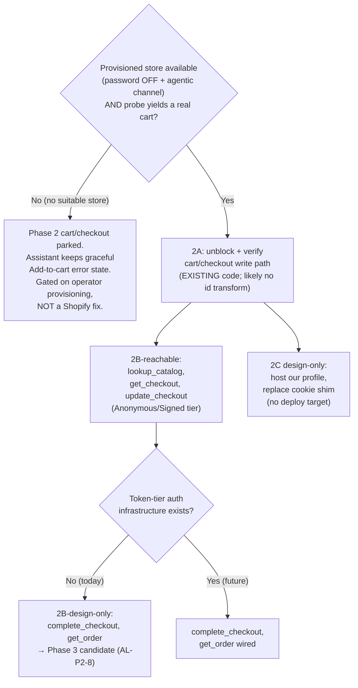

# UCP shopping-assistant migration — Phase 2

Plan slug: `ucp-migration-phase-2`
Status: DRAFT (Architect) — awaiting Plan-Reviewer.
Owner: Architect
Date: 2026-07-09

> **Revision 2 — 2026-07-10 (premise/trigger correction; supersedes the "await Shopify fix" framing).**
> The original plan gated Phase-2 cart/checkout work on "when Shopify resolves upstream ticket #68842755," on the premise that `-32603` was a Shopify code bug (framed as a "validator/resolver contradiction") awaiting a patch. **That premise is now WRONG.** Per the authoritative resolution at the top of `docs/bugs/ucp-cart-32603-fix-notes.md` ("✅ RESOLUTION (2026-07-10) — root cause is agentic-channel provisioning, NOT a Shopify code bug"), the real cause is a **provisioning prerequisite**: `create_cart`/`create_checkout` require the store's **agentic commerce sales channel** to be provisioned, which on a dev store is available only after the store is **published AND storefront-password protection is removed**. With the channel unprovisioned, the resolver surfaces an unhandled `-32603` instead of a clean "channel unavailable" error.
>
> - **Corroborated by two public Shopify community threads:** #34081 (byte-identical crash; OP fixed it by publishing + removing password; noted "the agentic channel was not available in our store") and #34499 (Shopify staff: "There is no supported way to make that merchant scoped UCP MCP endpoint publicly accessible while keeping the storefront password enabled at the moment").
> - **What this changes (see inline edits below):** No fix is coming from Shopify. The Phase-2 cart/checkout gate is now **environmental/provisioning** — a store with storefront-password OFF and the agentic channel provisioned — **not** a Shopify timeline (§0, §3.1, §3.2). `theme-evolution-os2-hydrogen` (the current password-locked dev store) can **never** satisfy the gate; it requires a different or reconfigured store, which the operator has said is not currently available, so Phase-2 cart/checkout is gated on **operator provisioning**, not on Shopify. AL-P2-1 (id-shape) is **downgraded** (the `gid://shopify/ProductVariant/<id>` shape from `search_catalog` was never wrong — it simply could not resolve without the agentic channel; the 2A id-shape normalization is now _probably unnecessary_ — verify, don't pre-build). A residual product-quality item (unhandled `-32603` vs a clean "channel unavailable" error) is filed as feedback on Support #68842755 with 2026-07-10 x-request-id captures and does **not** gate Phase 2. Sections changed: top note, §0, §1 (Problem + Goal 1), §3.1, §3.2, §3.3 wording carried, §4 (2A rows), §7 (risk + edge cases + OQ-P2-1), §8 (AL-P2-1 downgrade), §9 (2A steps + precondition gate), §10.

> This plan is Phase 2 of the migration begun in `docs/plans/ucp-migration.md` (Phase 1, `APPROVE`d and implemented per `docs/plans/ucp-migration-impl-notes.md`). Phase 1 pointed the shopping assistant at `/api/ucp/mcp`, built the DEV-ONLY cookie shim, migrated the response-envelope parsing and normalizers, and wired the `search`/`add` intents. Phase 2 **unblocks and verifies** the cart/checkout write path that Phase 1 already wrote but could never exercise (blocked by provisioning — see Revision 2), then adds the remaining Phase-2 tools.
>
> **Grounding provenance.** UCP tool argument shapes are from `docs/plans/ucp-tools-list.json` (13 tools, full `inputSchema`, captured 2026-07-08 live). Auth-tier capabilities, idempotency-key requirements, payment-handler shapes, `get_order` scope, and RFC 9421 claims were re-verified against the Shopify Dev MCP on 2026-07-09 (citations in §11 Sources). The `-32603` provisioning prerequisite and its acceptance gate are from `docs/bugs/ucp-cart-32603-fix-notes.md` (see its "✅ RESOLUTION (2026-07-10)" section, which supersedes the earlier "validator/resolver contradiction" framing) and the corroborating community threads #34081 and #34499. Where Phase-1 prose and these sources disagree, these sources win.

---

## 0. HARD PRECONDITION — read before anything else

**Phase 2 cart/checkout work does not start until BOTH of the following are true:**

1. **A store with storefront-password OFF and the agentic commerce sales channel provisioned is available for testing.** Per the 2026-07-10 resolution in `docs/bugs/ucp-cart-32603-fix-notes.md`, `-32603` is not a Shopify code bug awaiting a patch — it is a provisioning prerequisite: `create_cart`/`create_checkout` require the store's agentic commerce channel, which on a dev store is provisioned only after the store is **published AND its storefront password is removed**. **This gate is environmental/provisioning, not a Shopify timeline.**
2. **The probe matrix in `docs/bugs/ucp-cart-32603-fix-notes.md` §"Step 1 — Probe matrix" produces a real cart** when re-run **against that provisioned store** (NOT against `theme-evolution-os2-hydrogen.myshopify.com`).

**That probe matrix IS the Phase-2 acceptance gate.** The very first implementation step (§9, Step 2A.1) is to re-run it against the provisioned store as an acceptance test. Until it yields an HTTP-200 `create_cart` response with a populated `structuredContent.cart`, no Phase-2 cart/checkout code is written or modified.

**`theme-evolution-os2-hydrogen` can NEVER satisfy this gate.** It is a password-locked dev store; the DEV-ONLY cookie shim clears the password _read_ gate (an unsupported workaround, per #34499) but cannot provision the agentic channel, so cart/checkout remain structurally unreachable there. Community thread #34081 confirms the fix is to publish + remove password on a store; #34499 confirms there is no supported way to keep the password on and reach the endpoint. Satisfying the gate therefore requires a **different or reconfigured store**, which the operator has said is **not currently available**. **Phase-2 cart/checkout is gated on operator provisioning of a suitable store, not on any Shopify fix.**

**Assumption (downgraded): the working `line_items[].item.id` shape.** The 2026-07-10 resolution establishes that the id shape was never the problem — `gid://shopify/ProductVariant/<id>` from `search_catalog` is the correct shape; it simply could not _resolve_ without the agentic channel provisioned. On a properly-provisioned store the SAME shape very likely works with **no client-side normalization needed**. AL-P2-1 is downgraded accordingly (§8): the 2A id-shape normalization step is now _probably unnecessary_ — verify against the provisioned store, do not pre-build a transform.

If the provisioned store yields a real cart with Phase-1's existing `item.id` construction (the expected outcome), 2A is pure verification. If — contrary to expectation — the provisioned store reveals a _different_ working id shape, that is AL-P2-1's residual resolution and would feed a normalization change in Step 2A.2; treat this as the low-probability branch, not the default.

---

## 1. Problem statement and goals

### Problem

Phase 1 shipped a functionally-complete cart/checkout write path (`createCart` / `updateCart` / `createCheckout` in `app/lib/mcp.server.js`) but could never verify it live: every well-formed `gid://shopify/ProductVariant/<id>` crashes this store's UCP resolver with `-32603`. **Per the 2026-07-10 resolution, that crash is a provisioning prerequisite, not a client bug and not a Shopify code bug:** the store's agentic commerce sales channel is unprovisioned (available only on a published store with storefront-password OFF), and the resolver surfaces the missing channel as an unhandled `-32603` rather than a clean error. QA (`docs/qa/ucp-migration-report.md`) therefore signed off as `PASS WITH NITS` with cart/checkout parity explicitly **blocked (by provisioning)**, and the assistant degrades gracefully to an error state on "Add to cart". Additionally, several higher-value UCP tools (`lookup_catalog`, `get_order`, in-chat `get_checkout`/`update_checkout`/`complete_checkout`) were deferred to Phase 2, and two production-hardening items (host our own agent profile; replace the DEV-ONLY cookie shim) remain design-only.

### Goals

1. **Unblock and verify** the existing cart/checkout write path once a suitably-provisioned store (password OFF + agentic channel available) exists for testing: re-run the acceptance probe against that store, verify Phase-1's `item.id` construction resolves as-sent (expected — no normalization; see AL-P2-1 downgrade), drive a live end-to-end `create_cart` → `update_cart` → `create_checkout` → checkout-URL handoff through the assistant UI, and flip the QA/impl-notes/memory records from "blocked" to a full PASS. **This is mostly verify-and-unblock, not build-from-scratch** — the client code already exists, and the provisioning root cause means the client code was very likely correct all along.
2. **Add the reachable new Phase-2 tools** as genuinely new client code: `lookup_catalog` (Anonymous-tier reachable) and the in-chat checkout _read/edit_ tools `get_checkout` / `update_checkout` (Anonymous/Signed-tier reachable). Enumerate the Component Contract for each, add normalizers, wire intents, and note UI implications.
3. **Design (not necessarily build) the Token-tier tools** `complete_checkout` and `get_order`, which are **structurally unreachable** on the current dev store (see §3.1). Be honest that their full flow cannot be specified until Token-tier auth exists and the checkout/payment shapes become probeable. Spike-first, high-uncertainty; likely deferred to Phase 3 (AL-P2-8).
4. **Design the production-hardening path (2C)**: host our own agent profile, and replace the DEV-ONLY cookie shim with a production auth path. Design-only until a deploy target exists (`/ship` remains non-operational).
5. Keep every Hydrogen architectural directive intact: Anti-Stubbing, complete image handling for MCP JSON, hydration safety, root-vs-variant scope, and the Analytics Contract (there is **no** `Analytics.ItemView` — the namespace is `Provider`, `ProductView`, `CartView`, `CollectionView`, `SearchView`, `CustomView`).

### The decisive scoping fact (verified via Dev MCP 2026-07-09)

UCP tool access is tiered. The capability matrix (`shopify.dev/docs/agents/profiles/auth-and-rate-limiting`):

| Auth tier                                               | Catalog | Cart | Checkout build/edit (`get_/update_/create_/cancel_`) | `complete_checkout`                                      | Order (`get_order`)                        |
| :------------------------------------------------------ | :------ | :--- | :--------------------------------------------------- | :------------------------------------------------------- | :----------------------------------------- |
| **Token** (Dev Dashboard credential, Bearer JWT)        | Yes     | Yes  | Yes                                                  | Yes, _when the token has purchase-completion permission_ | Yes, _with `read_global_api_orders` scope_ |
| **Signed** (RFC 9421 ECDSA P-256)                       | Yes     | Yes  | Yes                                                  | **No**                                                   | **No**                                     |
| **Anonymous** (dev store today, behind the cookie shim) | Yes     | Yes  | Yes                                                  | **No**                                                   | **No**                                     |

**Consequence:** the dev store runs at the Anonymous tier (the cookie shim only clears the storefront password; it does not authenticate the agent). Therefore `complete_checkout` and `get_order` **cannot be reached, let alone probed,** on this store as configured. They require Token-tier auth infrastructure (a Dev Dashboard credential, a Bearer-JWT mint path, purchase-completion permission and/or `read_global_api_orders` scope, our own hosted profile declaring the capability, and — for Shop Pay/Google Pay — a registered payment handler `client_id`). None of that exists yet. This is why §2B splits into "reachable now" (`lookup_catalog`, `get_checkout`, `update_checkout`) vs. "Token-tier, design-only / Phase-3 candidate" (`complete_checkout`, `get_order`).

> **Note (Revision 2):** the tier table above governs `complete_checkout`/`get_order` reachability. The _cart/checkout build/edit_ tools are Anonymous-tier-reachable **in principle**, but on a dev store they additionally require the **agentic commerce sales channel to be provisioned** (published store + password OFF). That provisioning prerequisite — not the auth tier — is what blocks cart/checkout on `theme-evolution-os2-hydrogen`. The two gates are independent: a provisioned Anonymous-tier store can build carts; the password-locked store cannot, regardless of tier.

---

## 2. Non-goals

- **Building Token-tier auth infrastructure in Phase 2.** Minting Bearer JWTs from Dev Dashboard credentials, obtaining purchase-completion permission, registering a Shop Pay/Google Pay handler `client_id`, and acquiring `read_global_api_orders` scope are prerequisites for `complete_checkout` and `get_order`. Phase 2 designs the shape; it does not stand up the credential pipeline (AL-P2-8). If the operator wants in-chat completion, that becomes Phase 3 with its own plan.
- **Provisioning the agentic commerce channel / standing up a suitable test store.** Publishing a store, removing its storefront password, and provisioning the agentic commerce sales channel is an **operator concern** and a precondition for 2A (§0), not Phase-2 work. Phase 2 consumes such a store when it exists; it does not create one.
- **Shipping the cookie shim to production.** Still DEV-ONLY (carried forward from Phase 1). 2C designs the replacement; it does not deploy it.
- **A production deploy.** `/ship` is non-operational (no deploy target configured — see CLAUDE.md "Deploy targets"). 2C is design-only.
- **Re-investigating `-32603` as a client bug.** It is a provisioning prerequisite, resolved as of 2026-07-10 (memory `ucp-cart-checkout-broken-on-dev-store`; `docs/bugs/ucp-cart-32603-fix-notes.md` "✅ RESOLUTION"). Do NOT re-attempt the "extract numeric id" workaround — it produces a permanently-rejecting cart, strictly worse than the honest error state, and it addresses a bug that does not exist.
- **Single-cart unification** with the site's Hydrogen cart. The assistant cart stays separate (carried forward).
- **Converting `.jsx` → `.tsx`.** Per CLAUDE.md, not a drive-by change.
- **GraphQL / codegen changes.** UCP MCP is JSON-RPC over HTTP; no Storefront GraphQL fragments change. `npm run build` still runs codegen as the type gate, with no diff expected.
- **Global-catalog / cross-merchant flows.** The Dev MCP `ucp` guidance covers a global bundled catalog and multi-merchant baskets; this assistant is single-merchant (our own storefront). `lookup_catalog` here is the storefront-scoped variant (1–10 ids), not the global-catalog variant.

---

## 3. Proposed design

### 3.1 Reachability gates the whole plan



### 3.2 Sub-phase 2A — Unblock and verify the existing write path

This is the highest-value, lowest-new-code sub-phase. The client functions already exist and are unit-tested against the Dev-MCP-documented success shape; 2A proves them live **against a provisioned store** (password OFF + agentic channel) and removes the "blocked" caveats. Per the 2026-07-10 resolution, the block was provisioning — so on a suitable store this sub-phase is expected to be verification with no code change.

```mermaid
sequenceDiagram
    participant Op as Operator
    participant C as Coder
    participant S as /api/ucp/mcp (provisioned store: password OFF + agentic channel)
    Op->>C: Provisioned store available; dispatch Phase 2A
    C->>S: Re-run fix-notes probe matrix (acceptance test) against the provisioned store
    S-->>C: create_cart → 200 + structuredContent.cart (REAL CART)
    Note over C,S: If still -32603 → the store is NOT actually provisioned; STOP, re-check provisioning with operator
    C->>C: Confirm Phase-1 line_items[].item.id shape resolves as-sent (AL-P2-1, expected: no change)
    C->>C: (Low-probability) If a different shape is required, normalize in mcp-normalize.js / mcp.server.js
    C->>S: Live E2E: create_cart → update_cart → create_checkout
    S-->>C: continue_url handoff works through assistant UI
    C->>C: Add live cart/checkout tests; flip QA/impl-notes/memory to PASS
```

**Key 2A tasks (order matters):**

1. **Re-run the acceptance probe matrix against the provisioned store** (`docs/bugs/ucp-cart-32603-fix-notes.md` §"Step 1"). This is the gate. If `create_cart` still returns `-32603` on a store believed to be provisioned, STOP — the store is most likely NOT actually provisioned (channel not yet available, or password still on); record the negative result and hand back to the operator to confirm/complete provisioning. Do not touch code, and do NOT re-open `-32603` as a Shopify bug — it is a provisioning prerequisite.
2. **Confirm the working `item.id` shape (AL-P2-1, downgraded).** Record what shape produced the cart. Expected outcome, per the 2026-07-10 resolution:
   - **Same as Phase-1 sends** (`{item: {id: "gid://shopify/ProductVariant/<id>"}}` from `search_catalog`) → no normalization change; the existing `createCart`/`updateCart`/`createCheckout` bodies are correct as-is. **This is the expected happy path** — 2A becomes pure verification, because the id shape was never the problem (the channel provisioning was).
   - **A different shape** (low probability, only if the provisioned store surprises us) → apply the transform where Phase-1 builds `item.id`. The transform lives in `app/lib/mcp.server.js` (the line-item mapping in `createCart`/`updateCart`/`createCheckout`) and/or a helper in `app/lib/mcp-normalize.js` if it needs the raw catalog record. **Anti-Stubbing:** derive the id from real `search_catalog` data, never hardcode. **Do not pre-build this transform** — only add it if the probe actually demands it.
3. **Live E2E round-trip** through the assistant UI: `search` → "Add to cart" (`create_cart`) → add a second item (`update_cart` full-replace carry-forward, §6.4 of Phase-1 plan) → obtain the handoff URL (cart `continue_url` preferred, `create_checkout` fallback). Verify the cart `<Money>` total renders from `cart.totals[]` `type === "total"` and the checkout link opens.
4. **Remove the "blocked" caveats.** Flip `docs/qa/ucp-migration-report.md` cart/checkout section to PASS (QA-owned — 2A hands QA the evidence to do this in a `/qa` pass, or a QA re-run produces a fresh report; the Coder does NOT edit the QA report directly per squad discipline). Update `docs/plans/ucp-migration-impl-notes.md` (Coder-owned) to note the unblock **and the provisioning root cause** (so future readers don't inherit the "cart is broken / awaiting Shopify fix" framing). Update the `ucp-cart-checkout-broken-on-dev-store` memory to "resolved as of <date> on a provisioned store; root cause was agentic-channel provisioning, not a Shopify bug; cart/checkout parity achieved". These doc/memory edits are explicitly in scope for 2A and are the sub-phase's "done" signal alongside the live E2E.
5. **Add the live cart/checkout tests** that Phase 1 could not write: exercise a real `create_cart`/`update_cart`/`create_checkout` round-trip against the provisioned store. Prefer keeping these as `node --test` integration checks behind an env-gated flag (they hit the live store and the shim), OR extend the Playwright E2E (`npm run e2e`) with an add-to-cart-through-handoff scenario. Do NOT convert the existing synthetic-fixture unit tests to live tests — keep both (fixtures for CI determinism, live for acceptance).

### 3.3 Sub-phase 2B — New Phase-2 tools

Split by reachability tier (§3.1).

**2B-reachable (Anonymous/Signed tier — buildable and probeable once 2A unblocks the write path on a provisioned store):**

- **`lookup_catalog`** — batch resolve 1–10 product/variant ids in one request. Use case: validating assistant-cart line items against current catalog data, or resolving a deep-linked id to a renderable product card without a full text search. Distinct from `search_catalog` (free-text discovery) — see AL-P2-6 for the use-case boundary.
- **`get_checkout`** — read the current state of a checkout the assistant created (line items, totals, discounts, taxes, status, `continue_url`). Enables an in-chat "review your checkout" panel before handoff.
- **`update_checkout`** — apply new information to a checkout (buyer email, discount codes, fulfillment selection). Enables in-chat refinement (e.g. "apply promo code SPRING10") short of completing the order.

**2B-design-only / Phase-3 candidate (Token tier — NOT reachable on the dev store; see §3.1):**

- **`complete_checkout`** — submit payment and place the order. **The hard one.** Requires: Token tier + purchase-completion permission; `meta.idempotency-key` (UUID); a payment `instrument` (`id`, `handler_id`, `type`) sourced from a registered payment handler (the discovery doc advertises `com.google.pay`, `dev.shopify.card`, `dev.shopify.shop_pay`); the checkout at `status: ready_for_complete`; and handling `requires_escalation` (3DS, channel opt-in) by handing the buyer off to `continue_url`. See §5.5, §6.5, and AL-P2-3/AL-P2-4/AL-P2-8. **Its full flow cannot be specified until Token-tier auth exists and payment/checkout shapes are probeable. Marked spike-first, high-uncertainty; recommended for Phase 3, not Phase 2 (AL-P2-8).**
- **`get_order`** — read the state of an order the assistant placed. Requires Token tier + `read_global_api_orders` scope + profile declaring `dev.ucp.shopping.order`; only returns orders placed _through our agent_ (no buyer identity linking in v1); ~10s propagation delay after `complete_checkout`. Depends on `complete_checkout` existing (you can only read orders you placed), so it is downstream of the Phase-3 completion work (AL-P2-7).

### 3.4 Sub-phase 2C — Production hardening (design-only)

Two deferred-from-Phase-1 items, both design-only until a deploy target exists:

1. **Host our own agent profile.** Phase 1 uses Shopify's hosted fixture `https://shopify.dev/ucp/agent-profiles/2026-04-08/valid-with-capabilities.json`. Production and the Signed/Token tiers require our own profile at `/.well-known/ucp` declaring the capabilities we use (`dev.ucp.shopping.cart`, `.checkout`, `.catalog.search`, and — only if we pursue orders — `.order`) and, for the Signed tier, publishing our ECDSA P-256 public key. Design the profile document, where it is hosted (a Hydrogen route serving `/.well-known/ucp`, or a static asset), and the capability set. Cross-ref AL-P2-9.
2. **Replace the DEV-ONLY cookie shim.** Two production paths (from Phase-1 §4.4, re-verified):
   - **(a) Password removal + agentic-channel provisioning** — on a published store with the storefront password disabled and the agentic commerce channel provisioned, `/api/ucp/mcp` is reachable at the Anonymous tier with no shim, and cart/checkout build/edit work unauthenticated. This is exactly the configuration §0 requires for 2A, and it is the simplest production path. (Community #34499 confirms there is no supported way to reach the endpoint while the password stays on; #34081 confirms publish + password-off is the fix.)
   - **(b) RFC 9421 HTTP Message Signatures (Signed tier)** — sign requests with ECDSA P-256, verified against the public key in our hosted profile (2C item 1). Higher rate limits than Anonymous. Still cannot reach `complete_checkout`/`get_order` (those need Token tier). Note: signing addresses _agent authentication_, not channel provisioning — a Signed-tier request against an unprovisioned store would still fail to build a cart.
     Design where a signer slots into `callTool`'s pluggable auth-injection point (Phase 1 kept this pluggable — the cookie shim occupies that seam today). The loud-`config_error`-when-no-auth guard (Phase 1 §3.4) stays.

**2C stays design-only. `/ship` refuses until a deploy target is documented (CLAUDE.md).**

---

## 4. Affected files and modules

### 2A — unblock & verify (mostly no code; an id-shape transform is now _unlikely_)

| File                                                | Change                                                                                                                                                                                                                           | New/Modified                     |
| :-------------------------------------------------- | :------------------------------------------------------------------------------------------------------------------------------------------------------------------------------------------------------------------------------- | :------------------------------- |
| `app/lib/mcp.server.js`                             | **Only if AL-P2-1 (downgraded) reveals a different id shape on the provisioned store — now low probability:** adjust the `line_items[].item.id` construction in `createCart`/`updateCart`/`createCheckout`. Expected: unchanged. | Modified (unlikely, conditional) |
| `app/lib/mcp-normalize.js`                          | **Only if the id transform needs the raw catalog record** (e.g. deriving a numeric id from a GID) — add a small pure helper. Expected: unchanged.                                                                                | Modified (unlikely, conditional) |
| `app/lib/mcp.server.test.js` / new integration test | Add live cart/checkout round-trip tests (env-gated, run against the provisioned store) and/or a Playwright E2E scenario.                                                                                                         | Modified / New                   |
| `docs/plans/ucp-migration-impl-notes.md`            | Coder appends a "Phase-2A unblock" note: provisioned-store probe re-run result, confirmed id shape, provisioning root cause, any (unlikely) transform.                                                                           | Modified (docs, Coder-owned)     |
| `docs/qa/ucp-migration-report.md`                   | Flipped to full cart/checkout PASS by **QA** (a `/qa` re-run), not the Coder.                                                                                                                                                    | Modified (docs, QA-owned)        |
| `ucp-cart-checkout-broken-on-dev-store` memory      | Updated to "resolved — provisioning root cause; parity achieved on a provisioned store".                                                                                                                                         | Modified (memory)                |

### 2B-reachable — new tool wiring

| File                                                          | Change                                                                                                                                                                                                                                | New/Modified      |
| :------------------------------------------------------------ | :------------------------------------------------------------------------------------------------------------------------------------------------------------------------------------------------------------------------------------ | :---------------- |
| `app/lib/mcp.server.js`                                       | Add exports `lookupCatalog`, `getCheckout`, `updateCheckout` following the existing `searchCatalog`/`createCheckout` pattern (Component Contract §5, injectable `fetchImpl`).                                                         | Modified          |
| `app/lib/mcp-normalize.js`                                    | Add `normalizeLookupResults` (reuse `normalizeCatalogProduct` per-product; handle the `inputs[]`/`not_found` correlation), and `normalizeCheckout` reuse for `get_checkout`/`update_checkout` (the flat checkout shape from Phase 1). | Modified          |
| `app/routes/($locale).api.assistant.jsx`                      | Add intents: `"lookup"` → `lookupCatalog`; `"review"` → `getCheckout`; `"refine"` → `updateCheckout`. Keep the server-routed enum discipline (no LLM planner). Preserve empty-vs-error discipline and the locale guard verbatim.      | Modified          |
| `app/components/ChatAssistant.jsx`                            | UI for a checkout-review panel (`get_checkout` result: totals via the printer contract, `messages[]` display obligations §6.4) and a discount-code input (`update_checkout`). Hydration-safe (existing `useIsHydrated` gate).         | Modified          |
| `app/components/AssistantProductCard.jsx`                     | Reused for `lookup_catalog` results (normalizer absorbs shape differences; the `inputs[]` correlation is stripped in normalization). Likely unchanged.                                                                                | Possibly modified |
| `app/lib/mcp.server.test.js`, `app/lib/mcp-normalize.test.js` | Add unit tests for the new tool bodies and normalizers (Component Contract injection, envelope parse, `not_found` handling).                                                                                                          | Modified          |

### 2B-design-only / 2C — no code this phase

`complete_checkout`, `get_order`, the hosted profile, and the signed-request signer are **designed in this document (§5.5, §6.5, §3.4)** but **not implemented**. No files change for them in Phase 2. When Phase 3 wires them, they will touch `mcp.server.js` (new exports + a Token-tier auth-injection path), a new `app/lib/ucp-sign.server.js` (RFC 9421 signer), a new `/.well-known/ucp` route, and `env.d.ts` (Token-tier credential vars, operator-managed).

### Not modified (carried forward from Phase 1 §4)

- GraphQL fragments / generated declarations (`storefrontapi.generated.d.ts`, etc.) — JSON-RPC, not GraphQL.
- `server.js`, `entry.server.jsx`, `app/root.jsx`.
- `.env` / `.env.local` — operator-managed. Any new Token-tier credential var (Phase 3), or the connection details for a provisioned test store, is an operator concern, documented not edited.

---

## 5. Component Contract enumeration (REQUIRED)

Every `/api/ucp/mcp` request is JSON-RPC 2.0 `tools/call` with `params.arguments.meta.ucp-agent.profile` injected on **every** tool (verified per-tool against `docs/plans/ucp-tools-list.json`; re-confirmed via Dev MCP). Phase 1's `buildMeta(profileUrl)` helper in `mcp.server.js` already produces the `{'ucp-agent': {profile}}` object; Phase 2 tools reuse it, and `complete_checkout`/the cancel tools additionally inject `meta['idempotency-key']` (§5.6).

### 5.1 `lookup_catalog` (2B-reachable)

- Schema `required`: `["meta","catalog"]`; `catalog.required`: `["ids"]`.
- Body: `arguments = { meta, catalog: { ids: ["gid://shopify/Product/…" | "gid://shopify/ProductVariant/…"], context?, filters? } }`. **1–10 ids** (storefront-scoped variant; `maxItems: 10` per `ucp-tools-list.json`).
- No `meta.idempotency-key`. Reuses `buildMeta`.
- Response: UCP catalog lookup shape — products grouped, each variant carries an `inputs[]` correlation (which request id resolved to it, exact vs featured) and `not_found` messages for unresolved ids. Normalizer strips `inputs[]` down to the same `AssistantProduct` shape Phase 1 uses.

### 5.2 `get_checkout` (2B-reachable)

- Schema `required`: `["meta","id"]`. **`id` is a top-level sibling of `meta`** (not nested in a `checkout` object) — per `ucp-tools-list.json` and Dev MCP ("pass the checkout session ID as the top-level `id`").
- Body: `arguments = { meta, id: "gid://shopify/Checkout/…" }`.
- No `meta.idempotency-key`. Reuses `buildMeta`.
- Response: flat checkout object at `structuredContent` (Phase 1 confirmed the checkout tool is flat, no `.checkout` wrapper): `{id, status, currency, line_items[], totals[], messages[], continue_url, expires_at}`. Reuse Phase-1 `normalizeCheckout`.

### 5.3 `update_checkout` (2B-reachable)

- Schema `required`: `["meta","checkout","id"]`. **`id` top-level; the mutable payload is in `checkout`.**
- Body: `arguments = { meta, id: "gid://shopify/Checkout/…", checkout: { line_items?, buyer?, context?, fulfillment?, discounts?, payment? } }`. For Phase 2 in-chat refinement, the useful sub-fields are `buyer.email`, `discounts.codes[]` (case-insensitive, replaces previous codes, empty array clears), and `fulfillment.methods[]`. **Do NOT send `payment` here** — payment belongs to `complete_checkout` (Token tier).
- No `meta.idempotency-key` (schema and Dev MCP agree — only `ucp-agent`). Reuses `buildMeta`.
- **Full-replace caution:** like the cart, checkout `line_items` is full-replace ("Preserve `line_items` on every update" — Dev MCP). If Phase 2 ever updates line items via `update_checkout`, carry the full set forward. For discount/buyer refinement, `line_items` can be omitted (it is not `checkout.required`; only `line_items` is required on _create_, per `ucp-tools-list.json` `create_checkout`). **Confirm by probe whether `update_checkout` requires `line_items` on the server** (AL-P2-5).

### 5.4 `create_cart` / `update_cart` / `create_checkout` (2A — EXISTING, re-verified)

Already implemented in Phase 1 (`mcp.server.js`). Contract unchanged: `meta.ucp-agent.profile` only (no idempotency-key). Argument shapes: `cart.line_items[].item.id`; `update_cart` `id` top-level; `create_checkout` `checkout.line_items` required unconditionally (AL-UCP-7 in Phase 1 — the live server enforces the schema literally). **2A re-verifies these against a provisioned store (AL-P2-1, downgraded — expected to pass as-sent) and does not rebuild them.** The `-32603` seen on `theme-evolution-os2-hydrogen` was the missing agentic channel, not a contract error in these bodies.

### 5.5 `complete_checkout` (2B-design-only / Phase-3) — Token tier

- Schema `required`: `["meta","id","checkout"]`; `meta.required`: `["ucp-agent","idempotency-key"]`; `checkout.required`: `["payment"]`.
- Body: `arguments = { meta: { 'ucp-agent': {profile}, 'idempotency-key': "<UUID>" }, id: "gid://shopify/Checkout/…", checkout: { payment: { instruments: [{ id, handler_id, type, credential?, display?, billing_address?, selected? }], selected_instrument_id? } } }`.
- **Both schema AND Dev MCP require `meta.idempotency-key` (UUID).** No discrepancy.
- **Payment instrument** (`instruments[].{id, handler_id, type}` all required): `handler_id` must match a payment handler the merchant advertises (`com.google.pay`, `dev.shopify.card`, `dev.shopify.shop_pay` per the discovery doc). `type` is `'card'` for cards, `'token'` for wallet payments. For Shop Pay specifically, the agent must first register with Shop Pay to obtain a `client_id`, and the credential is a single-use, time-limited, checkout-scoped Shop Token (Dev MCP: `shop-pay-handler`).
- **Preconditions:** checkout `status` must be `ready_for_complete`; `complete_checkout` can still return `requires_escalation` (3DS, channel opt-in) → hand off to `continue_url`. Interpret `result.status`: `completed` (order placed, `result.order.id` present), `requires_escalation` (handoff), `incomplete` (fix via `update_checkout`), `complete_in_progress`, `canceled`.
- **Tier:** Token only, with purchase-completion permission. **Not reachable on the dev store.** See AL-P2-3/AL-P2-4/AL-P2-8. **Recommendation: defer to Phase 3.**

### 5.6 `get_order`, `cancel_cart`, `cancel_checkout` (design/contract capture)

- **`get_order`** (Token tier, `read_global_api_orders`, profile declares `dev.ucp.shopping.order`): `arguments = { meta, id: "gid://shopify/Order/…" }`. Only `meta.ucp-agent` required (no idempotency-key). Reads only orders placed through our agent. **Not reachable on the dev store.** Depends on `complete_checkout` (AL-P2-7).
- **`cancel_cart`** (Anonymous-tier reachable): `arguments = { meta, id: "gid://shopify/Cart/…" }`. **Docs REQUIRE `meta['idempotency-key']` (UUID); the captured schema lists only `ucp-agent` (docs-vs-schema discrepancy, AL-P2-2).** Safe default: send the key.
- **`cancel_checkout`** (Anonymous-tier reachable): `arguments = { meta, id: "gid://shopify/Checkout/…" }`. **Docs REQUIRE `meta['idempotency-key']`; captured schema lists only `ucp-agent` (AL-P2-2).** Safe default: send the key.
- Neither cancel tool is wired in Phase 2 unless 2B needs cart/checkout cleanup; if wired, send the idempotency-key.

### 5.7 Idempotency-key generation, storage, and reuse strategy (REQUIRED)

The key must be **stable across retries of the same logical operation** but **unique per new logical operation**. Design:

- **Minting.** Generate with `crypto.randomUUID()` (available in the Oxygen/workerd runtime; Dev MCP examples use exactly this) **server-side in the route action**, at the point a logical operation is _first initiated_ — not inside `callTool` (which retries transport-level and must reuse, not remint).
- **Which operations.** Only the idempotency-required tools: `complete_checkout` (schema+docs), `cancel_cart`, `cancel_checkout` (docs). Read/build/edit tools (`get_checkout`, `update_checkout`, `lookup_catalog`, cart create/update) do NOT get a key.
- **Storage/reuse.** A logical operation = one user-initiated intent for one resource. Cache the minted key keyed by `(intent, resourceId)` for the lifetime of that operation so that:
  - `callTool`'s existing bounded transport retry (the 302 re-mint path, timeout) reuses the SAME key — the key is passed _into_ `callTool` as an argument, so the retry naturally reuses it.
  - An operator/user-driven retry of the same logical completion (e.g. "try placing the order again" after an `incomplete`) reuses the SAME key so the payment lifecycle is retry-safe (Dev MCP: "Don't retry inside the same checkout or payment lifecycle without an idempotency-key").
  - A genuinely new operation (a different checkout, or an explicit "start over") mints a FRESH key.
- **Where the cache lives.** Because `complete_checkout` is Phase-3/design-only and the assistant is stateless per request, the pragmatic Phase-3 design is: the browser holds the minted key for an in-progress completion in the fetcher payload (the action echoes it back on `incomplete`/`requires_escalation`, and the client resubmits the same key on a manual retry), mirroring how `cartId` is threaded through the fetcher today. **This is a design note for Phase 3, flagged as AL-P2-3** — the exact lifecycle can only be finalized once `complete_checkout` is reachable and its retry semantics are probeable. For the Anonymous-tier cancel tools (if wired in 2B), the key is minted in the action per cancel invocation and reused only within `callTool`'s transport retry (no cross-request reuse needed, since a cancel is fire-and-observe).

---

## 6. Data model and API changes

### 6.1 Normalized view model — extended, mostly stable

Phase-1 shapes (`AssistantProduct`, `AssistantCart`, `Money`) stay. Additions:

```ts
AssistantCheckout = {
  id, status,                       // status drives the UI flow (§6.3)
  totals: TotalEntry[],             // ORDER-PRESERVED, printer contract (§6.4)
  lineCount,
  continueUrl?,
  messages: CheckoutMessage[],      // display obligations (§6.4)
}
TotalEntry     = { type, amount: Money, displayText }   // do NOT reorder/recompute
CheckoutMessage = { type: 'info'|'warning'|'error', presentation?, content, path?, url?, imageUrl? }
```

`lookup_catalog` results normalize to the existing `AssistantProduct[]`; the `inputs[]`/`not_found` correlation is surfaced as a small `{ notFoundIds: string[] }` sidecar so the UI can say "we couldn't find 1 of these" rather than silently dropping (Anti-Stubbing).

### 6.2 Money — uniform minor units (unchanged from Phase 1)

UCP is uniform integer minor units across catalog, cart, and checkout. Reuse Phase-1 `normalizeUcpMoney` (minor→decimal string, `currency`→`currencyCode`) on all checkout `totals[]` and lookup price paths. No new Money path.

### 6.3 Checkout status flow (new, for `get_checkout`/`update_checkout`/`complete_checkout`)

`status` values (Dev MCP): `ready_for_complete`, `requires_escalation`, `incomplete`, `complete_in_progress`, `completed`, `canceled`. The in-chat UI (2B) surfaces status as review copy; only `complete_checkout` (Phase 3) acts on it. On any `requires_escalation` or unrecoverable error, **hand off to `continue_url`** rather than proceeding in-chat.

### 6.4 The printer contract and message display obligations (REQUIRED for checkout UI)

Dev MCP mandates the "printer contract": **render `result.totals[]` in the order provided**, using each entry's `display_text`; do NOT reorder, recompute, filter, or aggregate (tax itemization, fee disclosures, regional accounting depend on merchant order). Amounts are signed integers — negative = discount, positive = charge; the sign is the direction, don't flip it. The Phase-1 `normalizeCart` already selects only the `type === "total"` entry for the compact cart summary; the new checkout-review panel (2B) must render the FULL ordered `totals[]`, not just the grand total.

Message display obligations (Dev MCP): `info` SHOULD display; `warning` with `presentation: "notice"` MUST display; `warning` with `presentation: "disclosure"` MUST display proximate to the item at `path`, MUST NOT hide/collapse/auto-dismiss, render `image_url`, surface `url` as a link (legal/compliance: Prop 65, allergens, age restrictions); `error` drives the status flow. **If the assistant UI cannot honor a disclosure rendering (e.g. an image in a text-only bubble), do NOT silently downgrade — hand off to `continue_url`.** This is a real design constraint on the in-chat checkout panel (AL-P2-5) and is why in-chat `complete_checkout` is risky: we may be obligated to escalate rather than complete.

### 6.5 `complete_checkout` payment shape (design-only, Phase 3)

Payment instruments and credentials are handler-specific (Google Pay / Shopify Card / Shop Pay). The exact credential payload, the `handler_id` values this store actually issues, and the `selected_instrument_id` handshake **cannot be specified until Token-tier auth and a registered handler exist and the shapes are probeable** (AL-P2-4). Design captured in §5.5; full spec deferred to a Phase-3 spike.

### 6.6 Analytics Contract — unchanged, re-verified

`<Analytics.ProductView>` with `data={{products:[…]}}`; `variantId` from normalized `firstVariantId`; truthy `vendor`/`variantTitle`. `lookup_catalog` product cards get the same treatment (skip the event if a variant id is genuinely absent, per the Phase-1 per-card exemption). **No `Analytics.ItemView`** — the namespace is `Provider`, `ProductView`, `CartView`, `CollectionView`, `SearchView`, `CustomView` (re-verified via Dev MCP 2026-07-09). A checkout-review panel does NOT introduce a new analytics component; if cart/checkout analytics are wanted, use `Analytics.CartView` (which exists), not a fabricated one.

---

## 7. Risks, edge cases, and open questions

### Risks

- **No suitably-provisioned store exists (high, gates 2A entirely).** Per the 2026-07-10 resolution, cart/checkout requires a published store with the storefront password OFF and the agentic commerce channel provisioned. `theme-evolution-os2-hydrogen` can never satisfy this, and the operator has said a replacement is not currently available. Mitigation: 2A is gated on operator provisioning (§0); until then Phase-2 cart/checkout stays parked with the graceful error state. **This is an environmental blocker, not a Shopify-timeline blocker — do not frame it as "awaiting a Shopify fix".**
- **A provisioned store unexpectedly requires a different id shape (LOW — downgraded).** AL-P2-1. The 2026-07-10 resolution establishes the id shape was never wrong; `gid://shopify/ProductVariant/<id>` from `search_catalog` is correct and simply could not resolve without the channel. Mitigation: verify on the provisioned store first; only add a transform if the probe actually demands one. Do not pre-build it.
- **`complete_checkout` scope creep (high).** It looks like "just another tool" but requires Token-tier auth, a registered payment handler `client_id`, purchase-completion permission, escalation handling, and idempotency-key lifecycle — none of which exist. Mitigation: explicitly scope it OUT of Phase 2 (design-only), recommend Phase 3 (AL-P2-8). Do not let a reviewer or operator treat it as in-scope by default.
- **In-chat checkout compliance obligations (medium-high).** The disclosure-message contract (§6.4) can obligate the assistant to escalate rather than render inline. A naive in-chat checkout panel could silently drop a legally-mandated disclosure. Mitigation: the `get_checkout`/`update_checkout` panel MUST implement the display-obligation rules and hand off to `continue_url` when it cannot honor a disclosure (AL-P2-5).
- **Idempotency-key misuse (medium).** Reusing a key across _different_ operations, or minting a fresh key on a _retry_, both break retry-safety. Mitigation: the §5.7 mint-once-per-logical-operation strategy; key passed into `callTool` so transport retries reuse it.
- **`lookup_catalog` vs `search_catalog` confusion (low-medium).** Wiring both without a clear boundary invites redundant calls / rate-limit pressure (Anonymous tier). Mitigation: AL-P2-6 fixes the boundary — `lookup` for known ids (validation, deep-links), `search` for free-text.
- **Doc/memory drift (medium).** 2A must flip THREE records (QA report, impl-notes, memory) from "blocked" to "resolved", and must record the **provisioning** root cause (not "awaiting Shopify fix"). Missing one leaves a false "cart is broken / Shopify owes a patch" claim that a future feature could inherit (the way `Analytics.ItemView` propagated). Mitigation: 2A "done" is explicitly all three plus live E2E.
- **Anti-Stubbing on `not_found` (low).** `lookup_catalog` partial resolution must surface not-found ids, not silently drop them. Mitigation: `notFoundIds` sidecar (§6.1).
- **Hydration.** Checkout-review panel stays behind `useIsHydrated`; no new browser-API access at render.

### Edge cases

- Re-run probe still returns `-32603` on a store believed provisioned → the store is not actually provisioned (channel unavailable or password still on); Phase 2 parked, no code touched, hand back to operator to complete provisioning. Do NOT re-open `-32603` as a Shopify bug.
- Provisioned store yields a real cart but with an id differing from Phase-1's send (low probability) → 2A id-shape transform (AL-P2-1, downgraded).
- `lookup_catalog` with a mix of valid + not-found ids → render found products + a "couldn't find N" note.
- `get_checkout` on an expired/canceled checkout → surface `status: canceled`/business-error, offer to start a new cart (mirror the Phase-1 stale-cart recovery).
- `update_checkout` with a discount code that doesn't apply → `messages[]` warning/error; render per §6.4, do not fabricate a discount.
- `complete_checkout` returns `requires_escalation` → hand off to `continue_url` (Phase 3).
- Token-tier tools invoked while the store is Anonymous-tier → they will be pruned from the negotiated session / rejected; the assistant must degrade gracefully (do not offer the intent in the UI until Token-tier auth exists).

### Open questions (resolve before coding the affected part)

- **OQ-P2-1** — Is a store with storefront-password OFF and the agentic commerce channel provisioned available for Phase-2 cart/checkout testing? If not, Phase-2 cart/checkout stays parked (gated on operator provisioning, not on Shopify). Once such a store exists, does Phase-1's `item.id` shape resolve as-sent? (→ AL-P2-1, downgraded; expected yes, resolved by re-running the acceptance probe against the provisioned store. THIS IS THE GATE.)
- **OQ-P2-2** — Is in-chat `complete_checkout` in scope for Phase 2, or deferred to Phase 3? **Architect recommendation: Phase 3.** It needs Token-tier auth infrastructure that does not exist and cannot be built as a side-effect of Phase 2 (→ AL-P2-8). Operator decision required.
- **OQ-P2-3** — Does the operator want to stand up Token-tier auth (Dev Dashboard credential, Bearer-JWT mint, payment-handler registration) at all on this dev store, or is in-chat completion out of scope for this storefront entirely? (→ AL-P2-8.)
- **OQ-P2-4** — For 2C, which production auth path is the target: password removal + agentic-channel provisioning (simplest, Anonymous tier — the same configuration 2A needs) or RFC 9421 Signed tier (needs our hosted profile + ECDSA keys)? This shapes the 2C design and the hosted-profile capability set (→ AL-P2-9). No deploy target exists yet, so this can be answered at design time without urgency.

---

## 8. Ambiguity Log (REQUIRED)

Confidence is the Architect's estimate that the stated resolution is correct as-designed. Entries flagged ⚠️ LOW-CONFIDENCE are called out for Plan-Reviewer priority scrutiny. **A lot of 2B/2C detail is contingent on a provisioned store and on shapes that cannot be probed until cart/checkout works — where that is true, the resolution is a spike, not an invented specific.**

### AL-P2-1 — The working `line_items[].item.id` shape ✅ DOWNGRADED (was ⚠️ LOW-CONFIDENCE)

- **Was:** Whether Shopify's fix would make Phase-1's `gid://shopify/ProductVariant/<id>` shape work as-sent or reveal a different shape, treated as unknowable "until the fix lands."
- **Now (per `docs/bugs/ucp-cart-32603-fix-notes.md` "✅ RESOLUTION (2026-07-10)"):** the id shape was **never wrong**. `gid://shopify/ProductVariant/<id>` from `search_catalog` is the correct shape; it could not _resolve_ only because the store's agentic commerce channel was unprovisioned (password-locked dev store). On a properly-provisioned store (password OFF + channel available), the SAME shape very likely works with **no client-side normalization needed**. Confidence that no transform is required is now HIGH.
- **Why it still matters (much less):** it remains the acceptance gate for 2A, but the expected outcome is "verify, no code change." The 2A id-shape normalization step is now _probably unnecessary_.
- **Resolve by:** Re-run the `docs/bugs/ucp-cart-32603-fix-notes.md` probe matrix against the **provisioned store** as the FIRST step (§9 Step 2A.1); confirm the cart comes back with Phase-1's existing send. **Do not pre-build a transform** — add one only if, contrary to expectation, the provisioned store demands a different shape.

### AL-P2-2 — Idempotency-key: docs require, schema under-specifies (cancel tools)

- **Discrepancy:** Dev MCP docs REQUIRE `meta['idempotency-key']` on `cancel_cart` AND `cancel_checkout`; the captured `ucp-tools-list.json` lists only `ucp-agent` as required for both. `complete_checkout` requires the key in both schema and docs (no discrepancy). Re-verified via Dev MCP 2026-07-09.
- **Why it matters:** A wrong assumption → cancels rejected (if the server enforces docs) or non-idempotent retries.
- **Resolve by:** Send the key on all three (matching docs) as the safe default; probe to confirm enforcement when/if wired. Carried forward from Phase-1 AL-UCP-8.

### AL-P2-3 — Idempotency-key lifecycle (mint / cache / reuse) ⚠️ LOW-CONFIDENCE

- **Unknown:** The exact retry lifecycle for `complete_checkout` — how many manual retries, whether a key expires, how the browser threads the in-progress key through `incomplete`/`requires_escalation` round-trips. §5.7 gives a design (mint per logical operation, reuse on retry, thread via fetcher like `cartId`), but the concrete lifecycle can only be finalized once `complete_checkout` is reachable.
- **Why it matters:** Payment retry-safety; a wrong lifecycle risks double-charging or rejected retries.
- **Resolve by:** Phase-3 spike once Token-tier auth exists and `complete_checkout` is probeable. §5.7 is the provisional design.

### AL-P2-4 — `complete_checkout` payment instrument / handler shape ⚠️ LOW-CONFIDENCE

- **Unknown:** Which `handler_id` values this store issues, the exact credential payload per handler (Google Pay token vs Shopify Card vs Shop Pay single-use token), and the `selected_instrument_id` handshake. The discovery doc advertises `com.google.pay`, `dev.shopify.card`, `dev.shopify.shop_pay`, but the live instrument shape is unprobeable at the Anonymous tier.
- **Why it matters:** `complete_checkout` cannot be built without a concrete payment payload; Shop Pay additionally needs agent registration for a `client_id`.
- **Resolve by:** Phase-3 spike. Recommendation: if pursued, wire `dev.shopify.card` (test card) first as the simplest handler, before wallet tokens.

### AL-P2-5 — `update_checkout` `line_items` requirement + disclosure-message rendering

- **Unknown (two parts):** (a) Whether the live server requires `checkout.line_items` on `update_checkout` (the create schema requires it; update may not). (b) Whether the in-chat panel can ever satisfy the `presentation: "disclosure"` display obligation, or must always escalate for legal/compliance messages.
- **Why it matters:** (a) A wrong body → validation error on refinement. (b) Silently downgrading a mandated disclosure is a compliance failure.
- **Resolve by:** (a) Probe `update_checkout` with buyer/discount fields and no `line_items` once 2A unblocks the write path on a provisioned store. (b) Design the panel to hand off to `continue_url` whenever a disclosure cannot be rendered inline (§6.4).

### AL-P2-6 — `lookup_catalog` vs `search_catalog` use-case boundary

- **Unknown:** When the assistant should use `lookup_catalog` vs `search_catalog`.
- **Resolution (confident):** `search_catalog` = free-text discovery ("find me snowboards"). `lookup_catalog` = resolve KNOWN ids (validate assistant-cart line items against current catalog, resolve a deep-linked/saved id to a renderable card) — 1–10 ids, no free text. They do not overlap; wire `lookup` only where the assistant already holds ids, not as an alternative search path. Verified via Dev MCP (`lookup_catalog` "when you have product or variant IDs").

### AL-P2-7 — `get_order` identity / auth requirements

- **Resolution (confident, via Dev MCP):** `get_order` is Token-tier only, requires a Global API JWT with `read_global_api_orders` scope, the profile must declare `dev.ucp.shopping.order`, and it returns ONLY orders placed through our agent (no buyer identity linking in v1; ~10s propagation after `complete_checkout`). It does NOT need a signed-in _customer_ — it needs a signed _agent_ (Token tier). It is therefore downstream of `complete_checkout` (you can only read orders you placed) and not reachable on the dev store. **Not a signed-in-customer feature; an agent-credential feature.**
- **Why it matters:** A common misread is that `get_order` needs Customer Account auth. It does not — it needs agent Token-tier auth. Deferred with `complete_checkout` (AL-P2-8).

### AL-P2-8 — Is in-chat `complete_checkout` (and `get_order`) in Phase 2 or Phase 3? ⚠️ LOW-CONFIDENCE (scope decision)

- **Unknown:** Whether the operator wants to stand up Token-tier auth infrastructure at all.
- **Architect recommendation:** **Phase 3.** Both tools are structurally unreachable at the dev store's Anonymous tier (§3.1, verified via Dev MCP capability matrix). Reaching them requires a Dev Dashboard credential, a Bearer-JWT mint path, purchase-completion permission (and `read_global_api_orders` scope for orders), our own hosted profile declaring the capability, and — for wallet payments — a registered handler `client_id`. That is a phase of work, not a tool wiring. Phase 2 captures the contract (§5.5, §5.6) and stops.
- **Resolve by:** Operator decision (OQ-P2-2/OQ-P2-3). If "yes, Phase 3", a separate plan owns the auth infrastructure and the payment spike.

### AL-P2-9 — Hosted agent profile + production auth path (2C)

- **Unknown:** Which production auth path (password removal + agentic-channel provisioning vs RFC 9421 Signed tier), and the exact capability set / hosting mechanism for our own `/.well-known/ucp` profile.
- **Why it matters:** Shapes 2C; the Signed tier needs our published ECDSA P-256 public key in the profile. Note the 2026-07-10 resolution makes clear that _any_ Anonymous/Signed production path still needs the agentic channel provisioned to build carts — auth and provisioning are independent gates.
- **Resolve by:** Design-time operator decision (OQ-P2-4); no urgency (no deploy target). Design both branches; pick when a deploy target is chosen. RFC 9421 / ECDSA P-256 / Signed-tier-can't-reach-`complete_checkout` all re-verified via Dev MCP 2026-07-09.

**Lowest-confidence entries for Plan-Reviewer priority scrutiny:**

1. **AL-P2-8** — `complete_checkout`/`get_order` Phase-2-vs-Phase-3 scope decision (Token-tier reachability; the biggest scope risk).
2. **AL-P2-4** — `complete_checkout` payment instrument/handler shape (unprobeable until Token-tier auth exists; highest technical uncertainty in any tool we might build).
3. **AL-P2-3** — idempotency-key lifecycle (finalizable only once `complete_checkout` is reachable).

> _(AL-P2-1 was the previous #1 lowest-confidence entry; per the 2026-07-10 provisioning resolution it is downgraded and no longer a top scrutiny item — the id shape was never wrong.)_

---

## 9. Step-by-step implementation checklist for the Coder

Run `npm run lint` and `npm run build` after meaningful changes and again at the end (`npm run build` is the type-check + production-build gate — there is **no separate `typecheck`**). Do the pre-save audit (no duplicate exports, no unused imports) on every file. Never log the storefront password, the session cookie, idempotency keys, payment credentials, or raw MCP payloads.

### 9.0 Precondition gate (operator-owned, resolve BEFORE dispatch)

- Confirm **a store with storefront-password OFF and the agentic commerce channel provisioned is available** for Phase-2 cart/checkout testing (this is the gate; `theme-evolution-os2-hydrogen` can never qualify — see §0). **This is operator provisioning work, not a Shopify fix — do not wait on a Shopify timeline.** Answer OQ-P2-2/OQ-P2-3 (is `complete_checkout`/`get_order` in scope) and OQ-P2-4 (2C target) — or explicitly delegate OQ-P2-1 to Step 2A.1. **If no provisioned store is available, Phase-2 cart/checkout does not start** (2B-reachable tools can still proceed only once a store where the write path works is available, since they build on a working cart/checkout).

### Sub-phase 2A — unblock & verify (do this FIRST, and completely, before 2B)

1. **Re-run the acceptance probe matrix against the provisioned store** (`docs/bugs/ucp-cart-32603-fix-notes.md` §"Step 1"). If `create_cart` still returns `-32603`, **STOP** — the store is not actually provisioned (channel unavailable or password still on); record the negative result in `docs/plans/ucp-migration-impl-notes.md`, hand back to the operator to complete provisioning. No code changes, and do NOT re-open `-32603` as a Shopify bug.
2. **Confirm the working `item.id` shape (AL-P2-1, downgraded).** Expected: it matches Phase-1's send (`gid://shopify/ProductVariant/<id>` from `search_catalog`) → **no code change**. Only if the provisioned store surprises us with a different shape (low probability), apply the minimal transform in `mcp.server.js` line-item mapping (and a pure helper in `mcp-normalize.js` if it needs the raw catalog record). Derive from real `search_catalog` data — never hardcode. **Do not pre-build the transform.**
3. **Live E2E** through the assistant UI: `search` → add (`create_cart`) → add a second item (`update_cart` full-replace carry-forward) → handoff URL (cart `continue_url` preferred, `create_checkout` fallback). Verify the cart total renders from `totals[]` `type === "total"` and the checkout link opens.
4. **Add live cart/checkout tests** (env-gated `node --test` integration and/or a Playwright E2E scenario, run against the provisioned store). Keep the existing synthetic-fixture unit tests too.
5. **Flip the records:** Coder updates `docs/plans/ucp-migration-impl-notes.md` (Phase-2A unblock note, recording the **provisioning** root cause and the provisioned-store identity, not "awaiting Shopify fix"); trigger a `/qa` re-run so **QA** flips `docs/qa/ucp-migration-report.md` to full cart/checkout PASS (Coder does not edit the QA report); update the `ucp-cart-checkout-broken-on-dev-store` memory to "resolved — provisioning root cause; parity achieved on a provisioned store". **2A is not done until all three records + live E2E agree.**
6. `npm run lint` + `npm run build` clean.

### Sub-phase 2B-reachable — new tools (only after 2A is fully PASS)

7. **Add `lookupCatalog`, `getCheckout`, `updateCheckout`** to `mcp.server.js` (Component Contract §5.1–5.3; reuse `buildMeta`, `callTool`, injectable `fetchImpl`; mind the top-level `id` on the checkout tools).
8. **Add normalizers** to `mcp-normalize.js`: `normalizeLookupResults` (reuse `normalizeCatalogProduct`; produce the `notFoundIds` sidecar; strip `inputs[]`), and reuse/extend `normalizeCheckout` for the full ordered `totals[]` + `messages[]` (printer contract §6.4). Keep pure functions; preserve truthy `vendor`/`variantTitle` for Analytics.
9. **Wire intents** in `($locale).api.assistant.jsx`: `"lookup"` → `lookupCatalog`; `"review"` → `getCheckout`; `"refine"` → `updateCheckout`. Keep the enum-routed discipline, the empty-vs-error distinction, and the locale guard verbatim. No idempotency-key on these (none required).
10. **UI** in `ChatAssistant.jsx`: a checkout-review panel rendering the FULL ordered `totals[]` via `display_text` (do NOT reorder/recompute), and the `messages[]` display obligations (§6.4) — escalate to `continue_url` if a `disclosure` cannot be rendered inline. A discount-code input for `update_checkout`. Hydration-safe (`useIsHydrated`). Reuse `AssistantProductCard` for `lookup` results (no `Analytics.ItemView`; use `Analytics.ProductView`, and `Analytics.CartView` only if adding cart analytics).
11. **Unit tests** for the new bodies/normalizers (contract injection, envelope parse, `not_found` handling, checkout status/`totals[]` ordering).
12. `npm run lint` + `npm run build` clean; `node --test app/lib/*.server.test.js` passes.

### Sub-phase 2B-design-only + 2C — NO CODE this phase

13. **Do not implement** `complete_checkout`, `get_order`, the hosted profile, or the signer. Their design lives in §5.5/§5.6/§5.7/§3.4. If the operator elects to pursue them, that is a separate Phase-3 plan. Record the scope decision (OQ-P2-2/3/4 outcomes) in `docs/plans/ucp-migration-impl-notes.md`.

### 9.1 Verification gate (every sub-phase)

- `npm run lint` clean vs. baseline.
- `npm run build` exits 0 (codegen + type gate; no GraphQL diff expected).
- `node --test app/lib/*.server.test.js` passes.
- **2A live acceptance:** the fix-notes probe matrix yields a real cart **on the provisioned store**; live E2E `create_cart`→`update_cart`→`create_checkout`→handoff succeeds through the UI; all three "blocked" records flipped with the provisioning root cause recorded.
- **2B live acceptance:** `lookup_catalog` resolves known ids (with a `not_found` case rendering the sidecar); `get_checkout`/`update_checkout` render the ordered `totals[]` + `messages[]` per the printer/display-obligation contracts; trust boundary intact (no endpoint URL, cookie, password, idempotency key, or raw payload in client JS).
- CLAUDE.md five-check baseline: HTTP 200 smoke; no hydration/CSP warnings; PDP unaffected; `npm run build` clean; `npm run lint` clean.

---

## 10. Sub-phase summary (for the operator)

| Sub-phase          | Scope                                                                                                           | Reachable now?                                                                                                                                                               | New code?                                                                                          |
| :----------------- | :-------------------------------------------------------------------------------------------------------------- | :--------------------------------------------------------------------------------------------------------------------------------------------------------------------------- | :------------------------------------------------------------------------------------------------- |
| **2A**             | Unblock + verify the EXISTING cart/checkout write path; flip the "blocked" records                              | Only once a store with password OFF + agentic channel provisioned is available (operator provisioning; NOT a Shopify fix). `theme-evolution-os2-hydrogen` can never qualify. | Minimal — id-shape transform now _unlikely_ (AL-P2-1 downgraded; likely pure verification) + tests |
| **2B-reachable**   | `lookup_catalog`, `get_checkout`, `update_checkout`                                                             | Yes (Anonymous tier) once 2A's write path works on a provisioned store                                                                                                       | Yes                                                                                                |
| **2B-design-only** | `complete_checkout`, `get_order`                                                                                | No (Token tier)                                                                                                                                                              | No — design only, Phase-3 candidate                                                                |
| **2C**             | Host our profile; replace the cookie shim (password removal + agentic-channel provisioning, or RFC 9421 Signed) | N/A (no deploy target)                                                                                                                                                       | No — design only                                                                                   |

---

## 11. Sources (verified during planning)

- UCP tool argument shapes (13 tools, full inputSchema): `docs/plans/ucp-tools-list.json` (captured 2026-07-08, live dev store).
- **`-32603` root cause (agentic-channel provisioning prerequisite, NOT a Shopify code bug) + acceptance probe matrix + 2026-07-10 x-request-id captures:** `docs/bugs/ucp-cart-32603-fix-notes.md` (see its "✅ RESOLUTION (2026-07-10)" section, which supersedes the earlier "validator/resolver contradiction" framing); filed report `docs/bugs/ucp-cart-32603-upstream-report.md` (Shopify Support #68842755, now product feedback not a fix request).
- **Corroborating public Shopify community threads:** #34081 (`tools/call create_checkout and create_cart tool error` — byte-identical `-32603`; resolved by publishing + removing password; "the agentic channel was not available in our store"); #34499 (`Storefront ucp access for password-protected store` — Shopify staff: no supported way to reach `/api/ucp/mcp` while the storefront password is enabled; use a store with password off).
- Phase-1 plan and implementation: `docs/plans/ucp-migration.md`, `docs/plans/ucp-migration-impl-notes.md`, `docs/qa/ucp-migration-report.md`.
- Memory: `ucp-cart-checkout-broken-on-dev-store`, `dev-store-password-blocks-ucp-mcp`.
- Auth tiers + RFC 9421 ECDSA P-256 + capability matrix (Token/Signed/Anonymous; Signed & Anonymous CANNOT reach `complete_checkout`/order tools): https://shopify.dev/docs/agents/profiles/auth-and-rate-limiting (Dev MCP, 2026-07-09).
- Checkout MCP (`complete_checkout` requires `meta["idempotency-key"]`; `ready_for_complete`; `requires_escalation`; top-level `id`; `cancel_checkout` requires idempotency-key): https://shopify.dev/docs/agents/carts-and-checkout/checkout-mcp (Dev MCP, 2026-07-09).
- Checkout tutorial (`complete_checkout` payment instrument shape, `crypto.randomUUID()` idempotency-key, escalation handling): https://shopify.dev/docs/agents/get-started/checkout (Dev MCP, 2026-07-09).
- Shop Pay handler (agent must register for `client_id`; single-use time-limited checkout-scoped Shop Token): https://shopify.dev/docs/agents/carts-and-checkout/shop-pay-handler (Dev MCP, 2026-07-09).
- Cart MCP (`cancel_cart` requires `meta["idempotency-key"]`; unauthenticated cart tools; full-replace `update`; `totals[]` not `cost`): https://shopify.dev/docs/agents/carts-and-checkout/cart-mcp (Dev MCP, 2026-07-09).
- Order MCP (`get_order` Token-tier only, `read_global_api_orders` scope, profile declares `dev.ucp.shopping.order`, only agent-placed orders, ~10s propagation): https://shopify.dev/docs/agents/orders/order-mcp (Dev MCP, 2026-07-09).
- `lookup_catalog` (resolve known ids, storefront-scoped 1–10): https://shopify.dev/docs/agents/catalog/storefront-catalog and `ucp-tools-list.json` (Dev MCP, 2026-07-09).
- Printer contract + message display obligations (render `totals[]` in order; disclosure MUST NOT be silently downgraded): UCP capability guidance (Dev MCP `ucp`, 2026-07-09).
- Hydrogen Analytics namespace (Provider, ProductView, CartView, CollectionView, SearchView, CustomView — no ItemView): https://shopify.dev/docs/api/hydrogen/2026-04/hooks/useanalytics (carried forward, Phase-1 verified).
