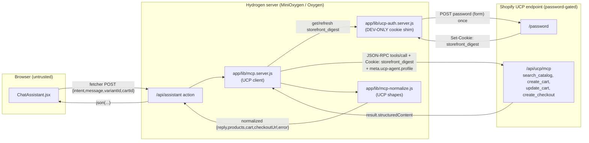

# Migrate the shopping assistant from `/api/mcp` to `/api/ucp/mcp`

Plan slug: `ucp-migration`
Status: REVISION 2 — addressing Plan-Reviewer `APPROVE WITH CHANGES` (`docs/reviews/ucp-migration-review.md`).
Owner: Architect
Date: 2026-07-08

> This plan migrates the **existing** shopping-assistant MCP client (shipped under `mcp-shopping-assistant`) from the standard Storefront MCP endpoint `/api/mcp` to the UCP-conforming endpoint `/api/ucp/mcp` on `theme-evolution-os2-hydrogen.myshopify.com`. It is a **concrete migration of live code**, not a greenfield build. The current implementation lives in `app/lib/mcp.server.js`, `app/lib/mcp-normalize.js`, `app/routes/($locale).api.assistant.jsx`, `app/components/ChatAssistant.jsx`, and `app/components/AssistantProductCard.jsx`.
>
> **Grounding provenance.** UCP request shapes are taken from `docs/plans/ucp-tools-list.json` (13 tools, full `inputSchema`, captured 2026-07-08 from the live dev store). Response-envelope, auth-tier, and rate-limit claims are verified via the Shopify Dev MCP (`shopify.dev/docs/agents/*`, 2026-04). The `/api/mcp`→`/api/ucp/mcp` reachability findings come from the memory note `dev-store-password-blocks-ucp-mcp` and probes 1–6 recorded in `docs/plans/mcp-shopping-assistant-impl-notes.md`. Where the retired UCP plan (Revision 2 of `docs/plans/mcp-shopping-assistant.md`) and the `/api/mcp` pivot (Revision 3) disagree with these sources, these sources win.

---

## Revision 2 — Review responses

This revision addresses all seven required changes from `docs/reviews/ucp-migration-review.md`. Each is mapped to the plan section(s) where it was folded in. The idempotency-key claim (change #3) and the rate-limit `-32000` behavior (change #5) were re-verified against the Shopify Dev MCP (UCP docs, 2026-04) before editing (citations in §5.4 and §6.5 / AL-UCP-13).

| # | Review required change | Addressed in |
| :-- | :-- | :-- |
| 1 | AL-UCP-3 prerequisite ownership — make OQ-U2 an operator-owned **pre-implementation gate**, resolved before the Coder is dispatched, not a Coder self-serve step. | New **§9.0 Operator-owned pre-implementation gate** (top of §9); OQ-U2 rewritten in §7; §4 "Not modified" env-var note reinforced. |
| 2 | AL-UCP-3 written fallback if the cookie does NOT clear the 302. | AL-UCP-3 rewritten with a concrete two-branch fallback tied to the STOP condition; §9.1 step 1a STOP branch expanded; §2 non-goal cross-ref; §7 top-risk mitigation. |
| 3 | §5.4 / AL-UCP-8 idempotency-key factual correction (`cancel_checkout` AND `cancel_cart` require the key per docs; `complete_checkout` too; schema requires only `ucp-agent`). | §5.4 rewritten; AL-UCP-8 rewritten; §11 Phase-2 note corrected. Re-verified via Dev MCP. |
| 4 | Dangling `"detail"` intent fate (remove intent + wiring cleanly, no unresolved imports, no Anti-Stubbing violation). | §4 route entry expanded; new **§9.1 step 7a**; §6.7a dead-code note for `mcp-normalize.js`; §7 edge-case + non-blocking note. |
| 5 | Rate-limit / `-32000` coverage gap — the HTTP-429 branch bypasses a `-32000`-in-body error; read `Retry-After` in BOTH paths and test the `-32000` case. | §6.5 rewritten; AL-UCP-13 rewritten; §9.1 step 5 + step 9 expanded; §10.4 unit-test list expanded. Re-verified via Dev MCP. |
| 6 | Cookie single-flight concurrency test coverage. | §4 test-file entry expanded; §9.1 step 4 adds a concurrency assertion; §10.4 expanded; AL-UCP-10 upgraded from "resolve during coding" to a firm §9 requirement. |
| 7 | `normalizeCart` total shape (`cart.cost.total_amount` → UCP `totals[]`). | §6.5 rewritten with explicit `totals[]` rewrite instruction; §9.1 step 6 made explicit; AL-UCP-5 resolution sharpened. |

Additionally folded in (reviewer non-blocking observations tied to the required changes): the production-with-no-auth path is now a **loud config error** rather than a silent 302 loop (§3.4, §4.4 — supports changes #1/#2); the `"add"` handoff is biased explicitly toward the cart `continue_url` with `create_checkout` as fallback (§3.5 — reduces the Phase-1 critical path); and §5.3 now notes that `search_catalog`'s `catalog` object has no schema-required fields, so the action's empty-query guard must remain.

---

## 1. Problem statement and goals

### Problem

The shopping assistant currently talks to the **standard** Storefront MCP endpoint `https://{shop}.myshopify.com/api/mcp`. That endpoint is **deprecation-flagged**: every `search_catalog`/`update_cart` response carries a notice that the standard tools *"will no longer be accessible after August 31, 2026. Migrate to the UCP-conforming Cart MCP tools at /api/ucp/mcp"* (PROBED, impl-notes probe 2). The UCP endpoint `/api/ucp/mcp` is the destination Shopify is steering all storefront-MCP traffic toward. The assistant must migrate before the sunset, and the UCP surface is also richer (structured content, per-variant checkout URLs, capability negotiation).

The blocker that stopped the original UCP attempt was that **the dev store's storefront password redirects `/api/ucp/mcp` to `/password` (HTTP 302)** on every request (PROBED, impl-notes probe 1; memory `dev-store-password-blocks-ucp-mcp`). **The storefront password cannot be disabled on a Shopify dev store — it is a platform constraint, not a config choice.** This plan therefore adopts a documented **DEV-ONLY cookie-auth shim** to get past the password on the dev store, while the request contract, response parsing, and normalization are migrated to the real UCP shapes.

### Goals

1. Point the MCP client at `https://{shop}.myshopify.com/api/ucp/mcp` for the **four Phase-1 tools** (§ scope below).
2. Inject the **UCP Component Contract** on every request: the `meta.ucp-agent.profile` object (dev profile URL) plus, where required, an `meta.idempotency-key` (Phase 2 tools only — `complete_checkout`, `cancel_checkout`, `cancel_cart`; see §5.4). See §5 for the per-tool enumeration.
3. Migrate response parsing from the `/api/mcp` envelope (`JSON.parse(result.content[0].text)` + `result.isError`) to the **UCP envelope** (`result.structuredContent`, with the JSON-RPC `error` object for protocol failures). See §6.
4. Implement the **DEV-ONLY storefront-password cookie shim**: POST the password to `/password` once server-side to obtain a `storefront_digest` cookie, cache it, and attach it as a `Cookie` header on every `/api/ucp/mcp` call. Never ship this to production; document the two production paths (paid tier where the password is disabled, or RFC 9421 signed requests).
5. Preserve **feature parity** with the current assistant: natural-language search, add-to-cart, cart summary, and a checkout-URL handoff — now via the UCP cart `continue_url` (preferred) with `create_checkout` as fallback.
6. Keep all Hydrogen architectural directives intact: Anti-Stubbing, complete-image handling (reconciled for MCP JSON, §5.5), hydration safety, root-vs-variant scope, and the Analytics Contract (there is **no** `Analytics.ItemView`; verified via Dev MCP — the namespace is `Provider`, `ProductView`, `CartView`, `CollectionView`, `SearchView`, `CustomView`).

### Phase-1 scope (feature parity only)

| Tool | Purpose in Phase 1 |
| :-- | :-- |
| `search_catalog` | Natural-language product discovery. |
| `create_cart` | Create the assistant cart with the chosen variant. |
| `update_cart` | Add/replace line items in an existing assistant cart (**full-replace semantics**, §6.4). |
| `create_checkout` | Convert the cart into a checkout to obtain the checkout URL for handoff — **fallback only**, used when the cart response does not expose a usable `continue_url` (§3.5, AL-UCP-6). |

Everything else is out of scope for Phase 1 (see §2 and the Phase-2 candidate list).

---

## 2. Non-goals

- **Disabling the storefront password.** Impossible on a dev store; not attempted. The shim works *around* it. (If the shim itself fails to unblock the endpoint, the fallback is an operator action — password removal on a paid tier or a `/api/ucp/*` path exception — or deferral; see AL-UCP-3.)
- **Shipping the cookie shim to production.** It is DEV-ONLY. Production auth is a paid-tier password removal or RFC 9421 signed requests (§4.4). A production build with neither the shim nor a signer must raise a **loud config error**, not silently 302-loop (§3.4, §4.4).
- **Hosting our own agent profile.** Phase 1 uses the Shopify-hosted test fixture `https://shopify.dev/ucp/agent-profiles/2026-04-08/valid-with-capabilities.json`. Hosting our own profile (required for the Signed/Token tiers and for production capability negotiation) is **Phase 2** (§4.4).
- **In-chat checkout completion.** `get_checkout`, `update_checkout`, `complete_checkout`, `cancel_checkout` are **not** wired in Phase 1. The assistant hands off to the checkout URL. These are Phase-2 candidates.
- **`lookup_catalog`, `get_order`, `get_product` (UCP detail), `cancel_cart`.** Not wired in Phase 1. Phase-2 candidates. (`get_product` is UCP's product-detail tool; the current `"detail"` intent that used the standard `get_product`/`getProductDetails` is **removed** in Phase 1 — see §4 and §9.1 step 7a — not migrated.)
- **Signed/Token auth tiers** (RFC 9421 ECDSA P-256 signing; Bearer JWT). Documented as the production path (§4.4) but not implemented in Phase 1; the dev store runs at the **Anonymous tier** behind the cookie shim.
- **Single-cart unification** with the site's Hydrogen cart. The assistant cart stays separate (existing dual-cart caveat, carried forward).
- **Converting `.jsx` files to `.tsx`.** Per CLAUDE.md, not a drive-by change.
- **GraphQL / codegen changes.** UCP MCP is JSON-RPC over HTTP; no Storefront GraphQL fragments change.

---

## 3. Proposed design

### 3.1 Trust boundary (unchanged shape, new endpoint + shim)



Rules (carried forward from the existing implementation and reinforced):

- **MCP is called only from `*.server.js` / the route `action`.** `mcp.server.js` and the new `ucp-auth.server.js` both carry the `.server.js` suffix so Vite never bundles them client-side. The storefront password and the `storefront_digest` cookie NEVER reach the browser.
- The browser receives only the normalized view model. No UCP endpoint URL, no raw UCP payload, no cookie, no profile URL leaks client-side.
- The user's free-text message stays untrusted: trimmed, length-capped (500 chars, already enforced), passed only as `catalog.query`.

### 3.2 Request flow per user turn (Phase 1)

```mermaid
sequenceDiagram
    participant U as Shopper
    participant C as ChatAssistant (browser)
    participant A as /api/assistant action
    participant M as mcp.server.js (UCP)
    participant Z as ucp-auth.server.js (shim)
    participant S as Shopify /api/ucp/mcp

    U->>C: "snowboards under $1000"
    C->>A: fetcher.submit {intent:"search", message}
    A->>M: searchCatalog({query, context})
    M->>Z: ensureStorefrontDigest()
    Z-->>M: Cookie: storefront_digest=… (cached or freshly minted)
    M->>S: POST tools/call search_catalog + meta.ucp-agent.profile + Cookie
    S-->>M: result.structuredContent {products[]}
    M-->>A: normalizeCatalogProducts(...)
    A-->>C: json({reply, products})
    U->>C: "Add to cart" on a variant
    C->>A: fetcher.submit {intent:"add", variantId, cartId?}
    A->>M: cartId ? updateCart(...) : createCart(...)
    M->>S: POST tools/call create_cart|update_cart (full line_items)
    S-->>M: result.structuredContent {cart}
    Note over A,M: if cart_id stale/invalid → clear cartId, create_cart fresh (cartReset:true)
    A->>A: prefer cart continue_url; else createCheckout({cartId}) fallback
    A->>M: (fallback only) createCheckout({cartId})
    M->>S: POST tools/call create_checkout
    S-->>M: result.structuredContent {checkout.continue_url}
    A-->>C: json({reply, cart, checkoutUrl})
    C->>U: cart summary + external checkout link
```

`intent` remains a small server-routed enum: `"search"` → `search_catalog`; `"add"` → `create_cart` (no cart yet) or `update_cart` (existing cart), then the handoff URL (cart `continue_url` if present, else `create_checkout`). No LLM planner (unchanged). The `"detail"` intent is **removed** in this migration (§4, §9.1 step 7a).

### 3.3 Endpoint reachability (PROBED)

| Endpoint | Reachability | Tools |
| :-- | :-- | :-- |
| `https://{shop}.myshopify.com/api/mcp` | HTTP 200, no auth (current) | standard tools (deprecated 2026-08-31) |
| `https://{shop}.myshopify.com/api/ucp/mcp` | **HTTP 302 → `/password`** without the shim; **HTTP 200 with the `storefront_digest` cookie** (shim, *assumed — must be probe-confirmed, AL-UCP-3*) | 13 UCP tools (`docs/plans/ucp-tools-list.json`) |
| `https://{shop}.myshopify.com/password` | Accepts a form POST of the password; responds `Set-Cookie: storefront_digest=…` | — |

> The 302→`/password` behavior is PROBED (impl-notes probe 1). The cookie-shim recovery path is the **documented workaround this plan introduces**; the exact `Set-Cookie` name (`storefront_digest`) and the POST body field name must be **confirmed by a live probe before coding** (AL-UCP-2, AL-UCP-3). **Whether the cookie actually clears the 302 on `/api/ucp/mcp` is the make-or-break question — AL-UCP-3 now carries a concrete written fallback if it does not.**

### 3.4 DEV-ONLY storefront-password cookie shim

New module `app/lib/ucp-auth.server.js`:

- `ensureStorefrontDigest({storeDomain, password, fetchImpl})` returns a `Cookie` header string. On first call (or after the cached value expires/fails), it POSTs the storefront password to `https://{storeDomain}/password` as a form body, reads the `storefront_digest` cookie from the `Set-Cookie` response header, caches it in a module-level variable with a soft TTL, and returns it. On a subsequent `/api/ucp/mcp` call that returns 302→`/password` (cookie rejected/expired), the client invalidates the cache and re-mints once (single bounded retry).
- **Single-flight minting (firm requirement, AL-UCP-10, change #6):** concurrent callers that arrive while a `/password` POST is in flight MUST share the same in-flight promise rather than each issuing their own POST. Implement with a module-level `inFlightPromise` that is set before the POST, awaited by concurrent callers, and cleared on settle. This is a correctness requirement, not a probe unknown, and is unit-tested (§9.1 step 4, §10.4).
- The password is read from `context.env` (a new **dev-only** env var; see §5.2). It is NEVER logged and NEVER returned to the browser.
- **This module must be labeled DEV-ONLY in a top-of-file comment banner and gated behind an explicit boolean check:** the shim runs only when the password env var is present. In a production build where the password is absent:
  - If a signed-request signer is configured (Phase 2), the client uses it.
  - If **neither** the shim nor a signer is available and the endpoint is still password-gated, the client MUST raise a **loud config error** (a `McpError('config_error', …)` surfaced as a config error to the action) rather than silently entering an infinite 302→`/password` loop. A hard guard prevents the shim from silently activating in production, and prevents a silent no-op auth path.

> **The shim must never ship to production.** It circumvents a storefront access control. Its only justification is that the dev store's password cannot be disabled. The Plan-Reviewer should confirm the DEV-ONLY guard, the env-var gating, and the loud-config-error-on-missing-auth behavior are explicit.

### 3.5 UI/UX (largely unchanged)

The existing `ChatAssistant.jsx` and `AssistantProductCard.jsx` UI is preserved. Migration touches the **data** they consume, not the layout:

- Product cards still render `` (MCP media has no `width`/`height`) + `<Money>` + an "Add to cart" button, and `<Analytics.ProductView>` with a `{products:[ProductPayload]}` payload when a variant id is present.
- The empty-vs-error state distinction is preserved verbatim (a zero-result search is NOT an error).
- **Checkout-URL sourcing biases toward the cart `continue_url`.** The UCP guidance (Dev MCP: *"Sharing a cart link with the buyer → Cart MCP (`continue_url`)"* and the response-field guidance *"Cart … keep `continue_url`"*) is that the cart response itself exposes a `continue_url` usable for handoff. The `"add"` intent MUST prefer that cart `continue_url` when present, and only call `create_checkout` as a **fallback** when it is absent. This drops a tool call per add (lower Anonymous-tier rate-limit pressure, §7) and makes AL-UCP-7 (`cart_id`-vs-`line_items`) moot for the common path. Confirm the cart `continue_url` shape by probe (AL-UCP-6, OQ-U1).
- The dual-cart caveat copy ("assistant cart, separate from the site cart") stays.
- The `"detail"` intent's product-detail panel is removed with the intent (§9.1 step 7a); `ChatAssistant.jsx`'s `message.productDetail` branch becomes permanently unreached but harmless (§6.7a).

---

## 4. Affected files and modules

### New files

- `app/lib/ucp-auth.server.js` — **DEV-ONLY** storefront-password cookie shim (§3.4). `.server.js` suffix mandatory. Exports `ensureStorefrontDigest()` and an internal cache-invalidation helper. Reads the dev-only password env var; hard-gated off when absent; raises a loud config error in production when neither shim nor signer is available (§3.4). Single-flight minting (AL-UCP-10).
- `app/lib/ucp-auth.server.test.js` — unit test for the shim: injected `fetchImpl` returns a `Set-Cookie: storefront_digest=…`; assert (a) the returned `Cookie` header, (b) the caching behavior (second call does not re-POST), (c) the invalidate-and-re-mint-once path on a simulated 302, and (d) **single-flight concurrency** — two concurrent `ensureStorefrontDigest()` callers with no cached cookie issue exactly ONE `/password` POST and both receive the same cookie (change #6). `node --test` (matches the existing `mcp.server.test.js` harness).

### Modified files

- `app/lib/mcp.server.js` — the heart of the migration:
  - Change `MCP_PATH` from `/api/mcp` to `/api/ucp/mcp`.
  - Inject `meta.ucp-agent.profile` into every tool's `arguments` (Component Contract, §5.1). Read the profile URL from a new env var / const (§5.2).
  - Call `ensureStorefrontDigest()` and attach `Cookie: storefront_digest=…` on every request (dev shim). Handle a 302→`/password` response by invalidating the cached cookie and retrying once.
  - Migrate `callTool` response parsing from `JSON.parse(result.content[0].text)` + `result.isError` to **`result.structuredContent`** (§6.2), plus JSON-RPC `error` handling (protocol errors, code `-32000`/`-32001`).
  - **Rate-limit coverage (change #5):** the current `callTool` throws on `res.status === 429` at line 88 *before* parsing the body. UCP surfaces rate-limiting as a JSON-RPC `-32000` protocol error in a **200 body** while ALSO honoring the HTTP `Retry-After` header (Dev MCP, §6.5). The migrated `callTool` MUST (a) keep the HTTP-429 branch and read `Retry-After` there, AND (b) after parsing, detect a `data.error.code === -32000` body, read the HTTP `Retry-After` header (if present) in that path too, and map both to `McpError('rate_limited', {retryAfterMs})`. Do not let the `-32000` body path bypass the rate-limit mapping.
  - Replace `getProductDetails`/`getCart` (standard-tool exports) with the Phase-1 UCP exports: `searchCatalog`, `createCart`, `updateCart`, `createCheckout`. Keep `McpError` and the injectable `fetchImpl`. **Delete `getProductDetails`** (its only caller was the removed `"detail"` intent — §9.1 step 7a).
- `app/lib/mcp-normalize.js` — re-map to the UCP response shapes (§6.3): product `id` is a UCP product id (`gid://shopify/p/…`) per docs; prices are **integer minor units** across catalog, cart, and checkout (UCP is uniform minor-units — this **removes** the two-path divergence the `/api/mcp` code had to handle). **`normalizeCart` (currently `mcp-normalize.js:296`) reads `rawCart.cost?.total_amount`, which WILL break against UCP** — rewrite it to read the UCP `totals[]` array (§6.5, change #7). Add `normalizeCheckout` for the `continue_url`. **Delete `normalizeProductDetail` and `normalizeProductDetailsMoney`** — they become dead code once the `"detail"` intent is removed (§6.7a, §9.1 step 7a). Keep the pure-function discipline.
- `app/routes/($locale).api.assistant.jsx` — update the `"add"` intent to call `createCart` (no `cartId`) or `updateCart` (existing `cartId`, full line-item replace) then obtain the handoff URL (prefer the cart `continue_url`, else `createCheckout`, §3.5); update the stale-cart recovery to the UCP error shape; keep the empty-vs-error discipline and the locale guard verbatim. **Remove the `"detail"` intent (lines ~109–124) AND its imports of `getProductDetails` / `normalizeProductDetail` (lines ~6–14)** — cleanly, not commented out (§9.1 step 7a, Anti-Stubbing). Add a config/auth error path when the shim cannot mint the cookie.
- `app/lib/const.js` — add the UCP profile URL constant and (optionally) a `UCP_MCP_PATH` constant. Keep `ASSISTANT_RESULT_LIMIT`, `MCP_TIMEOUT_MS`.

### Possibly modified

- `app/components/AssistantProductCard.jsx` — only if the UCP product/variant id field names differ from the normalized shape (the normalizer should absorb the difference so the card stays unchanged). Confirm variant id path (AL-UCP-4).

### Not modified

- GraphQL fragments / generated declarations — no change (JSON-RPC, not GraphQL). `npm run build` still runs codegen (type gate) with no diff expected.
- `app/components/ChatAssistant.jsx` — no change expected (it is data-shape-agnostic; it reads `cart`, `checkoutUrl`, `products`, `error`, `cartReset`, `productDetail`). Its `message.productDetail` branch becomes permanently unreached once `"detail"` is removed, but is harmless dead UI (§6.7a). Leaving it is acceptable for this migration; the reviewer flagged it as harmless.
- `server.js`, `entry.server.jsx`, `app/root.jsx` — no change.
- `.env` / `.env.local` — **NOT edited by the Coder.** The dev-only password env var is an **operator** concern; the plan documents which var is needed, the operator adds it as part of the **§9.0 pre-implementation gate** (change #1) before the Coder is dispatched.

### 4.4 Production path (documented, not built)

The cookie shim is DEV-ONLY. In production, `/api/ucp/mcp` must be reached one of two ways:

1. **Paid Shopify tier with the storefront password disabled.** On a plan where the password can be turned off, `/api/ucp/mcp` is reachable at the **Anonymous tier** with no shim — cart/checkout build/edit tools work unauthenticated. `complete_checkout` and order tools still require Token tier.
2. **RFC 9421 HTTP Message Signatures (Signed tier).** Per Shopify docs (verified via Dev MCP, `shopify.dev/docs/agents/profiles/auth-and-rate-limiting`): the Signed tier uses **HTTP Message Signatures per RFC 9421 using ECDSA P-256**, verified against the public key published in the agent's well-known UCP profile. This requires **hosting our own agent profile** (Phase 2) with signing keys, and gets higher rate limits than Anonymous. (`complete_checkout` and order tools are still unavailable at the Signed tier — those need Token tier / Bearer JWT.)

Keep `callTool` auth-injection pluggable so a future signed-request signer slots in where the cookie shim is today. **If a production build has neither the shim (password env var) nor a signer AND the endpoint is still password-gated, the client raises a loud `config_error` rather than silently 302-looping** (§3.4).

---

## 5. Component Contract enumeration (REQUIRED)

Every `/api/ucp/mcp` request body is JSON-RPC 2.0 `tools/call`:

```jsonc
{
  "jsonrpc": "2.0",
  "method": "tools/call",
  "id": 1,
  "params": {
    "name": "<tool>",
    "arguments": {
      "meta": { "ucp-agent": { "profile": "<PROFILE_URL>" } },
      // ... tool-specific fields
    }
  }
}
```

### 5.1 `meta.ucp-agent.profile` — REQUIRED on every Phase-1 tool

Verified per-tool against `docs/plans/ucp-tools-list.json` (`inputSchema.required` includes `"meta"`, and `meta` requires `"ucp-agent"`, and `ucp-agent` requires `"profile"`):

| Tool | `required` (top level) | `meta.required` | `meta.ucp-agent.required` | `meta.idempotency-key`? |
| :-- | :-- | :-- | :-- | :-- |
| `search_catalog` | `["meta","catalog"]` | `["ucp-agent"]` | `["profile"]` | not present |
| `create_cart` | `["meta","cart"]` | `["ucp-agent"]` | `["profile"]` | not present |
| `update_cart` | `["meta","cart","id"]` | `["ucp-agent"]` | `["profile"]` | not present |
| `create_checkout` | `["meta","checkout"]` | `["ucp-agent"]` | `["profile"]` | not present |

So for **all four Phase-1 tools**, the injected contract is exactly `meta.ucp-agent.profile = <PROFILE_URL>`. No idempotency key is required by any Phase-1 tool's schema.

**Dev profile URL (Phase 1):** `https://shopify.dev/ucp/agent-profiles/2026-04-08/valid-with-capabilities.json` — a Shopify-hosted test fixture ("valid, with capabilities") for UCP version `2026-04-08`. Hosting our own profile is Phase 2 (§4.4). The Dev MCP confirms Shopify hosts "valid profiles … with capabilities" fixtures for exactly this negotiation purpose.

### 5.2 Configuration (env vars)

Two configuration values are needed. Both are **operator-managed** (`.env.local`); the Coder does NOT edit env files. The dev-only password var is resolved via the **§9.0 pre-implementation gate** (change #1) before implementation starts.

| Value | Where | Purpose | Notes |
| :-- | :-- | :-- | :-- |
| Storefront password | `.env.local` (new **dev-only** var, e.g. `DEV_STOREFRONT_PASSWORD`) | Feeds the cookie shim. | DEV-ONLY. Referenced by pointer only; the literal value lives in `docs/dev-fixtures.md` (uncommitted) and MUST NOT be copied into this committed plan. Absence disables the shim. **Operator adds this before the Coder is dispatched (§9.0).** |
| UCP agent profile URL | `app/lib/const.js` constant (or env var) | `meta.ucp-agent.profile`. | The Phase-1 dev fixture URL is public and non-secret, so a `const` is acceptable; a `PUBLIC_UCP_AGENT_PROFILE_URL` env var is the Phase-2-ready alternative. |

`PUBLIC_STORE_DOMAIN` is reused to build the endpoint (already present).

### 5.3 Phase-1 tool argument bodies (from `ucp-tools-list.json`)

- `search_catalog`: `arguments = { meta, catalog: { query, context?: {address_country, currency?, language?, intent?}, filters?: {price:{min,max}/*minor units*/, categories?, available?}, pagination?: {limit, cursor?} } }`. **Note:** the top-level `required` is `["meta","catalog"]`, but the `catalog` object itself has **no `required` array** — neither `query` nor `filters` is schema-required (the tool description states "at least one of query or filters must be provided" as prose; the server enforces query-or-filters **at runtime**, not via schema validation). Therefore the action's existing empty-query guard (`($locale).api.assistant.jsx` line ~78, returns a `validation_error` when `message` is empty) MUST remain — schema validation will NOT catch an empty query for us (change #4 note).
- `create_cart`: `arguments = { meta, cart: { line_items: [{ item: {id: "<variant_gid>"}, quantity }], context?, buyer?, discounts? } }`. **Note the nested shape: `line_items[].item.id`** (the variant id) — different from the `/api/mcp` `add_items[].product_variant_id`.
- `update_cart`: `arguments = { meta, cart: { line_items: [...] }, id: "<cart_gid>" }`. **`id` is a top-level sibling of `cart`** (per schema `required: ["meta","cart","id"]`). Full-replace semantics (§6.4).
- `create_checkout` (**fallback path only**, §3.5): `arguments = { meta, checkout: { cart_id?: "<cart_gid>", line_items?: [...] } }`. Prefer `cart_id` conversion (per UCP guidance) to reuse cart contents. `checkout.required = ["line_items"]` in the schema, but the schema's `cart_id` description says a cart id supplies line items — **confirm whether `cart_id` alone satisfies the `line_items` requirement, or whether line items must be resent (AL-UCP-7).** Because the primary handoff now uses the cart `continue_url`, this question only matters if the cart lacks a `continue_url`.

### 5.4 Idempotency-key contract — captured now for Phase 2 (do not lose) — CORRECTED (change #3)

Even though Phase 1 wires none of these, the contract is recorded so it is not lost. **Re-verified against the Shopify Dev MCP (Cart MCP + Checkout MCP docs, 2026-04) during this revision.** The finding is stronger than the previous revision stated: the **docs require `meta["idempotency-key"]` on all three of** `complete_checkout`, `cancel_checkout`, and `cancel_cart`, while the captured `ucp-tools-list.json` schema lists only `ucp-agent` as required for the two cancel tools. This is a docs-vs-schema discrepancy on the cancel tools (AL-UCP-8).

- **`complete_checkout` (Phase 2):** BOTH `ucp-tools-list.json` schema AND the Dev MCP Checkout MCP docs REQUIRE `meta.idempotency-key` (a UUID string) **in addition to** `meta.ucp-agent.profile`. No discrepancy. Dev MCP: *"complete_checkout … Requires `meta[\"idempotency-key\"]` (UUID) in addition to `meta[\"ucp-agent\"]`."* Use a unique UUID per completion attempt; reuse the same key on retries of the *same* logical completion so the payment lifecycle is retry-safe (Dev MCP: *"Don't retry inside the same checkout or payment lifecycle without an idempotency-key."*).
- **`cancel_checkout` (Phase 2):** **The Dev MCP Checkout MCP docs REQUIRE `meta.idempotency-key`** — *"cancel_checkout … Requires `meta[\"idempotency-key\"]` (UUID) in addition to `meta[\"ucp-agent\"]`."* This corrects the previous revision, which wrongly stated only `complete_checkout` needed the key among checkout tools. However the captured `ucp-tools-list.json` schema for `cancel_checkout` lists only `ucp-agent` as required. **Docs-vs-schema discrepancy → AL-UCP-8; resolve by probe before wiring in Phase 2, but treat the docs (key required) as the safe default.**
- **`cancel_cart` (Phase 2):** **The Dev MCP Cart MCP docs REQUIRE `meta.idempotency-key`** — *"cancel_cart … Requires `meta[\"idempotency-key\"]` (UUID) in addition to `meta[\"ucp-agent\"]`."* The captured `ucp-tools-list.json` schema lists only `ucp-agent`. Same docs-vs-schema discrepancy → AL-UCP-8. Reuse the same key when retrying a cancel so the server returns the same outcome without cancelling twice (Dev MCP).

**Net:** all three completion/cancel tools have docs that require the idempotency-key; the schema capture under-specifies the two cancel tools. When Phase 2 wires any of them, send the key (matching the docs), and probe to confirm the server enforces it. Do not let the previous understatement propagate into a Phase-2 plan the way the `Analytics.ItemView` error propagated last time.

---

## 6. Data model and API changes

### 6.1 Endpoint + auth

- Endpoint: `/api/mcp` → `/api/ucp/mcp`.
- Auth (dev): none natively (Anonymous tier) but password-gated → cookie shim supplies `Cookie: storefront_digest`. Auth (prod): §4.4.

### 6.2 Response envelope — the load-bearing change (verified via Dev MCP)

The `/api/mcp` envelope was `JSON.parse(result.content[0].text)` + boolean `result.isError`. The **UCP envelope is different**:

- **Success (business outcome):** `result.structuredContent` carries the typed payload (e.g. `structuredContent.products` for catalog, `structuredContent.cart` for cart tools). `result.content[]` may ALSO be present as a text representation — but `structuredContent` is authoritative. (Dev MCP: *"The cart is returned in `result.structuredContent`. The `result.content` array may also be present with a text representation of the cart."*)
- **Protocol error (transport failure — auth, rate limit, unavailability):** JSON-RPC top-level `error` object with code `-32000` (or `-32001` for discovery errors). Map to `McpError`. (Dev MCP: *"Transport-level failures … are returned as JSON-RPC error with code -32000, or -32001 for discovery errors."*)
- **Business-outcome errors** (application-level, e.g. expired cart, unavailable merchandise) come back as a *successful* `result` with a `messages[]` array (info/warning/error). The action must inspect `structuredContent.cart.messages[]` for `error`-type entries rather than relying on a boolean `isError` flag.

`callTool` change: parse `data.result.structuredContent`; if absent, fall back to parsing `data.result.content[0].text` defensively (belt-and-suspenders during migration) but treat `structuredContent` as primary. Handle `data.error` (JSON-RPC) → `McpError('rpc_error' | 'rate_limited', …)`. This is **AL-UCP-1**, flagged low-confidence: the exact live shape must be confirmed by a probe before finalizing the parser, because the retired plan's ancestor assumed `structuredContent` and was proven wrong for `/api/mcp` — we must not repeat that mistake in the opposite direction for `/api/ucp/mcp`.

### 6.3 Normalized view model (browser-facing contract — mostly stable)

The `AssistantProduct` / `AssistantCart` shapes the components consume stay the same:

```ts
AssistantProduct = { id, title, vendor, descriptionHtml?, priceRange:{min:Money,max:Money}, image?:{url,altText}, firstVariantId?, firstVariantTitle, available }
Money           = { amount: string /* decimal, major units */, currencyCode: string }
AssistantCart   = { id, totalAmount: Money, lineCount, checkoutUrl? }
```

What changes is the **mapping** from UCP raw shapes to this model (§6.5).

### 6.4 Cart semantics — full-replace (behavior change)

UCP `update_cart` is **full-replace**: *"Replace the cart's contents"* / *"cart update is full-replace: always carry forward the entire line_items array"* (Dev MCP). This differs from the standard `/api/mcp` `update_cart`, which used incremental `add_items`. Consequence for the action's `"add"` intent: to add an item to an existing cart, the action must **send the full desired line-item set** (existing lines + the new one), not just the delta. Phase 1 keeps the assistant cart simple (typically one item at a time), but the Coder MUST carry forward existing lines when the cart already has contents, or items will be silently dropped. Logged as a design risk (§7).

### 6.5 Money mapping + cart `totals[]` — simplification and required rewrite (changes #5 and #7)

**Money (simplification).** UCP uses **integer minor currency units uniformly** across catalog, cart, and checkout (Dev MCP: *"Minor currency units apply to every amount in the response … `15000` = $150.00"*; catalog `price_range.min = {amount: 8900, currency: "USD"}`). This **removes** the two-path divergence the `/api/mcp` normalizer needed (catalog integer vs detail/cart decimal-string). The migrated normalizer applies `minorUnitsToDecimalString(amount, currencyCode)` on ALL price paths and renames `currency` → `currencyCode` everywhere. Keep the zero-decimal-currency guard (dev store is USD).

**Cart total shape — REQUIRED rewrite (change #7).** The current `normalizeCart` (`app/lib/mcp-normalize.js:296`) reads `rawCart.cost?.total_amount`. The Dev MCP is explicit that **UCP has no `cost` field**: *"Cart/checkout pricing lives in `result.totals[]`; there is no `result.cost` field."* Left as-is, `normalizeCart` would read `undefined` and render $0.00. The Coder MUST rewrite `normalizeCart` to:
  1. Read `rawCart.totals` (an array of `{type, amount, display_text}` entries, minor units, per the UCP printer contract).
  2. Select the `type === "total"` entry for `AssistantCart.totalAmount` (convert via `minorUnitsToDecimalString`, pair with `rawCart.currency`).
  3. If no `type === "total"` entry exists, fall back to a safe `{amount: '0.00', currencyCode}` (Anti-Stubbing: this is a genuine "no total available" state, not fabricated data).
  4. Do NOT reorder/recompute the `totals[]` array; if a future revision surfaces a breakdown, render entries order-preserving using `display_text` (UCP printer contract). Phase 1 only needs the single `total`.
Confirm the exact cart total shape and the `type` value by probe (**AL-UCP-5**) before finalizing.

**Rate-limit interaction (change #5, cross-ref §6.2 / AL-UCP-13).** Rate-limiting can arrive either as an HTTP 429 (with `Retry-After`) OR as a JSON-RPC `-32000` protocol error in a 200 body (also honoring `Retry-After`). The normalizer is not where this is handled — it is handled in `callTool` (§6.2, AL-UCP-13). Called out here because the money/total rewrite and the rate-limit branch are edited in the same migration pass and must not be conflated.

### 6.6 Image mapping — unchanged reconciliation

MCP media provides `url` + `alt_text`, no `width`/`height`. Keep the existing `` render (no fabricated dimensions). The CLAUDE.md complete-image directive binds GraphQL queries, not MCP JSON; honor its spirit by always supplying a real URL + non-empty alt (fallback to title). Confirm the UCP media field name (`media[].url`/`images[].url`, `alt_text`) by probe (AL-UCP-4).

### 6.7 Analytics Contract — unchanged, re-verified

`<Analytics.ProductView>` with `data={{products:[ProductPayload]}}`; `variantId` from the normalized `firstVariantId`; `price` a string; `vendor`/`variantTitle` truthy (Hydrogen drops the event on falsy `vendor`/`variantTitle`). The Hydrogen `Analytics` namespace exposes `Provider`, `ProductView`, `CartView`, `CollectionView`, `SearchView`, `CustomView` — **no `Analytics.ItemView`** (re-verified via Dev MCP, 2026-04). If UCP catalog products lack a stable variant id in Phase 1, the existing per-card exemption (skip the event rather than emit an empty id) applies.

### 6.7a `"detail"` intent removal — normalizer dead code (change #4)

Removing the route's `"detail"` intent (§9.1 step 7a) makes three symbols dead:
- `mcp.server.js`: `getProductDetails` — **delete** (only caller was the `"detail"` intent).
- `mcp-normalize.js`: `normalizeProductDetail` and `normalizeProductDetailsMoney` — **delete** (only callers were `getProductDetails` / the `"detail"` intent).
- `ChatAssistant.jsx`: the `message.productDetail` branch becomes permanently unreached but harmless; leaving it is acceptable for this migration (reviewer confirmed harmless). No stub or empty-value placeholder is introduced — the intent and its wiring are **removed cleanly**, satisfying the Anti-Stubbing Rule (removing a feature is fine; commenting it out to dodge a TypeError is not). UCP's product-detail equivalent is `get_product`, a Phase-2 candidate (§11); if in-chat detail is later wanted, it is re-introduced against `get_product`, not resurrected against the deprecated `/api/mcp`.

---

## 7. Risks, edge cases, and open questions

### Risks

- **Cookie shim is a security-adjacent workaround (top risk).** It defeats a storefront access control. Mitigation: DEV-ONLY label + hard env-var gate + `.server.js` boundary + never logging the password/cookie + a loud config error (never a silent 302 loop) if production has neither shim nor signer (§3.4). **If the cookie does not even clear the 302, there is a written fallback (AL-UCP-3): operator removes the password / adds a `/api/ucp/*` path exception on a paid tier, OR the migration is deferred until a signed-request path exists.** The Plan-Reviewer must confirm the shim cannot activate in a production build.
- **Response-envelope regression (high).** The `/api/mcp`→`/api/ucp/mcp` migration inverts the very assumption (`structuredContent` vs `content[0].text`) that broke the original attempt. A parser that guesses wrong renders nothing or crashes. Mitigation: probe the live envelope first (AL-UCP-1), parse `structuredContent` primary with a defensive `content[0].text` fallback, unit-test both.
- **Full-replace cart data loss (high).** UCP `update_cart` replaces line items; a delta-style add silently drops existing lines (§6.4). Mitigation: always carry forward the full line-item set; test a two-item add sequence.
- **Rate-limit body error missed (medium-high, change #5).** The existing `callTool` throws on HTTP 429 before parsing the body, so a `-32000` rate-limit in a 200 body would bypass the rate-limit mapping and surface as a generic `rpc_error`. Mitigation: read `Retry-After` in BOTH the 429 path and the `-32000` body path; unit-test the `-32000`+`Retry-After` case (§9.1 step 5/9, §10.4).
- **Cookie lifetime / concurrency (medium).** A module-level cached cookie shared across concurrent in-flight requests could be invalidated mid-flight by one request while another is using it; the cookie may also not survive a Hydrogen server restart. Mitigation: single-flight minting (firm requirement, AL-UCP-10) + single bounded re-mint on 302; treat the cache as best-effort (AL-UCP-9, AL-UCP-11). Unit-tested for concurrency (change #6).
- **Sunset timing (medium).** `/api/mcp` sunsets 2026-08-31; this migration must land before then. UCP is the forward path regardless.
- **Anonymous-tier rate limits (medium).** The dev store runs Anonymous (lowest limits). Mitigation: keep one-tool-call-per-turn where possible — preferring the cart `continue_url` over a separate `create_checkout` (§3.5) removes a call per add — honor `Retry-After`, conservative `pagination.limit`.
- **Anti-Stubbing.** No fake product/cart data on failure paths; empty results are a friendly empty state distinct from errors (carried forward). The `"detail"` intent is removed cleanly, not stubbed (§6.7a).
- **Hydration.** `ChatAssistant` stays gated behind `useIsHydrated`; no new browser-API access at render.

### Edge cases

- Password rejected / changed → shim POST fails → action returns a config/auth error (not an empty state).
- Password env var absent in dev → shim disabled → action returns a loud config error (§3.4), never a silent 302 loop.
- `storefront_digest` expired mid-session → next `/api/ucp/mcp` call 302s → invalidate + re-mint once → retry.
- UCP protocol error `-32000` (auth/rate-limit) vs business `messages[].error` → mapped to distinct error copy. `-32000` in a 200 body with `Retry-After` → `rate_limited` (change #5).
- Stale/invalid `cart_id` on `update_cart` → clear stored cartId, `create_cart` fresh, `cartReset:true` (carried forward, re-mapped to UCP error shape).
- Zero results (`structuredContent.products` empty) → empty state, Send enabled.
- Variant unavailable → render card, disable "Add to cart".
- Non-default locale → action URL is `${pathPrefix}/api/assistant` (never `<Link>`-wrapped) — unchanged.
- A client that still POSTs `intent:"detail"` after the intent is removed → the `switch` falls through to the default/unknown-intent branch (returns a `validation_error`), NOT a crash; the browser UI no longer offers a detail trigger (§6.7a).

### Open questions (resolve before coding the affected part)

- **OQ-U1** — Is `create_checkout` needed for the handoff URL, or does the UCP `create_cart`/`update_cart` response already expose a cart-level `continue_url` we can hand off directly (avoiding an extra tool call per add)? **Recommendation (now the plan's default, §3.5):** prefer the cart `continue_url`; use `create_checkout` only as a fallback. Cross-ref AL-UCP-6. Probe first.
- **OQ-U2 (OPERATOR-OWNED PRE-IMPLEMENTATION GATE — change #1)** — The operator MUST add the dev-only storefront-password env var (§5.2) and confirm `docs/dev-fixtures.md` holds the current dev-store password **before the Coder is dispatched**. This is not a Coder step: the Coder cannot self-serve the password, and the make-or-break AL-UCP-3 probe (§9.1 step 1a) depends on it. **If the operator does not/cannot provide the password, implementation does not begin** — see §9.0. Without it the shim cannot mint the cookie and Phase 1 cannot run on this store.
- **OQ-U3** — Phase-1 profile fixture: is `valid-with-capabilities.json` the right fixture, or do we need the cart+checkout-capabilities variant specifically for `create_cart`/`create_checkout` negotiation? If negotiation prunes cart/checkout capabilities, those tools error. Cross-ref AL-UCP-12.

---

## 8. Ambiguity Log (REQUIRED)

Confidence is the Architect's estimate that the stated resolution is correct as-designed. **Entries flagged ⚠️ LOW-CONFIDENCE are called out for Plan-Reviewer priority scrutiny.**

### AL-UCP-1 — Tool-call response envelope shape ⚠️ LOW-CONFIDENCE

- **Unknown:** Whether the live `/api/ucp/mcp` returns the payload in `result.structuredContent` (docs) or somewhere else, and whether `result.content[]` co-exists.
- **Why it matters:** This is the exact assumption that broke the original attempt (docs said `structuredContent`; `/api/mcp` actually used `content[0].text`). Getting it wrong renders nothing or crashes the parser. Load-bearing for `callTool`.
- **Resolve by:** Live probe of `search_catalog` on `/api/ucp/mcp` (behind the cookie shim) before finalizing the parser; parse `structuredContent` primary with a defensive `content[0].text` fallback; unit-test both.

### AL-UCP-2 — `storefront_digest` cookie name + `/password` POST body field ⚠️ LOW-CONFIDENCE

- **Unknown:** The exact `Set-Cookie` name Shopify returns from `/password` (assumed `storefront_digest`) and the exact form field name for the password in the POST body.
- **Why it matters:** The entire dev shim depends on reading the right cookie and posting the right field; wrong names → perpetual 302.
- **Resolve by:** Live probe: POST the password form to `/password`, inspect `Set-Cookie`; confirm the field name from the store's password form HTML.

### AL-UCP-3 — Whether the cookie shim actually clears the 302 on `/api/ucp/mcp` ⚠️ LOW-CONFIDENCE — WITH WRITTEN FALLBACK (change #2)

- **Unknown:** Whether attaching `storefront_digest` to `/api/ucp/mcp` yields HTTP 200, or whether the endpoint has a separate gate the cookie does not satisfy (e.g. it keys off a different session cookie, a Bearer token, or a Storefront access token rather than the Liquid password cookie).
- **Why it matters:** If the cookie does not unblock the endpoint, Phase 1 cannot run on this store — this is the exact axis the retired attempt died on.
- **Prerequisite:** This probe depends on the operator-supplied password (OQ-U2). It is gated behind the **§9.0 pre-implementation gate**; the operator resolves OQ-U2 before the Coder runs this probe.
- **Resolve by:** Live probe: mint the cookie, then `tools/list` on `/api/ucp/mcp` with the cookie; expect 200. **This is the make-or-break probe — run it first (§9.1 step 1a).**
- **Written fallback if the probe does NOT return 200 (the STOP condition):** the Coder STOPS all implementation and hands back to the operator with the probe evidence. The operator then chooses ONE of:
  - **(a) Unblock the endpoint at the platform level** — remove the storefront password (only possible on a paid tier) OR configure a `/api/ucp/*` path exception on the dev store so the UCP endpoint is reachable without the password. This is the operator's known unblock per the memory note `dev-store-password-blocks-ucp-mcp` (*"until the password is removed or a path exception is configured"*). Once unblocked, the Coder drops the cookie shim entirely (Anonymous-tier reach) and proceeds with the rest of the migration.
  - **(b) Defer Phase 1 on this store** — if neither password removal nor a path exception is available, the migration is **deferred** until a paid-tier password removal or a signed-request (RFC 9421) path exists (§4.4). The response-envelope, normalizer, and Component-Contract work are NOT started against a store where the endpoint is unreachable, because they cannot be verified. The plan records the deferral decision in `docs/plans/ucp-migration-impl-notes.md`.
  - The decision point is explicit: `200` → proceed with the shim; `302` after a confirmed-correct cookie (AL-UCP-2 resolved) → operator picks (a) or (b); there is no "guess and keep coding" branch.

### AL-UCP-4 — UCP product/variant/media field names

- **Unknown:** Exact field paths for product id, first-variant id, media url/alt in the live UCP catalog response (docs show `id: "gid://shopify/p/…"`, `variants[].id`, `options[].values[].label`; media shape unconfirmed).
- **Why it matters:** The normalizer and the Analytics `variantId` depend on these; a wrong path drops add-to-cart and analytics.
- **Resolve by:** Probe `search_catalog`; map the real shape in `mcp-normalize.js`.

### AL-UCP-5 — Cart/checkout total shape (`totals[]` vs `cost`) — RESOLUTION SHARPENED (change #7)

- **Unknown:** The exact structure of the UCP cart `totals[]` array and the `type` value that denotes the grand total.
- **Confirmed (Dev MCP):** UCP cart/checkout pricing lives in `result.totals[]`; **there is no `result.cost` field.** The current `normalizeCart` reading `rawCart.cost?.total_amount` (`mcp-normalize.js:296`) is therefore known-broken and MUST be rewritten to read `totals[]` (§6.5).
- **Why it matters:** `normalizeCart` would render $0.00 against the real shape.
- **Resolve by:** Probe `create_cart`; confirm the `totals[]` entry shape (`{type, amount, display_text}`) and that the grand total is `type === "total"`; select that entry. Do not reorder/recompute the array (UCP printer contract).

### AL-UCP-6 — Cart-level `continue_url` vs a separate `create_checkout` for handoff

- **Unknown:** Whether the cart response exposes a `continue_url` usable directly for handoff, or whether `create_checkout` is required to get a checkout URL.
- **Why it matters:** Determines whether the `"add"` intent is one tool call or two; affects rate-limit budget and the Phase-1 tool set. The Dev MCP guidance strongly favors the cart `continue_url` for buyer handoff, so the plan biases toward it (§3.5) with `create_checkout` as fallback.
- **Resolve by:** Probe `create_cart` for `continue_url`; if present, use it and treat `create_checkout` as fallback only; cross-ref OQ-U1.

### AL-UCP-7 — `create_checkout`: `cart_id` alone vs required `line_items`

- **Unknown:** The schema lists `checkout.required = ["line_items"]` yet `cart_id` "uses cart contents." Whether passing only `cart_id` satisfies the requirement.
- **Why it matters:** A wrong body → schema-validation error on the checkout handoff. **Scope note:** only matters on the fallback path now that the primary handoff uses the cart `continue_url` (§3.5).
- **Resolve by:** Probe `create_checkout` with `cart_id` only; if it errors, resend line items.

### AL-UCP-8 — Idempotency-key: schema vs docs discrepancy for cancel tools — CORRECTED (change #3)

- **Unknown / discrepancy:** The captured `ucp-tools-list.json` schema requires only `ucp-agent` on `cancel_cart` and `cancel_checkout`, BUT the Dev MCP docs (re-verified this revision) explicitly REQUIRE `meta["idempotency-key"]` on BOTH: Cart MCP — *"cancel_cart … Requires `meta[\"idempotency-key\"]` (UUID) in addition to `meta[\"ucp-agent\"]`"*; Checkout MCP — *"cancel_checkout … Requires `meta[\"idempotency-key\"]` (UUID) in addition to `meta[\"ucp-agent\"]`."* So the discrepancy is a **docs-require vs schema-optional** conflict on both cancel tools. `complete_checkout` requires the key in both schema and docs (no discrepancy).
- **Why it matters:** Phase 2 correctness; a wrong assumption → cancel calls rejected (if the server enforces the docs) or non-idempotent retries. This corrects the previous revision's understatement that only `complete_checkout` needed the key among checkout tools.
- **Resolve by:** Probe (Phase 2). Captured now so the contract isn't lost. **Safe default: send the idempotency-key on all three tools (matching the docs), reusing the same key on retries of the same logical cancel/complete.**

### AL-UCP-9 — Cookie session lifetime and refresh strategy

- **Unknown:** How long `storefront_digest` stays valid; whether a TTL is exposed.
- **Why it matters:** Determines cache TTL and re-mint frequency.
- **Resolve by:** Probe cookie `Max-Age`/`Expires`; default to invalidate-on-302 re-mint if unknown.

### AL-UCP-10 — Concurrent-request cookie safety — FIRM REQUIREMENT (change #6)

- **Resolution (no longer "resolve during coding" — this is a firm design requirement):** Serialize minting with a module-level in-flight promise (single-flight): concurrent callers with no cached cookie await the same `/password` POST rather than each issuing one; the promise is cleared on settle so a later 302 can re-mint. This is implemented in `ucp-auth.server.js` (§3.4) and **unit-tested** (two concurrent callers ⇒ exactly one POST; §9.1 step 4, §10.4). Without single-flight, a burst of assistant requests after a cold start would fire duplicate `/password` POSTs and could race the cache invalidation.
- **Why it matters:** Race could cause spurious 302s or duplicate `/password` POSTs. It is a correctness issue, not a probe unknown.

### AL-UCP-11 — Cookie survival across Hydrogen server restarts

- **Unknown:** Whether the module-level cache survives a MiniOxygen restart (it does not — it's in-memory).
- **Why it matters:** First request after a restart pays a one-time `/password` POST; acceptable but must be expected (not treated as an error).
- **Resolve by:** Design the shim to lazily mint on first use; no persistence needed for dev.

### AL-UCP-12 — Agent-profile capability negotiation outcome

- **Unknown:** Whether the `valid-with-capabilities.json` fixture negotiates the cart + checkout capabilities the Phase-1 tools need, or whether a checkout-specific fixture is required.
- **Why it matters:** If negotiation prunes cart/checkout capabilities, `create_cart`/`create_checkout` error even with a valid profile.
- **Resolve by:** Probe each Phase-1 tool with the fixture; if pruned, select the correct fixture (cross-ref OQ-U3).

### AL-UCP-13 — 429 / `Retry-After` parity on UCP — EXPANDED (change #5)

- **Confirmed (Dev MCP):** UCP surfaces rate-limiting as a JSON-RPC **`-32000` protocol error** (in a 200 body) while ALSO honoring the HTTP `Retry-After` header: *"When the server rate-limits your request, retry after the delay specified by the HTTP Retry-After response header … honor Retry-After and apply exponential backoff with jitter when the header is absent."* A pure HTTP-429 may also occur.
- **Why it matters:** The current `callTool` throws on `res.status === 429` at `mcp.server.js:88` BEFORE parsing the body, so a `-32000`-in-a-200-body rate-limit would bypass that branch and be mis-mapped as a generic `rpc_error`. The existing 429 unit test alone does not cover the more-likely `-32000` path.
- **Resolve by:** In `callTool`, read `Retry-After` in **BOTH** places — the HTTP-status-429 path AND the parsed `data.error.code === -32000` body path — and map both to `McpError('rate_limited', {retryAfterMs})`, reusing the existing seconds→ms conversion. Unit-test the `-32000`+`Retry-After` combination in addition to the existing HTTP-429 test (§10.4).

**Lowest-confidence entries for Plan-Reviewer priority scrutiny:** AL-UCP-3 (does the cookie unblock the endpoint at all — make-or-break, now with a written fallback), AL-UCP-1 (response envelope shape — the exact class of bug that broke the last attempt), AL-UCP-2 (cookie name + password field — foundation of the shim).

---

## 9. Step-by-step implementation checklist for the Coder

Run `npm run lint` and `npm run build` after meaningful changes and again at the end (`npm run build` is the type-check + production-build gate — there is **no separate `typecheck` script**). Do the pre-save audit (no duplicate exports, no unused imports) on every file. Never log the storefront password, the `storefront_digest` cookie, or raw MCP payloads (G4 logging discipline).

### 9.0 Operator-owned pre-implementation gate (change #1 — resolve BEFORE the Coder is dispatched)

The following are **operator responsibilities**, resolved before implementation begins. The Coder does NOT self-serve them, and does NOT start coding until they are satisfied:

1. **Provide the dev-only storefront-password env var (OQ-U2).** The operator adds `DEV_STOREFRONT_PASSWORD` (or the agreed name) to `.env.local`, and confirms `docs/dev-fixtures.md` holds the current dev-store password (by pointer — never pasted into any committed file). The Coder never edits `.env` / `.env.local`.
2. **Confirm the password value is current.** The operator confirms the password in `docs/dev-fixtures.md` matches the live dev store's storefront password (it can rotate).
3. **Answer OQ-U1 and OQ-U3** (or explicitly delegate them to the §9.1 probes).

**Gate condition:** if the operator cannot provide a current storefront password (item 1/2), **implementation does not start.** The make-or-break AL-UCP-3 probe cannot run without it, and every downstream migration step depends on a reachable endpoint. In that case the plan is parked pending the operator (or the AL-UCP-3 fallback (b) — deferral — is chosen up front).

### 9.1 Implementation steps

1. **Run the make-or-break probes FIRST** (§9.0 gate already satisfied). In order:
   a. Probe AL-UCP-2/AL-UCP-3: POST the storefront password (from `docs/dev-fixtures.md`, by pointer — do not paste into any committed file) to `/password`, capture the `Set-Cookie` name and value, then `tools/list` on `/api/ucp/mcp` with that cookie. Confirm HTTP 200. **If it does not return 200 (with a confirmed-correct cookie per AL-UCP-2), STOP.** Do not start feature code. Hand back to the operator with the probe evidence and invoke the AL-UCP-3 written fallback: operator chooses (a) remove password / add `/api/ucp/*` path exception, then resume without the shim; or (b) defer Phase 1. Record the outcome in `docs/plans/ucp-migration-impl-notes.md`.
   b. Probe AL-UCP-1: `search_catalog` on `/api/ucp/mcp` (with cookie + `meta.ucp-agent.profile`); record whether the payload is in `result.structuredContent`.
   c. Probe AL-UCP-4/AL-UCP-5/AL-UCP-6/AL-UCP-7/AL-UCP-12: field names, cart totals `totals[]` shape (and the `type === "total"` entry), cart `continue_url` presence, `create_checkout` with `cart_id` only, and capability negotiation with the fixture.
   Record all probe results in `docs/plans/ucp-migration-impl-notes.md`. Do not guess silently — if a blocking unknown is unanswered, write the question into this plan file and stop.
2. **Add config** to `app/lib/const.js`: the UCP agent profile URL constant (Phase-1 fixture) and optionally `UCP_MCP_PATH = '/api/ucp/mcp'`. (The operator has already added the dev-only password env var per §9.0.)
3. **Write `app/lib/ucp-auth.server.js`** (DEV-ONLY, `.server.js` mandatory). Implement `ensureStorefrontDigest()` with **single-flight minting (AL-UCP-10, firm requirement)**, in-memory cache (AL-UCP-11), invalidate-on-302 re-mint (AL-UCP-9), a hard gate that disables the shim when the password env var is absent (§3.4), and a **loud config error** (not a silent no-op) when neither shim nor signer is available in production (§3.4). Top-of-file DEV-ONLY banner. Never log the password/cookie.
4. **Write `app/lib/ucp-auth.server.test.js`** — `node --test`. Assert: (a) cookie parsed from `Set-Cookie`; (b) second call does not re-POST (cache hit); (c) invalidate path re-mints once; (d) **single-flight concurrency — two concurrent callers with no cached cookie trigger exactly ONE `/password` POST and both receive the same cookie** (change #6).
5. **Migrate `app/lib/mcp.server.js`.** Change the path to `/api/ucp/mcp`. Inject `meta.ucp-agent.profile` on every tool body (§5). Attach the `Cookie` header from `ensureStorefrontDigest()`; on a 302→`/password`, invalidate and retry once. Migrate `callTool` to parse `result.structuredContent` (primary) with a defensive `content[0].text` fallback, and map JSON-RPC `error` (`-32000`/`-32001`) to `McpError` (AL-UCP-1). **Rate-limit (change #5, AL-UCP-13): read `Retry-After` in BOTH the HTTP-429 path AND the parsed `data.error.code === -32000` body path; map both to `McpError('rate_limited', {retryAfterMs})`.** Replace the standard exports with `searchCatalog`, `createCart`, `updateCart`, `createCheckout` using the §5.3 bodies (mind `line_items[].item.id`, top-level `id` on `update_cart`). **Delete `getProductDetails`** (dead after the `"detail"` removal, §6.7a). Keep `McpError`, the injectable `fetchImpl`.
6. **Migrate `app/lib/mcp-normalize.js`** to the UCP shapes: uniform minor-units on ALL price paths (§6.5), UCP product/variant/media field names (AL-UCP-4). **Rewrite `normalizeCart` (`mcp-normalize.js:296`) to read the UCP `totals[]` array and select the `type === "total"` entry — NOT `rawCart.cost.total_amount`, which does not exist in UCP (§6.5, AL-UCP-5, change #7).** Add `normalizeCheckout` for the handoff URL. **Delete `normalizeProductDetail` and `normalizeProductDetailsMoney`** (dead after the `"detail"` removal, §6.7a). Keep pure functions. Preserve the truthy `vendor`/`firstVariantTitle` fallbacks for the Analytics Contract.
7. **Migrate `app/routes/($locale).api.assistant.jsx`.** Keep the locale guard verbatim. Update the `"add"` intent: `createCart` (no cartId) or `updateCart` with **full line-item carry-forward** (§6.4); then obtain the handoff URL (**cart `continue_url` if present, else `createCheckout`**, §3.5 / OQ-U1 / AL-UCP-6). Re-map stale-cart detection to the UCP error shape (business `messages[].error` and/or `-32000`), clear cartId, `create_cart` fresh, `cartReset:true`. Keep empty-vs-error discipline. **Keep the empty-query guard** (`search_catalog`'s `catalog` object is not schema-required, §5.3, change #4 note). Add an auth/config error path when the shim cannot mint the cookie.
   7a. **Remove the `"detail"` intent cleanly (change #4).** Delete the `case 'detail':` block (lines ~109–124) AND remove `getProductDetails` / `normalizeProductDetail` from the import statements (lines ~6–14). Do NOT comment them out and do NOT leave unresolved imports (Anti-Stubbing + pre-save audit rule). Confirm no other caller references `getProductDetails` / `normalizeProductDetail` / `normalizeProductDetailsMoney` before deleting them from `mcp.server.js` / `mcp-normalize.js` (step 5/6). The `ChatAssistant.jsx` `message.productDetail` branch becomes harmless dead UI and may be left (§6.7a).
8. **Verify `app/components/AssistantProductCard.jsx` / `ChatAssistant.jsx` need no change** (the normalizer absorbs shape differences). Touch only if a field path leaks through (AL-UCP-4). Preserve the `<Analytics.ProductView>` payload and the no-`ItemView` rule.
9. **Update/replace `app/lib/mcp.server.test.js`** for the UCP envelope (structuredContent + JSON-RPC error), keeping the HTTP-429 case AND **adding a `-32000`-in-body + `Retry-After` rate-limit case** (change #5).
10. **Lint + build + unit tests.** `npm run lint` clean; `npm run build` exits zero (codegen + type gate, no diff expected); `node --test app/lib/*.server.test.js` passes.
11. **Manual + MCP verification (§10).** Update `docs/plans/ucp-migration-impl-notes.md` with probe results, OQ answers, deviations, and lint/build/test evidence.

---

## 10. Verification

### 10.1 UCP live probes (record in impl-notes)

Run the §9.1 probes and record trimmed responses. The make-or-break probe (AL-UCP-3: cookie unblocks `/api/ucp/mcp`) MUST pass before any feature code; if it fails, the AL-UCP-3 written fallback governs (operator unblock or deferral).

### 10.2 Project baseline (CLAUDE.md five-check)

1. **HTTP smoke:** `curl -s -o /dev/null -w "%{http_code}\n" http://localhost:3000` → 200.
2. **Browser:** open `http://localhost:3000`; open the assistant panel; **no React hydration warnings AND no CSP violations** in DevTools (media host `cdn.shopify.com` is CSP-safe).
3. **Product page:** navigate to a product (see `docs/dev-fixtures.md`); confirm existing PDP/GraphQL still renders and `<Analytics.ProductView>` is unaffected (no GraphQL change here).
4. **Build:** `npm run build` completes (codegen + production build), no errors/warnings. This is the type gate — there is no separate `typecheck` script.
5. **Lint:** `npm run lint` clean vs. baseline.

### 10.3 Feature acceptance (browser / Playwright MCP)

- **Search:** a `"snowboard"` query returns cards with real `cdn.shopify.com` `` and `<Money>`-formatted decimal prices (NOT minor-unit integers) — confirming the uniform minor-units normalizer.
- **Empty vs error:** `"shirt"` (0 results) → empty state, Send enabled, no error icon. A forced failure (e.g. wrong profile URL or shim disabled) → visible error state, distinct from empty, no crash, no fabricated data.
- **Add to cart + handoff:** "Add to cart" → cart summary (`<Money>` total sourced from the UCP `totals[]` `type === "total"` entry, change #7) + an external checkout link (cart `continue_url` preferred, else `create_checkout` `continue_url`). Dual-cart caveat copy shown.
- **Stale-cart:** submit `add` with a stale `cartId` → `cartReset` "started a new cart" note; a fresh cart is created.
- **Full-replace guard:** add two different items across two turns → the cart shows BOTH (proves line-item carry-forward, §6.4), not just the last.
- **Analytics:** on a card with a variant id, `<Analytics.ProductView>` fires with that id inside `{products:[…]}` and `price` as a string.
- **`"detail"` removal:** confirm the UI no longer offers a product-detail trigger and no console/build error references `getProductDetails` / `normalizeProductDetail` (change #4).
- **Trust boundary:** view page bundle / network — no UCP endpoint URL, no `storefront_digest` cookie, no storefront password, no raw UCP payload in client JS; `mcp.server.js` / `ucp-auth.server.js` not in the client graph.

### 10.4 Unit tests

- `node --test app/lib/ucp-auth.server.test.js` — cookie mint/cache/re-mint AND **single-flight concurrency (two concurrent callers ⇒ one `/password` POST)** (change #6).
- `node --test app/lib/mcp.server.test.js` — UCP envelope parse (structuredContent + JSON-RPC error), the HTTP-429/`Retry-After` seconds→ms branch, AND the **`-32000`-in-body + `Retry-After` rate-limit branch** (change #5).

---

## 11. Phase-2 candidates (documented, NOT designed here)

- **In-chat checkout completion:** `get_checkout`, `update_checkout`, `complete_checkout` (requires Token tier + `meta.idempotency-key`), `cancel_checkout` (**docs require `meta.idempotency-key`**, schema under-specifies — AL-UCP-8).
- **`cancel_cart`** (**docs require `meta.idempotency-key`**, schema under-specifies — AL-UCP-8).
- **`lookup_catalog`** (batch id resolution, max 10) and **`get_product`** (UCP detail with option selection) — the UCP replacement for the removed `"detail"` intent (§6.7a).
- **`get_order`** (Token tier + `read_global_api_orders` scope).
- **Host our own agent profile** with signing keys → **Signed tier (RFC 9421 ECDSA P-256)** for higher rate limits and a production-viable auth path (replaces the dev cookie shim).
- **Single-cart unification** with the site's Hydrogen cart.

---

## Sources (verified during planning)

- UCP request shapes (13 tools, full inputSchema): `docs/plans/ucp-tools-list.json` (captured 2026-07-08, live dev store).
- Reachability findings: memory `dev-store-password-blocks-ucp-mcp`; `docs/plans/mcp-shopping-assistant-impl-notes.md` (probes 1–6).
- Cart MCP server (envelope `result.structuredContent`; unauthenticated cart tools; **`cancel_cart` requires `meta["idempotency-key"]`**; full-replace `update_cart`; `totals[]` not `cost`; `-32000` protocol errors + `Retry-After`): https://shopify.dev/docs/agents/carts-and-checkout/cart-mcp
- Checkout MCP server (**`complete_checkout` AND `cancel_checkout` require `meta["idempotency-key"]`**; protocol errors `-32000`/`-32001`; `Retry-After` + idempotency-key on retries): https://shopify.dev/docs/agents/carts-and-checkout/checkout-mcp
- Agent profiles and negotiation (`meta.ucp-agent.profile`; hosted valid-with-capabilities fixtures): https://shopify.dev/docs/agents/profiles and https://shopify.dev/docs/agents/get-started/profile
- Auth and rate limiting (Token > Signed > Anonymous; **Signed = RFC 9421 ECDSA P-256**): https://shopify.dev/docs/agents/profiles/auth-and-rate-limiting
- Catalog search (minor-units prices; `meta.ucp-agent.profile`; `structuredContent`): https://shopify.dev/docs/agents/get-started/search-catalog
- Cart build guide (`cancel_cart` idempotency-key; `continue_url` handoff): https://shopify.dev/docs/agents/get-started/build-a-cart
- Hydrogen Analytics namespace (Provider, ProductView, CartView, CollectionView, SearchView, CustomView — no ItemView; verified 2026-04): https://shopify.dev/docs/api/hydrogen/2026-04/hooks/useanalytics
