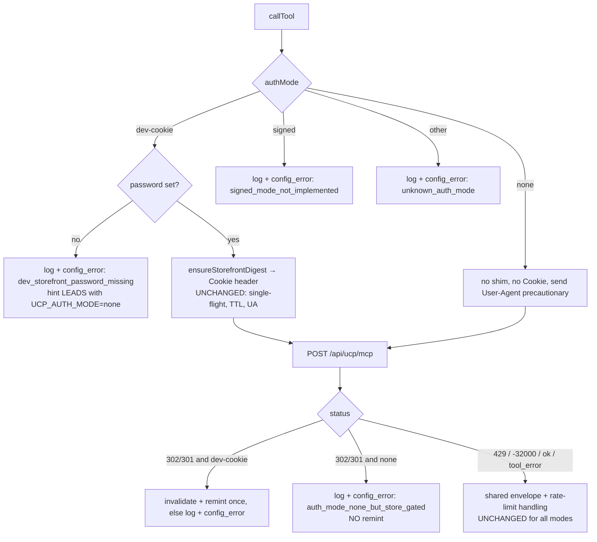

# Plan: UCP no-auth mode for a public storefront

Slug: `ucp-no-auth-mode`
Author: Architect
Date: 2026-07-15
Extends: `docs/plans/ucp-migration.md` (§3.4 DEV-ONLY shim, §4.4 production/two-tier auth model)
Status: revised after `/review-plan` (Revision 2) — awaiting re-review / `/implement`

---

## Revision history

### Revision 2 — 2026-07-15 (addresses `docs/reviews/ucp-no-auth-mode-review.md`, verdict `APPROVE WITH CHANGES`)

Dated-correction style — nothing below is silently rewritten; each change is auditable against the review's three required changes. Everything the reviewer confirmed sound (the A-vs-B decision, the `dev-cookie` default, "shim untouched by construction" / G2, the `signed` throw-only seam, test-count and line-number claims) is preserved unchanged.

- **Required Change 1 (BLOCKING — observability).** Added §4.1 "Observability of `config_error` throws," which specifies G4-compliant server-side `console.error` logging (coarse category + machine-readable `reason` token, no secret values) on every auth-mode `config_error` throw path, mirroring the existing `http_error`/`rpc_error` logging at `mcp.server.js:173,190`. Enumerated the exact reason tokens and where each is thrown. Rewrote §10.6 so its loud-failure verification runs against **server logs and/or the `detail.reason` unit assertions** (tests 4/7/8/10), not against the single opaque browser string that `mapMcpError` renders identically for all four reasons. Threaded the logging requirement into §4, §5 (mcp.server.js row), §6, §7b, and §9.2.
- **Required Change 2 (misleading hint).** Rewrote the relocated `dev_storefront_password_missing` hint to **lead with `UCP_AUTH_MODE=none` for a public storefront**, then the dev password (password-gated store), then the Phase-2 signer. This is the most-likely misconfiguration for the actual target env (public `ashford-quantum`). Applied consistently in §3 (default rationale), §4 design, §4 mermaid, §6, and §9.2.
- **Required Change 3 (overstated AL-2 UA claim).** Downgraded the User-Agent-on-`none` justification from "firm requirement / confirmed" to an explicit **hypothesis**, citing the direct counter-evidence that the existing dev-cookie MCP POST (`mcp.server.js:124–140`) sends **no** `User-Agent` and is probe-confirmed 200. Kept the decision to send the UA on the `none` POST (cheap, harmless belt-and-suspenders). Added an explicit probe/verification step (§10.4a) to test the cookieless `none` POST against `ashford-quantum` both with and without the UA, so the requirement becomes evidence-backed. Updated AL-2 and the §8 risk bullet; added AL-7 recording the now-open UA-necessity question.

Reviewer non-blocking notes N1–N4 were already consistent with the plan; N3 (CLAUDE.md env row) and N4 (`signed` fails at request-time not boot) are carried into §9.7 impl-notes as explicit known properties.

### Revision 1 — 2026-07-15

Initial plan submitted to `/review-plan`.

---

## 1. Problem statement and goals

The env-layer migration to `ashford-quantum.myshopify.com` (Basic plan, storefront password **disabled**, agentic-commerce channel **provisioned**) is complete. Verified 2026-07-15: UCP works end-to-end via `curl` with **no auth at all** — `tools/list` returns 13 tools and `create_cart` with a ProductVariant GID returns a real cart.

The client cannot run in that env. `app/lib/mcp.server.js` `callTool()` hard-throws `config_error` when `DEV_STOREFRONT_PASSWORD` is absent (lines 107–112):

```js
if (!password) {
  throw new McpError('config_error', {
    reason: 'dev_storefront_password_missing',
    hint: 'Set DEV_STOREFRONT_PASSWORD in .env.local (dev-only) or configure a Signed-tier request signer (Phase 2, §4.4).',
  });
}
```

That guard rests on the §3.4 assumption that an unauthenticated call **must** 302-redirect-loop against the password gate. That assumption held for the password-gated dev store (`theme-evolution-os2-hydrogen`, now retired — see `docs/bugs/ucp-cart-32603-fix-notes.md`) and is **false** for a public storefront, where no auth is needed. The very env that now works end-to-end via `curl` is the one env our client refuses to enter.

**Goals**

- G1. Let the UCP client operate against a public (password-disabled, channel-provisioned) storefront with no cookie shim and no signing.
- G2. Preserve the DEV-ONLY cookie-shim path (`ucp-auth.server.js`) **byte-for-byte in behavior**: single-flight minting, soft TTL, User-Agent header, invalidate-on-302 remint, no-secret logging.
- G3. Keep misconfiguration failures **loud and legible** (the §3.4 / §4.4 core invariant: never silently 302-loop, never silently skip auth). Per Revision 2 / §4.1, "legible" now includes an operator-visible server log line naming which misconfiguration fired.
- G4. No regressions to the existing ~51-test unit suite; the dev-cookie tests should ideally require **zero** changes. Also (logging discipline, unchanged): never log the raw query, password, cookie, or full payloads — only coarse category + reason token.

---

## 2. Non-goals

- **Phase-2 signed requests (RFC 9421 ECDSA P-256).** No signing logic. Per this plan's central decision (§3), `signed` exists only as an **enumerated-but-unimplemented** auth-mode value that throws a `not_implemented` config error. No key handling, no agent-profile hosting.
- **Token tier / Bearer JWT** (`complete_checkout`, order tools). Out of scope, unchanged from §4.4.
- **`.env` / `.env.local` edits.** Operator concern. This plan documents the var the operator must set; the Coder never touches env files.
- **Converting `.jsx` → `.tsx`, hand-editing generated GraphQL types, GraphQL fragment changes.** None are needed (JSON-RPC, not GraphQL).
- **Changing the response-envelope, rate-limit, normalizer, or `"add"`/`"search"` intent logic.** Untouched — the no-auth change is confined to how the transport acquires (or skips) credentials.
- **Re-adding the removed `"detail"` intent.**
- **Adding a per-reason browser-facing `mapMcpError` case.** Out of scope for Revision 2: the browser message stays generic ("The shopping assistant is not configured.") for all `config_error` reasons (no reason leakage to end users). Operator-facing differentiation is delivered via server logs (§4.1), not the browser string.

---

## 3. Central decision: conditional shim (A) vs explicit auth-mode var (B)

> The prompt requires a firm recommendation weighing (i) which fails more clearly on misconfiguration and (ii) which is more honest about intent.

### Option A — Conditional shim (infer "no auth" from absent password)

`callTool` treats **absence of `DEV_STOREFRONT_PASSWORD`** as "no auth needed": password present → run shim; password absent → send an unauthenticated request.

### Option B — Explicit `UCP_AUTH_MODE` env var

Operator declares intent: `UCP_AUTH_MODE = none | dev-cookie | signed`. `none` sends an unauthenticated request; `dev-cookie` runs the existing shim (still requires the password); `signed` is enumerated but throws `not_implemented` (Phase 2).

### Recommendation: **Option B**, firmly.

**Clarity on misconfiguration — B wins decisively.** Consider the failure the prompt names: an operator points the client at a **password-gated** store but **forgets the password**.

- Under **A**, "no password" is overloaded to mean *two contradictory things at once*: "this store is public, skip auth" and "I forgot to set my password." The client **cannot tell them apart**, because both present as the identical absent value. So it cannot emit a precise error. It sends an unauthenticated request, eats a 302 to `/password`, and surfaces a redirect-shaped error that looks like a network fault — not "you forgot your password." The operator debugs the wrong layer.
- Under **B**, intent is declared, so any mismatch between declared intent and the store's actual behavior is **detectable and nameable**:
  - Declared `dev-cookie`, password missing → the **existing** hard gate fires *immediately* (`dev_storefront_password_missing`) before any network call — precise and intent-matched.
  - Declared `none`, but the store is gated → the request 302s and the client throws `config_error` with a legible reason ("auth mode `none` but the storefront is password-gated") — the intent/reality mismatch is spelled out, not inferred.

The root problem with A is that it **destroys information** (collapses two intents into one absent value); B **preserves** it.

**Honesty about intent — B wins.** A infers a *security-sensitive* behavior (skip authentication) from the *absence* of a value. That is the most dangerous class of implicit default: the "worked in dev, shipped to prod with no auth because a var happened to be unset" failure mode. B forces a conscious, auditable declaration (`UCP_AUTH_MODE=none`). This also directly upholds the migration's stated invariant (§3.4, §4.4): *"a production build with neither the shim nor a signer must raise a loud config error, not silently 302-loop."* A erodes that guarantee by making "no auth" a valid state reachable through inference; B keeps it — every mode is declared, and anything unrecognized still errors loudly.

**Cost of B:** one extra operator-set env var and threading an `authMode` param through five functions. Cheap, and it doubles as the pluggable seam §4.4 already asked for (a future `signed` signer slots into the same switch the cookie shim lives in). Accepted.

### Default when `UCP_AUTH_MODE` is unset

Recommendation: **default to `dev-cookie`.** Rationale:

- Backward compatibility: existing dev setups (with `DEV_STOREFRONT_PASSWORD` in `.env.local`) and the existing 23 auth-touching unit tests keep working unchanged — the default reproduces today's behavior exactly.
- It stays loud: an operator who removed the password from env but left `UCP_AUTH_MODE` unset lands on `dev-cookie` → the existing hard gate throws `dev_storefront_password_missing`, whose hint tells them what to do.
  - **Revision 2 (Required Change 2):** for this plan's actual target env — the **public** `ashford-quantum` store — the *most likely* misconfiguration is migrating to it and forgetting `UCP_AUTH_MODE=none`, which lands on the `dev-cookie` default and yields `dev_storefront_password_missing`. The pre-Revision hint led with "set a password," steering the operator to set a password the store does not need. The hint is therefore **rewritten to lead with `UCP_AUTH_MODE=none` (public storefront)**, then the dev password (password-gated store), then the Phase-2 signer. See §4 and §9.2 for the exact wording, applied consistently.
- It does **not** make "no auth" reachable by default — reaching `none` requires an explicit declaration, preserving G3/honesty.

Defaulting to `none` is rejected (silently reachable no-auth); defaulting to a hard "must be set" error is a defensible stricter alternative, logged in the Ambiguity Log (AL-1) — but it breaks G4 (every existing test and dev env would need the var added) for little gain over the loud gate the `dev-cookie` default already provides.

---

## 4. Proposed design

`callTool` gains an `authMode` parameter, threaded through the four public wrappers (`searchCatalog`, `createCart`, `updateCart`, `createCheckout`) exactly as `password` / `profileUrl` are today. It defaults to `'dev-cookie'` when omitted so direct callers and existing tests are unaffected. The route reads `context.env.UCP_AUTH_MODE` (falling back to `'dev-cookie'`) and adds it to `mcpBase`.

Inside `callTool`, a switch on `authMode` selects the credential strategy **before** the shared envelope/rate-limit/timeout logic (which is identical for all modes):

- `dev-cookie` → **unchanged** existing path: `ensureStorefrontDigest()`, attach `Cookie`, and the 302→invalidate→remint-once retry.
- `none` → skip the shim entirely, send **no** `Cookie` header, send a `User-Agent` header (AL-2 — precautionary, see §4.1/§10.4a). A 302/301 here means the store is gated despite a `none` declaration → throw `config_error` (`auth_mode_none_but_store_gated`) with **no** remint retry (there is nothing to remint).
- `signed` → throw `config_error` (`signed_mode_not_implemented`) — Phase 2 seam (§4.4), no logic.
- anything else → throw `config_error` (`unknown_auth_mode`).

The `!password` guard at lines 107–112 moves *inside* the `dev-cookie` branch (its meaning is mode-specific now); its hint is **rewritten to lead with `UCP_AUTH_MODE=none`** (Required Change 2). Proposed hint string:

```
'Set UCP_AUTH_MODE=none for a public (password-disabled) storefront; '
+ 'or set DEV_STOREFRONT_PASSWORD in .env.local for a password-gated dev store; '
+ 'or configure a Signed-tier request signer (Phase 2, §4.4).'
```

Every `config_error` throw introduced or relocated here is preceded by a G4-compliant server-side log line — see §4.1.



The shared post-response logic (429, `-32000`-in-body, `structuredContent` primary + `content[0].text` fallback, `isError`/`tool_error`, timeout) is **mode-agnostic** and stays exactly as it is — the only mode-specific branch below the fetch is the 302 handling.

**`ucp-auth.server.js` is not modified at all.** The `none` branch never calls into it. This guarantees G2 by construction: the shim's discipline can't regress because its code doesn't change.

### 4.1 Observability of `config_error` throws (Required Change 1 / Revision 2)

**Problem being fixed.** `mapMcpError` (`($locale).api.assistant.jsx:339–343`) maps *every* `config_error` to one browser string, `"The shopping assistant is not configured."`. Meanwhile the `config_error` throw paths in `callTool` log **nothing** server-side — unlike `http_error`/`rpc_error`, which `console.error` a coarse category + status at `mcp.server.js:173,190`. So the four distinct auth misconfigurations are indistinguishable to an operator running the app, which makes the §10.6 loud-failure checks non-executable as originally written. This is a security-sensitive path; an operator debugging "not configured" needs a signal telling them *which* misconfiguration fired.

**Fix.** Every auth-mode `config_error` throw in `callTool` is immediately preceded by a `console.error` line in the **exact same discipline** as the existing `http_error`/`rpc_error` logs: a coarse `[mcp] config_error` category plus a machine-readable `reason` token and the tool `name` — and **no secret values** (never the password, cookie, authenticity token, query text, or request/response payload). Suggested format, parallel to line 173's `[mcp] http_error status=... tool=...`:

```
console.error(`[mcp] config_error reason=<token> tool=${name}`); // eslint-disable-line no-console
```

**Reason tokens and where each is thrown** (all in `callTool`, `app/lib/mcp.server.js`):

| `reason` token | Branch | When it throws | Network call made first? |
| :--- | :--- | :--- | :--- |
| `dev_storefront_password_missing` | `dev-cookie` | `password` absent (relocated guard, was lines 107–112) | No — pre-flight |
| `auth_mode_none_but_store_gated` | `none` | first `302/301` response (store gated despite `none`) | Yes — one POST, no remint |
| `signed_mode_not_implemented` | `signed` | immediately (Phase-2 stub) | No — pre-flight |
| `unknown_auth_mode` | default | immediately (unrecognized value) | No — pre-flight |
| `password_gate_persists_after_remint` *(pre-existing, lines 148–150)* | `dev-cookie` retry | second `302/301` after a fresh mint | Yes — after remint |

The first four are the reviewer's required set. The fifth (`password_gate_persists_after_remint`) already exists and is currently also silent; the Coder should give it the **same one-line log** for parity so the dev-cookie 302-exhaustion case is equally legible. This is a consistency add in the identical discipline, not a scope expansion — no new behavior, just a log line.

`unknown_auth_mode` may additionally include `mode=${authMode}` in the log (and in `detail`, per N1) — `authMode` is operator-set env, not a secret and not user input, so logging it is safe and aids debugging a typo. It must **not** be interpolated into any browser-visible string (the generic `mapMcpError` message already prevents that).

**Why not differentiate in the browser instead?** Non-goal (§2): leaking which auth misconfiguration fired to an end user is unnecessary and mildly information-disclosing. The operator reads the dev-server console; CI asserts on `detail.reason`. Both are server-side. `mapMcpError` stays as-is.

**Verification of the observability itself** is twofold and replaces the old opaque §10.6:
- **Unit (CI):** §7b tests 4/7/8/10 already assert the thrown `detail.reason` for `auth_mode_none_but_store_gated`, `signed_mode_not_implemented`, `unknown_auth_mode`, and the relocated `dev_storefront_password_missing`. These are the machine-checkable proof that the right reason fires on each path.
- **Manual (operator):** the rewritten §10.6 has the operator read the dev-server console for the `[mcp] config_error reason=<token>` line, rather than the (identical-for-all) browser string.

---

## 5. Affected files and modules

| File | Change | Notes |
| :--- | :--- | :--- |
| `app/lib/mcp.server.js` | **Modify.** Add `authMode` to `callTool` params (default `'dev-cookie'`) and thread it through `searchCatalog`/`createCart`/`updateCart`/`createCheckout`. Add the `authMode` switch; move the `!password` guard into the `dev-cookie` branch with the **rewritten hint** (Change 2); add the `none`/`signed`/unknown branches; make the `Cookie` header conditional; branch the 302 handling on mode; send `User-Agent` on the `none` request (AL-2, precautionary). **Add a `console.error('[mcp] config_error reason=… tool=…')` line before each auth-mode `config_error` throw** and the pre-existing `password_gate_persists_after_remint` throw (Change 1 / §4.1), matching the `http_error`/`rpc_error` logging discipline; no secret values. | Heart of the change. Envelope/rate-limit logic untouched. |
| `app/routes/($locale).api.assistant.jsx` | **Modify.** Read `context.env.UCP_AUTH_MODE` (default `'dev-cookie'`), add to `mcpBase` (~line 89). `mapMcpError` (~line 339) is **unchanged** — the generic `config_error` message stays; per-reason differentiation is server-log only (§4.1). | Config guard (~lines 55–76) stays; `DEV_STOREFRONT_PASSWORD` still read but now only load-bearing for `dev-cookie`. |
| `app/lib/const.js` | **Modify (optional but recommended).** Add a single-source-of-truth enum, e.g. `export const UCP_AUTH_MODES = {NONE:'none', DEV_COOKIE:'dev-cookie', SIGNED:'signed'}` and `UCP_DEFAULT_AUTH_MODE`. Referenced by `callTool` and the route (zero-hardcoding). | See AL-4. |
| `app/lib/mcp.server.test.js` | **Modify (add cases only).** New `describe('callTool — auth modes')` block (§7). Existing 15 cases unchanged. | |
| `app/lib/ucp-auth.server.js` | **NOT modified.** | G2 by construction. |
| `app/lib/ucp-auth.server.test.js` | **NOT modified.** All 8 cases unchanged. | |
| `app/lib/mcp-error.server.js` | **NOT modified.** New reasons live in `detail`, not the `McpErrorCode` enum; `config_error` already covers them. | |
| `app/lib/mcp-normalize.js` / `.test.js` | **NOT modified.** | Not auth-touching. |
| `.env` / `.env.local` | **NOT edited by Coder.** Operator sets `UCP_AUTH_MODE=none` for `ashford-quantum`. Documented in §9. | |
| `CLAUDE.md` (required-env-vars table) | **Deferred / AL-3 / N3.** Adding a `UCP_AUTH_MODE` row is a doc improvement but `CLAUDE.md` is a convention file; flag rather than silently edit. Recorded in §9.7 impl-notes so a future agent grounding on `CLAUDE.md` still learns the var exists. | |

---

## 6. Data model and API changes

- **New env var (operator-set): `UCP_AUTH_MODE`.** Values `none | dev-cookie | signed`. Unset → `dev-cookie`. Read via `context.env` in the route, same pattern as `PUBLIC_STORE_DOMAIN` / `DEV_STOREFRONT_PASSWORD`. Never returned to the browser.
- **New `callTool` (and wrapper) param: `authMode: 'none' | 'dev-cookie' | 'signed'`** (optional, default `'dev-cookie'`). JSDoc `@type` updated on all five functions.
- **New `config_error` `detail.reason` values:** `auth_mode_none_but_store_gated`, `signed_mode_not_implemented`, `unknown_auth_mode`. The `McpErrorCode` enum in `mcp-error.server.js` is **unchanged** (`config_error` already present).
- **New server-log lines (not an API surface):** `[mcp] config_error reason=<token> tool=<name>` on each auth-mode throw (§4.1). Coarse category + reason token only; no secret values. Parallel to the existing `[mcp] http_error …` / `[mcp] rpc_error …` lines.
- **Relocated hint string** on `dev_storefront_password_missing` now leads with `UCP_AUTH_MODE=none` (Change 2). The hint travels in `detail.hint`; it is not surfaced to the browser by `mapMcpError` (generic message), so this is an operator/log-facing string.
- **Request shape under `none`:** identical JSON-RPC body (same `meta.ucp-agent.profile` Component Contract), minus the `Cookie` header, plus a `User-Agent` header (precautionary, AL-2/§10.4a).
- **No GraphQL, schema, or generated-type changes.** `npm run build` codegen runs with no expected diff.

---

## 7. Test-impact enumeration

Baseline suite (`npm run test:unit` → `node --test`): `mcp.server.test.js` (15), `ucp-auth.server.test.js` (8), `mcp-normalize.test.js` (~28). Total ≈ 51.

### 7a. Tests that must NOT change (regression guards for G2/G4)

- **`ucp-auth.server.test.js` — all 8** (a–f + the two config-error cases). The shim is untouched; every one must stay green verbatim. If any require edits, the change has leaked into the dev-cookie path — treat as a defect.
- **`mcp-normalize.test.js` — all ~28.** Not auth-touching.
- **`mcp.server.test.js` — all existing 15.** They call `callTool` with no `authMode`; the `'dev-cookie'` default reproduces today's behavior exactly, including the config-gate test (`password: undefined` → `config_error`) and both 302-retry tests. **Requirement: these pass with zero edits.** This is the concrete test of G4; if the default were `none` they would break, which is one more reason the default is `dev-cookie` (§3).
  - Note: the config-gate test asserts only `err.code === 'config_error'` (verified by the reviewer against line 73 of the test file), so relocating the guard into the `dev-cookie` branch and rewriting its `hint`/adding a log line does not break it.

### 7b. New tests required (no-auth path) — add to `mcp.server.test.js`

New `describe('callTool — auth modes')`. Use the existing `withPasswordShim` helper for `dev-cookie` cases and a **plain** `fetchImpl` (no `/password` handling) for `none` cases so the assertion "the shim was never called" is structural.

1. `authMode:'none'` with `password:undefined` → succeeds, returns `structuredContent`. Proves no-auth works and needs no password.
2. `authMode:'none'` → the fetch log contains **no** `GET`/`POST /password` request (shim never invoked).
3. `authMode:'none'` → the `/api/ucp/mcp` request carries **no `Cookie` header** and a **non-empty `User-Agent`** (AL-2 guard).
4. `authMode:'none'` + a 302 response → throws `config_error` with `detail.reason === 'auth_mode_none_but_store_gated'`, and the tool endpoint is called **exactly once** (no remint retry). *(Backs §4.1 observability: this is the CI proof the correct reason fires on the `none`-gated path.)*
5. `authMode:'none'` still injects `meta.ucp-agent.profile` into the request body (Component Contract holds across modes).
6. `authMode:'none'` still maps HTTP 429 (and the `-32000`-in-body path) → `rate_limited` with `retryAfterMs` (shared envelope logic not bypassed by the mode branch). One representative rate-limit case suffices.
7. `authMode:'signed'` → throws `config_error` with `detail.reason === 'signed_mode_not_implemented'`; no network call made. *(Backs §4.1.)*
8. `authMode:'unknown'` → throws `config_error` with `detail.reason === 'unknown_auth_mode'`. *(Backs §4.1.)*
9. `authMode:'dev-cookie'` explicit (password present) → behaves identically to the omitted-default cases (pins the default's equivalence).
10. `authMode:'dev-cookie'` with `password:undefined` → still throws `dev_storefront_password_missing` (guard relocation didn't drop the check). *(Backs §4.1 for the relocated gate. Assert on `detail.reason === 'dev_storefront_password_missing'`; optionally assert `detail.hint` mentions `UCP_AUTH_MODE=none` to pin Change 2.)*

> Logging assertions: the `console.error` lines in §4.1 are a side-channel and are **not** required to be asserted directly (mirroring how the existing `http_error`/`rpc_error` logs are not unit-asserted today). The `detail.reason` assertions in tests 4/7/8/10 are the authoritative CI proof that the correct reason fires on each path; the log line simply mirrors that reason to the operator console. A Coder may optionally spy on `console.error` for test 4/10 if trivial, but it is not mandated.

### 7c. Not unit-tested (manual verification)

The route wiring (`context.env.UCP_AUTH_MODE` read + default) has no existing route-level unit test harness; verify manually via §10 (curl parity + browser) against `ashford-quantum` with `UCP_AUTH_MODE=none`, and confirm a dev-cookie store still works.

---

## 8. Risks, edge cases, and open questions

### Risks / edge cases

- **`none` against a still-gated store** → now a clear, **logged** `config_error` (`auth_mode_none_but_store_gated`) on the first 302 (edge handled by design). No infinite loop, no remint.
- **Backward-compat trap:** operator removes the password from env but leaves `UCP_AUTH_MODE` unset → default `dev-cookie` → loud, **logged** `dev_storefront_password_missing`. This is the *desired* loud failure; the hint now **leads with `UCP_AUTH_MODE=none`** (Change 2) so an operator who actually meant "public store" is pointed at the right fix instead of being told to set a password the store does not need.
- **`Cookie: undefined` bug:** the `none` path must **omit** the header key, not send `Cookie: undefined`. Build the headers object conditionally. (Test 3 guards this.)
- **workerd no-User-Agent behavior (AL-2 — downgraded in Revision 2):** the verified `curl` sends a UA, and under MiniOxygen/workerd an outbound `fetch` sends none by default. The shim's `/password` legs are **confirmed** to 403 without a UA (`const.js:16–24`, `docs/bugs/ucp-dev-env-issue2-fix-notes.md`). **However**, whether the *cookieless `none` MCP POST* to `/api/ucp/mcp` requires a UA is **not confirmed** — direct counter-evidence exists: the existing dev-cookie MCP POST (`mcp.server.js:124–140`) sends **no** `User-Agent` and is probe-confirmed 200. The working case differs by carrying a valid `_shopify_essential` cookie, so the `none` (cookieless) case *may* be more exposed to the bot-protection edge — but that is a **hypothesis**, not a confirmed requirement. Decision: **still send the UA on `none`** (cheap, safe, harmless belt-and-suspenders), but treat its necessity as unverified until the §10.4a probe. See AL-2 and AL-7.
- **Mode branch drift:** if the 302 handling isn't branched carefully, a `none`-mode 302 could fall into the dev-cookie remint path (which calls `invalidateStorefrontDigest()` / retries with a password that may be undefined). Test 4 guards this.
- **Scope creep into signing:** `signed` must remain a throw-only stub. No key/crypto code (Non-goal).

### Open questions — see Ambiguity Log (§8a) for proposed resolutions.

### 8a. Ambiguity Log

| ID | Question | Proposed resolution |
| :--- | :--- | :--- |
| AL-1 | Default when `UCP_AUTH_MODE` is unset: `dev-cookie` vs hard error? | **`dev-cookie`.** Backward-compatible, keeps all existing tests green (G4), and still fails loud (existing gate, now also logged per §4.1) if the store needs auth. A hard-error default is stricter but breaks G4 for negligible gain over the existing loud gate. Revisit only if the reviewer prioritizes strictness over back-compat. *(Reviewer confirmed sound.)* |
| AL-2 | Does the `none` MCP request need a `User-Agent`? If so, which one? | **Send one, but treat necessity as a hypothesis (Revision 2 / Change 3).** The `/password` legs confirmedly 403 without a UA; the cookieless `none` MCP POST is **not** confirmed to — the existing dev-cookie MCP POST (`mcp.server.js:124–140`) sends no UA and is 200. So sending a UA on `none` is **precautionary belt-and-suspenders**, not a proven requirement. Keep it (cheap, harmless) and **prove it via §10.4a** (probe `none` against `ashford-quantum` with and without the UA). For the header value, prefer a **neutral** const, e.g. add `UCP_CLIENT_USER_AGENT` to `const.js`, rather than reusing the DEV-ONLY-labeled `DEV_SHIM_USER_AGENT` on a path that is explicitly *not* dev-only. If the reviewer prefers minimal surface, reuse `DEV_SHIM_USER_AGENT` and rename it to drop the `DEV_SHIM_` prefix — but that touches the shim's const and is a wider blast radius; a new const is cleaner. |
| AL-3 | Add a `UCP_AUTH_MODE` row to the `CLAUDE.md` required-env-vars table? | **Defer to operator/reviewer (N3).** `CLAUDE.md` is a shared convention file; the Architect will not silently edit it. Recommend the operator add the row when they set the var; record in §9.7 impl-notes so it is not lost. |
| AL-4 | Enum constant in `const.js` vs inline string literals? | **Add the enum** (`UCP_AUTH_MODES` + `UCP_DEFAULT_AUTH_MODE`). Single source of truth for `callTool` and the route; upholds the zero-hardcoding directive. Low cost. |
| AL-5 | Include `signed` in the enum now, given it's unimplemented? | **Yes**, as a throw-only value (`signed_mode_not_implemented`). Keeps the enum honest, gives Phase 2 (§4.4) a named seam, and makes "declared signed but not built" a legible (and now logged, §4.1) error instead of falling into `unknown_auth_mode`. No signing logic (Non-goal). *(Reviewer confirmed sound.)* |
| AL-6 | Should the route validate `UCP_AUTH_MODE` up front (like the config guard at lines 66–76) or let `callTool` reject an unknown value? | **Let `callTool` reject it** (`unknown_auth_mode` → logged `config_error` → `mapMcpError`). Keeps validation next to the logic that consumes it and avoids duplicating the enum check in the route. Known property (N4): `signed`/unknown therefore fail at **request time, not boot** — acceptable given no startup-validation harness exists; recorded in §9.7 impl-notes. |
| AL-7 *(new, Revision 2)* | Is the `User-Agent` actually required on the cookieless `none` MCP POST, or only on the shim's `/password` mint? | **Open — pending the §10.4a probe.** Counter-evidence (dev-cookie MCP POST sends no UA yet is 200) means we cannot assert it. Resolution path: run `none` against `ashford-quantum` **with** the UA (expect 200) and **without** it; record the outcome in §9.7 impl-notes. If without-UA also returns 200, the UA becomes documented-as-precautionary-only (keep it, but downgrade the const's JSDoc from "required" to "precautionary, workerd bot-edge hedge"). If without-UA 403s, promote the const's JSDoc to "required" with the probe as evidence. Either way the code ships **with** the UA; only the justification's strength is settled by the probe. |

---

## 9. Step-by-step implementation checklist for the Coder

> Read `CLAUDE.md` (esp. the Hydrogen directives and Anti-Stubbing Rule) before starting. Files stay `.jsx` + JSDoc. Do not edit `.env`, generated types, or `ucp-auth.server.js`.

**9.0 Pre-implementation gate (operator, not Coder):** confirm the operator has set `UCP_AUTH_MODE=none` in the `ashford-quantum` env (or documented intent). The Coder does not touch env files.

1. **`app/lib/const.js`** — add `UCP_AUTH_MODES` (`{NONE, DEV_COOKIE, SIGNED}`), `UCP_DEFAULT_AUTH_MODE = UCP_AUTH_MODES.DEV_COOKIE`, and (AL-2) `UCP_CLIENT_USER_AGENT` for the `none` path. JSDoc-comment the UA as **precautionary** (workerd bot-edge hedge; necessity unverified for the cookieless case — see AL-2/AL-7, to be settled by the §10.4a probe). Do **not** alter `DEV_SHIM_USER_AGENT`.
2. **`app/lib/mcp.server.js` — `callTool`:**
   - Add `authMode = UCP_DEFAULT_AUTH_MODE` to the destructured params and JSDoc `@type`.
   - Replace the top-of-function `!password` guard (lines 107–112) with an `authMode` switch:
     - `dev-cookie`: keep the `!password` guard, but **rewrite its `hint` to lead with `UCP_AUTH_MODE=none`** (Change 2), e.g. `'Set UCP_AUTH_MODE=none for a public (password-disabled) storefront; or set DEV_STOREFRONT_PASSWORD in .env.local for a password-gated dev store; or configure a Signed-tier request signer (Phase 2, §4.4).'`. Then `ensureStorefrontDigest()` → `cookie` as today.
     - `none`: no shim; `cookie` stays undefined; will send `User-Agent: UCP_CLIENT_USER_AGENT` and no `Cookie`.
     - `signed`: `throw new McpError('config_error', {reason: 'signed_mode_not_implemented'})`.
     - default: `throw new McpError('config_error', {reason: 'unknown_auth_mode', mode: authMode})`.
   - **Observability (Change 1 / §4.1):** immediately **before** each of the four `config_error` throws above, add a `console.error(`[mcp] config_error reason=<token> tool=${name}`); // eslint-disable-line no-console` line, matching the existing `http_error`/`rpc_error` logging at lines 173/190. For `unknown_auth_mode` include `mode=${authMode}` in the log. **Never** log the password, cookie, authenticity token, query, or payload (G4). Also add the same one-line log before the pre-existing `password_gate_persists_after_remint` throw (lines 148–150) for parity.
   - Build the request `headers` conditionally: always `Content-Type`; add `Cookie` only when in `dev-cookie` mode; add `User-Agent` in `none` mode. (Guard against `Cookie: undefined`.)
   - Branch the `302/301` handler: `dev-cookie` → existing invalidate + remint-once retry (thread `authMode` into the recursive call — hygiene; note N2: not load-bearing since only `dev-cookie` reaches the retry); `none` → log + `throw new McpError('config_error', {reason: 'auth_mode_none_but_store_gated'})` (no remint).
   - Leave 429 / `-32000` / envelope / `tool_error` / timeout logic **unchanged**.
   - Run `npm run lint` after this change.
3. **`app/lib/mcp.server.js` — wrappers:** thread `authMode` through `searchCatalog`, `createCart`, `updateCart`, `createCheckout` (param + JSDoc), passing it into their `callOpts`, mirroring how `password`/`profileUrl` flow today.
4. **`app/routes/($locale).api.assistant.jsx`:** read `const authMode = context.env.UCP_AUTH_MODE || UCP_DEFAULT_AUTH_MODE;` near the other env reads (~line 62–64) and add `authMode` to `mcpBase` (~line 89). **`mapMcpError` stays unchanged** — do not add a per-reason case; per-reason differentiation is server-log only (§4.1). Pre-save audit for unused imports / duplicate declarations.
5. **`app/lib/mcp.server.test.js`:** add the `describe('callTool — auth modes')` block with tests 1–10 from §7b. Do not modify existing blocks. Add a plain (non-shim) `fetchImpl` helper for the `none` cases.
6. **Do not touch** `ucp-auth.server.js`, `ucp-auth.server.test.js`, `mcp-normalize.js`, `mcp-error.server.js`, generated types, or env files.
7. **Impl notes:** write `docs/plans/ucp-no-auth-mode-impl-notes.md` recording: the chosen default (AL-1); the UA decision and the **§10.4a probe result** (AL-2/AL-7 — did the cookieless `none` POST 200 without the UA?); the `CLAUDE.md` env-row deferral (AL-3/N3) so a future agent still learns `UCP_AUTH_MODE` exists; the request-time-not-boot property of `signed`/unknown (AL-6/N4); and the §4.1 log tokens added.

---

## 10. Verification

Run in order; all must pass before marking complete.

1. `npm run test:unit` — the ~51 existing cases stay green (esp. all 8 shim tests + all 15 `mcp.server` tests **unchanged**), plus the new no-auth cases pass — including the `detail.reason` assertions (tests 4/7/8/10) that back the §4.1 observability.
2. `npm run lint` — clean.
3. `npm run build` — completes without errors. This is the type-check + production-build gate (codegen included); there is no separate `typecheck` script. Expect no generated-type diff.
4. **Manual — public store (`UCP_AUTH_MODE=none`, `ashford-quantum`):** `npm run dev`, then:
   - HTTP smoke: `curl -s -o /dev/null -w "%{http_code}\n" http://localhost:3000` → 200.
   - In the shopping assistant UI: run a `search`, then `add` → confirm a real cart / checkout URL comes back (parity with the verified `curl` result), no config error, no 302 loop, no React hydration warnings in DevTools.
   - Confirm `<Analytics.ProductView>` receives a valid `variantId` on assistant product cards (Analytics Contract).
4a. **Manual — UA probe for the cookieless `none` POST (Change 3 / AL-2 / AL-7):** with `UCP_AUTH_MODE=none` against `ashford-quantum`, exercise the assistant `search`/`add` path and confirm the `none` MCP POST returns 200 **with** the `User-Agent` header (the shipped behavior). Then, as a one-off diagnostic, temporarily issue the same cookieless `/api/ucp/mcp` POST **without** a `User-Agent` (e.g. a direct `curl`/`fetch` reproducing the `none` request, or a throwaway local edit — **not** committed) and record whether it returns 200 or 403. Note the outcome in §9.7 impl-notes and resolve AL-7: if without-UA also 200s, the UA is documented as precautionary-only; if it 403s, the UA is promoted to a proven requirement. Either way the code ships **with** the UA.
5. **Manual — regression, dev-cookie store:** point env at a password-gated store with `DEV_STOREFRONT_PASSWORD` set and `UCP_AUTH_MODE` unset (or `dev-cookie`) → assistant still works via the shim (proves G2 end-to-end, not just via unit tests).
6. **Manual — loud-failure checks (rewritten for Change 1 / §4.1).** The browser renders the identical generic string ("The shopping assistant is not configured.") for all `config_error` reasons, so **verify against the dev-server console log line `[mcp] config_error reason=<token> …` and/or the `detail.reason` unit assertions in step 1**, not the browser message:
   - (a) `UCP_AUTH_MODE=none` against a **gated** store → server log shows `reason=auth_mode_none_but_store_gated`; no loop, single POST. (CI proof: test 4.)
   - (b) `UCP_AUTH_MODE=dev-cookie` (or unset) with **no** password → server log shows `reason=dev_storefront_password_missing`; confirm the thrown `detail.hint` **leads with `UCP_AUTH_MODE=none`** (Change 2). (CI proof: test 10.)
   - (c) `UCP_AUTH_MODE=signed` → server log shows `reason=signed_mode_not_implemented`; no network call. (CI proof: test 7.)
   - (d) `UCP_AUTH_MODE=<typo>` → server log shows `reason=unknown_auth_mode mode=<typo>`; no network call. (CI proof: test 8.)
   In every case the browser still shows the generic message — that is expected and correct (reason is not leaked to end users); the operator distinguishes them by the console log / unit assertions.

---

## 11. Handoff

Next: re-review via `/review-plan docs/plans/ucp-no-auth-mode.md`, then `/implement`. Revision 2 folded in the reviewer's three required changes:
- **Change 1** — §4.1 observability spec + rewritten §10.6 (server-log/unit-assertion verification, not the opaque browser string).
- **Change 2** — `dev_storefront_password_missing` hint rewritten to lead with `UCP_AUTH_MODE=none`, applied consistently (§3, §4, §6, §9.2, §10.6).
- **Change 3** — AL-2 UA claim downgraded to a hypothesis with the dev-cookie-POST-sends-no-UA-yet-200 counter-evidence cited; UA kept on `none`; §10.4a probe added; AL-7 records the now-open necessity question.

The reviewer should confirm: the dev-cookie path is provably unchanged (G2), each misconfiguration now emits a G4-compliant server log naming its `reason` while the browser message stays generic, the corrected hint no longer mis-steers the public-store operator, and the UA justification is now evidence-seeking rather than asserted.
